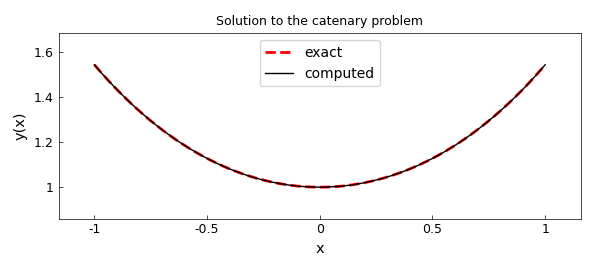

# The catenary problem from the calculus of variations

*Hrothgar and Toby Driscoll, April 2014*

[Original MATLAB Chebfun example](https://www.chebfun.org/examples/opt/Catenary.html)

Python translation: [`examples/opt/catenary.py`](https://github.com/ma-gilles/chebfunjax/blob/main/examples/opt/catenary.py)

```matlab
FS = 'fontsize'; LW = 'linewidth';
```

Suppose we wish to solve a classical problem from the calculus of variations of the form

$$ \min_{y(t)} J[y] \equiv \int_{-1}^1 f(t,y,y') dt $$

subject to the boundary conditions

$$ y(-1) = \alpha, \quad y(1) = \beta. $$

Problems like this arise in physics, for example, when $J$ is an energy functional.

A standard example of a variational problem is the catenary problem, which is to determine the shape of a hanging rope. In this case $J$ is an energy functional taking the form [1]

$$ J[y] = \int f(t,y,y') dt = \int y \sqrt{1 + (y')^2} dt. $$

To solve this problem with Chebfun, we begin with the functional and boundary conditions. We will choose boundary conditions that make it easy to verify the known solution.

```matlab
f = @(y,yp) y .* sqrt(1 + yp.^2);
J = @(y) sum( f(y, diff(y)) );

alpha = cosh(-1);
beta  = cosh(1);
```

Since the problem is nonlinear, we will need to solve it iteratively. As an initial guess to the iteration we'll choose a simple line, and note its functional value.

```matlab
dom = [-1,1];
y0 = chebfun([alpha, beta]', dom);
startJ = J(y0)
```

```text
startJ =
   3.086161269630487
```

The simplest way to compute extrema of the functional $J[y]$ is to find solutions of the Euler-Lagrange equation

$$ \frac{\partial f}{\partial u} - \frac{d}{dx}\frac{\partial f}{\partial (u')} = 0. $$

To do so we must compute the first variations of the function $f$,

$$ \frac{\partial f}{\partial u}, \quad \frac{\partial f}{\partial u'}. $$

Using only information about first variations, we could implement a steepest descent method. However, if can also get our hands on the second variations of $f$, then we could implement a more efficient Newton method. The second- variation equivalent of the Euler-Lagrange equation, sometimes called Jacobi's accessory equation, is

$$ \frac{d}{dx}\Big(\frac{\partial^2 f}{\partial(u')^2}\Big) + \Big(\frac{d}{dx}\frac{\partial^2 f}{\partial u \partial u'}- \frac{\partial^2 f}{\partial u^2}\Big)u = 0. $$

To find the first and second variations, we will use Chebfun2. First we make a chebfun2 of $f$.

```matlab
dom2 = [1 2 -2 4];
F = chebfun2(f, dom2);
```

Now we can compute the first and second variations of $f(y,y')$ by taking derivatives of `F`: each `diff(F,[a b])` is a chebfun2 corresponding to

$$ \frac{\partial^{(a+b)} f}{\partial^a (u) \partial^b (u')}. $$

```matlab
F1  = diff(F, [1 0]);
F2  = diff(F, [0 1]);
F11 = diff(F, [2 0]);
F12 = diff(F, [1 1]);
F22 = diff(F, [0 2]);
```

Now we are able to compute, say $\partial f(y,y')/\partial u$ for a particular function $y$ by writing `F1(y,diff(y))` for a chebfun `y`.

The iteration will take Newton steps by solving the accessory equation. Five iterations are enough to get an accurate solution.

```matlab
y = y0;
pref = cheboppref;
pref.plotting = 'off';
pref.display = 'none';

for k = 1:5
    % The first and second variations of f.
    yp = diff(y);
    f1  = F1(y, yp);
    f2  = F2(y, yp);
    f11 = F11(y, yp);
    f12 = F12(y, yp);
    f22 = F22(y, yp);

    % Compute the next Newton step by solving the accessory equation.
    N = chebop( @(x,u) diff(f22.*diff(u)) + (diff(f12)-f11).*u, dom );
    N.lbc = 0;
    N.rbc = 0;
    u = solvebvp(N, (f1-diff(f2)), pref);

    % Increment by the step.
    y = y + u;

    % Print out the current value of the energy functional.
    nextJ = J(y)
end
```

```text
nextJ =
   2.840828750691889
nextJ =
   2.816226754422303
nextJ =
   2.813551498179470
nextJ =
   2.813430779819884
nextJ =
   2.813430203941231
```

The exact solution is a simple $\cosh$. Here is the error in our solution.

```matlab
y_exact = chebfun('cosh(x)', dom);
norm(y - y_exact)
```

```text
ans =
     7.515155634723200e-06

  final J[y]: 2.8134302039412309
optimal J[y]: 2.8134302039235082
```

And the values of the energy functional:

```matlab
fprintf('\n  final J[y]: %.16f\n', J(y))
fprintf('optimal J[y]: %.16f\n', J(y_exact))
```

```text

```

Finally, a plot of the catenary:

```matlab
plot(y_exact, 'r--', LW,2), hold on
plot(y, 'k-', LW,1)
axis equal
title('Solution to the catenary problem', FS, 12)
xlabel('x', FS, 14), ylabel('y(x)', FS, 14)
legend('exact','computed','location','north')
```



## References

1. Charles Fox, *An Introduction to the Calculus of Variations*, Courier Dover Publications, 1987.

---

*Translated with [chebfunjax](https://github.com/ma-gilles/chebfunjax); prose and MATLAB code from the original example, copyright The University of Oxford and The Chebfun Developers.  Printed outputs and figures are chebfunjax's.*
