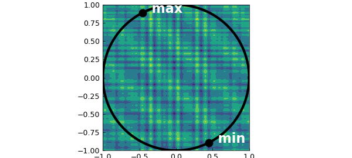
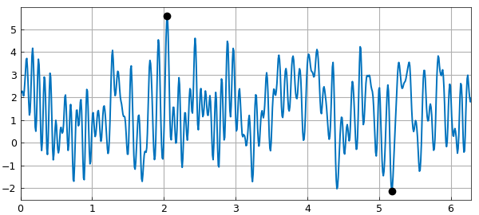
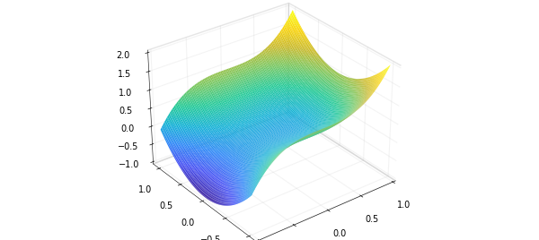
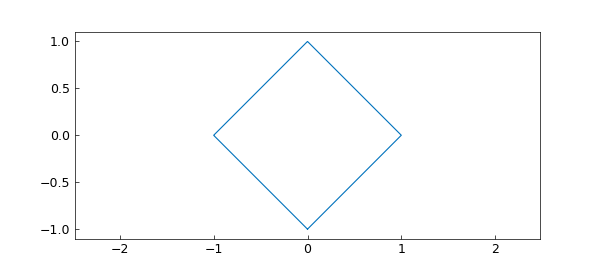
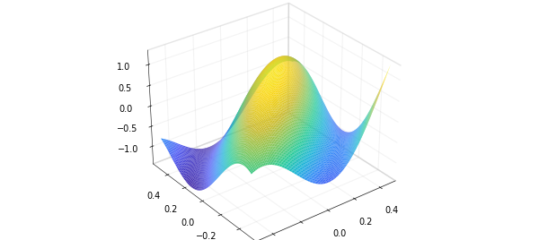

# Extrema of a function under constraints and on non-standard domains

*Olivier Sète, November 2016*

[Original MATLAB Chebfun example](https://www.chebfun.org/examples/opt/ConstrainedExtrema.html)

Python translation: [`examples/opt/constrained_extrema.py`](https://github.com/ma-gilles/chebfunjax/blob/main/examples/opt/constrained_extrema.py)

We illustrate how to find extrema of a function under a constraint that can be parametrized by a chebfun, chebfun2v or chebfun3v object. For this we use the composition of different Chebfun objects.

## 1. Extrema on curves

To demonstrate the idea, we begin with a very simple example where one can see the solution (and one certainly would not need to use Chebfun2 in practice!). Suppose we want to find the extrema of the function $g(x,y) = x^2 - y^2$ on the unit circle in the euclidean plane using Chebfun. The extrema of $g$ are known analytically: $g$ attains its maximum $1$ at the points $(\pm 1, 0)$, and its minimum $-1$ at $(0, \pm 1)$. To find these values in Chebfun, we parametrize the constraint:

```matlab
f = chebfun(@(t) [cos(t), sin(t)], [0, 2*pi]);
```

and search for the extrema of $h = g(f)$. The advantage is that we are now computing the extrema of a function of one variable, without constraint. $h$ is again a chebfun which we compute by

```matlab
g = chebfun2(@(x,y) x.^2 - y.^2);
h = g(f)
```

```text
(no matching output)
```

Its extrema can be found with the command `minandmax`:

```matlab
format long
[Y, X] = minandmax(h, 'local')
```

```text
Y =
   1.000000000000000
   -1.000000000000000
   1.000000000000000
   -1.000000000000000
   1.000000000000000
```

Here we use the the `local` flag to obtain all (local) extrema of $h$. The computed points `X` are points in the domain of definition of $h$. To obtain the points on the unit circle, where $g$ is defined, we map these with $f$:

```matlab
X = f(X)
```

```text
X =
   0.000000000000000
   1.570796326794901
   3.141592653589793
   4.712388980384690
   6.283185307179586
X (on circle) =
    1.000000000000000    0.000000000000000
   -0.000000000000004    1.000000000000000
   -1.000000000000000    0.000000000000000
   -0.000000000000000   -1.000000000000000
    1.000000000000000   -0.000000000000000
```

Since `X(1,:) = X(5,:)`, we have recovered the four points on the circle where $g$ attains its extrema.

Let us consider the more interesting example of finding the extrema of the function

```matlab
g = cheb.gallery2('challenge');
```

from the SIAM 100-digit challenge on the unit circle. As before we compute the extrema of the chebfun $h = g(f)$:

```matlab
h = g(f);
[Y, Xh] = minandmax(h)
```

```text
Y =
  -2.123351672827960
   5.601493400930873
Xh =
   5.178692247354338
   2.047196233288410
```

The corresponding points on the unit circle are

```matlab
X = f(Xh)
```

```text
X =
    0.449587308415002   -0.893236392066598
   -0.458582925296231    0.888651619380031
```

and are marked as black dots on the contour plot of $g$:

```matlab
contourf(g, 4)
hold on
plot(chebfun(@(t) exp(1i*t), [0, 2*pi]), 'k-', 'LineWidth', 2)
plot(X(:,1), X(:,2), 'ko', 'MarkerFaceColor', 'k')
text(X(1,1), X(1,2), '  min', 'color','w', 'FontWeight','bold', 'FontSize',42)
text(X(2,1), X(2,2), '  max', 'color','w', 'FontWeight','bold', 'FontSize',42)
hold off
axis equal
```



The restriction of $g$ to the unit circle, $h = g(f)$, looks as follows:

```matlab
plot(h)
hold on
plot(Xh, Y, 'ko', 'MarkerFaceColor', 'k')
hold off
```



Similarly we can find the extrema of a function of three variables on a curve in 3d space: $g$ then will be a chebfun3 and $f$ a chebfun with three columns.

## 2. Extrema on surfaces

Suppose we want to compute the extrema of a function $g(x,y,z)$ of three variables on a 2d surface in 3d space. For surfaces that are parametrized by a function $[x;y;z] = f(u,v)$, we can compute the extrema of $g$ on that surface by considering the composition $h = g(f)$ and determining its extrema. The advantage is that we now compute the extrema of a function of two variables and get rid of the constraint.

Let us compute the extrema of

```matlab
g = chebfun3(@(x,y,z) x + y + z, [-2, 2, -2, 2, -2, 2]);
```

on the 2d surface in 3d space parametrized by

```matlab
f = chebfun2v(@(x,y) x, @(x,y) y, @(x,y) x.^3 + y.^2);
surf(f)
```



To find the extrema, we compute

```matlab
h = g(f);
[Y, X] = minandmax2(h)
```

```text
Y =
  -2.250000000000000   4.000000000000000
X =
  -1.000000000000000 -0.500000000000000 -0.750000000000000
   1.000000000000000  1.000000000000000  2.000000000000000
```

So $g$ attains its minimum and maximum at the points

```matlab
Xmin = f(X(1,1), X(1,2))
Xmax = f(X(2,1), X(2,2))
```

```text
(no matching output)
```

The values of $g$ at these points corresponds indeed to the values `Y` computed by minandmax2:

```matlab
g(Xmin(1), Xmin(2), Xmin(3))
g(Xmax(1), Xmax(2), Xmax(3))
```

```text
(no matching output)
```

## 3. Extrema on non-standard domains

So far we used the composition of chebfuns to compute extrema on a curve or surface which were lower-dimensional surfaces in the domain of definition of the function.

The same idea can be used to find the extrema of a chebfun2 on a non-standard region which can be parametrized by a chebfun2v, or of a chebfun3 on a non-standard region parametrized by a chebfun3v.

For example, consider the tilted square with corners $(1,0)$, $(0,1)$, $(-1,0)$, and $(0,-1)$, which can be parametrized by the function $f(x,y) = (x-y, x+y)$ defined on $[-1/2, 1/2] \times [-1/2, 1/2]$:

```matlab
f = chebfun2v(@(x,y) x - y, @(x,y) x + y, [-1/2, 1/2, -1/2, 1/2]);
```

Here is a plot:

```matlab
t = chebfun(@(t) t);
bdry = join(t - 1i, 1 + 1i*t, 1i - t, -1 - 1i*t)/2;
fbdry = f(bdry);
plot(fbdry(:,1), fbdry(:,2))
axis equal
```



Now let us compute the extrema of the function $g(x,y) = x^3 + \cos(5x) - y^2$ on this tilted square. As before, we compute the extrema of $h = g(f)$:

```matlab
g = chebfun2(@(x,y) x.^3 + cos(5*x) - y.^2);
h = g(f);
plot(h)
[Y, X] = minandmax2(h)
```

```text
Y =
  -1.391273244992605   1.283662185463225
Xmin/Xmax (in x-y coords) =
  -0.651400486475464 -0.348599513524536
   1.000000000000000  0.000000000000000
```



So the minimum and maximum of $g$ on the tilted square are located at

```matlab
Xmin = f(X(1,1), X(1,2))
Xmax = f(X(2,1), X(2,2))
```

```text

```

This method allows one to find extrema of chebfun2 objects on any set that is the image of a chebfun2v. Similarly, we can find the extrema of a chebfun3 on any set that is the image of a chebfun3v.

---

*Translated with [chebfunjax](https://github.com/ma-gilles/chebfunjax); prose and MATLAB code from the original example, copyright The University of Oxford and The Chebfun Developers.  Printed outputs and figures are chebfunjax's.*
