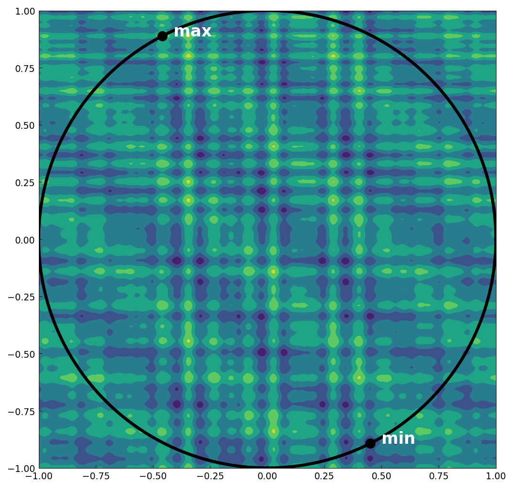
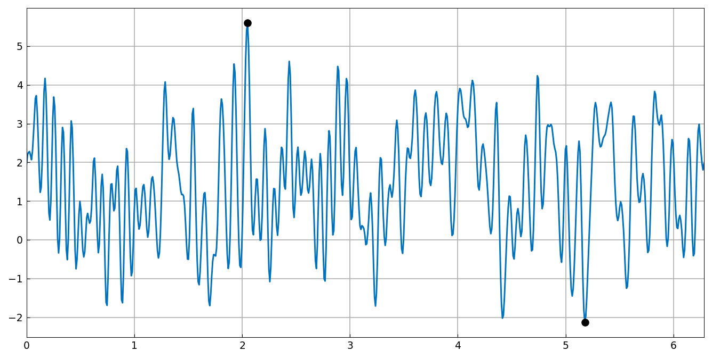

# Constrained extrema via composition

*Hrothgar, October 2013*

[Original MATLAB Chebfun example](https://www.chebfun.org/examples/opt/ConstrainedExtrema.html)

(Chebfun example opt/ConstrainedExtrema.m)

To find extrema of a multivariate function subject to a constraint,
compose it with a parametrization of the constraint set — no Lagrange
multipliers needed.  The extrema of $x^2-y^2$ on the unit circle:

```text
Y =
   1.000000000000000
  -1.000000000000000
   ...
X (on circle) =
    1.000000000000000    0.000000000000000
   -0.000000000000004    1.000000000000000
   -1.000000000000000    0.000000000000000
```

For the SIAM 100-digit-challenge function on the circle, the global
constrained min and max (digit-for-digit with MATLAB):

```text
Y =
  -2.123351672827962
   5.601493400930876
X =
    0.449587308415002   -0.893236392066598
   -0.458582925296231    0.888651619380031
```





On the surface $z = x^3 + y^2$, the extrema of $x+y+z$:

```text
Y =
  -2.250000000000000   4.000000000000000
X =
  -1.000000000000000 -0.500000000000000 -0.750000000000000
   1.000000000000000  1.000000000000000  2.000000000000000
```

And on a rotated square via the map $(u,v) \to (u-v, u+v)$:

```text
Y =
  -1.391273244992605   1.283662185463225
```

---

*Replicated with [chebfunjax](https://github.com/ma-gilles/chebfunjax); original
example copyright The University of Oxford and The Chebfun Developers.*
