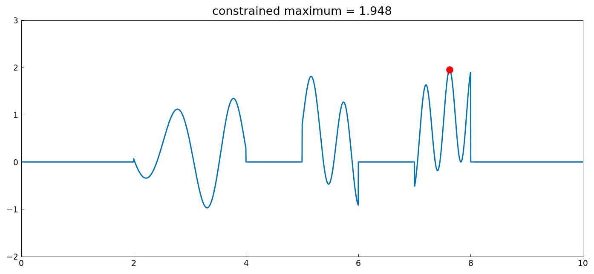
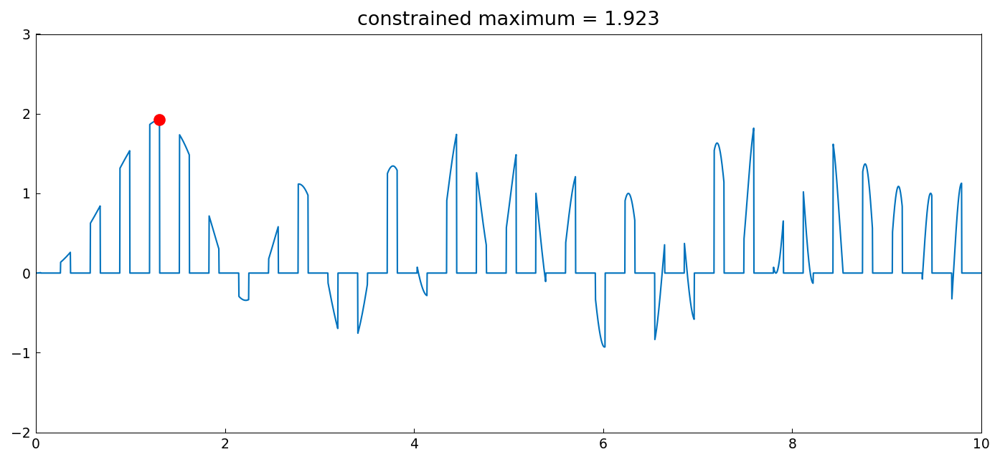
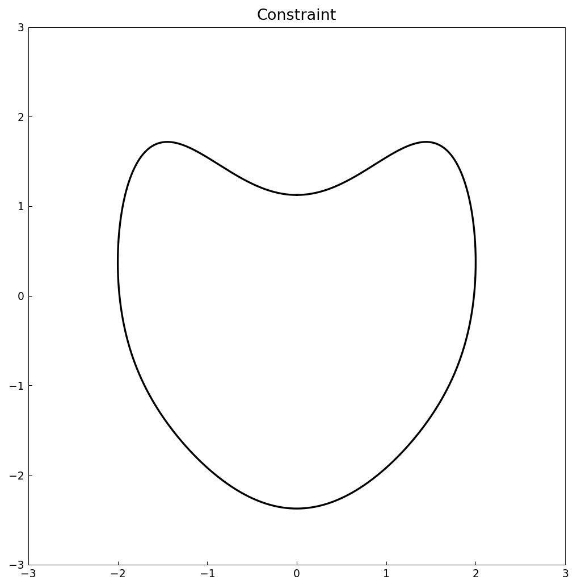
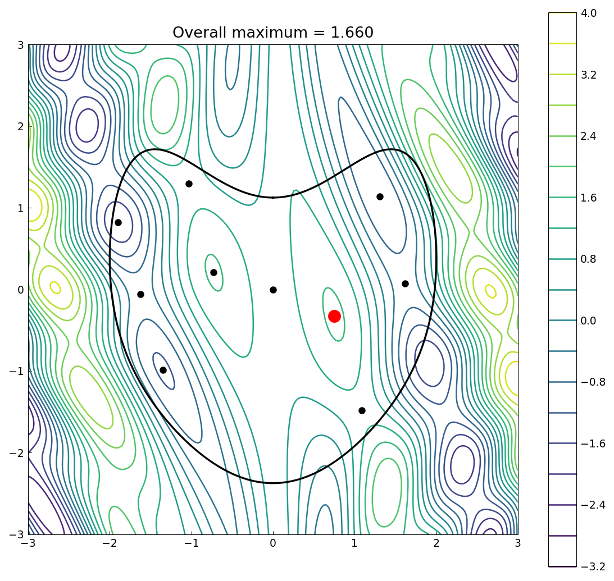

# Constrained optimization

*Alex Townsend, March 2013*

[Original MATLAB Chebfun example](https://www.chebfun.org/examples/opt/ConstrainedOptimization.html)

(Chebfun example opt/ConstrainedOptimization.m)

Set constraints become indicator functions.  Maximizing
$\sin^2 x + \sin x^2$ over the prime-indexed unit intervals
$[2,3] \cup [3,4] \cup [5,6] \cup [7,8]$:



Over the region where $|\sin 10x| < 1/2$:



For a 2D objective on a heart-shaped region, the maximum is either at
an interior critical point (roots of the gradient, filtered by the
region) or on the boundary curve (a 1D chebfun maximization):



```text
max_overall =
   1.659510987079419
```

(MATLAB: 1.659510987079417 — 15 digits.)



---

*Replicated with [chebfunjax](https://github.com/ma-gilles/chebfunjax); original
example copyright The University of Oxford and The Chebfun Developers.*
