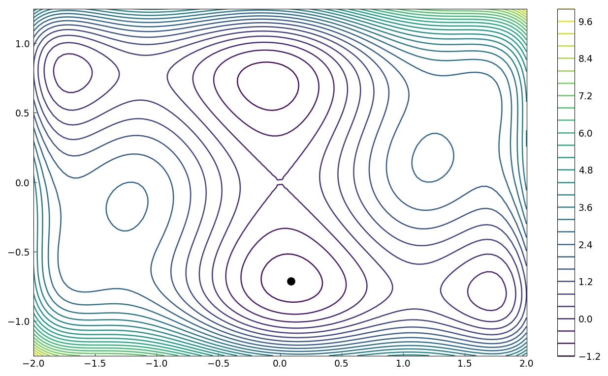

# The six-hump camel function of Dixon and Szego

*Nick Trefethen, September 2010*

[Original MATLAB Chebfun example](https://www.chebfun.org/examples/opt/DixonSzego.html)

(Chebfun example opt/DixonSzego.m)

The six-hump camel function is a classic global-optimization test
problem with six local minima, two of them global.  One approach:
minimize over $y$ for each $x$ (the inner minimum is found exactly),
build a chebfun of that profile with splitting, and minimize it:

```text
minx =
  0.089842015734230
minf =
  -1.031628453489866
miny =
   -0.712656403181555
```



Or in one step with chebfun2 `min2`, matching the published value to
all 15 digits:

```text
minf =
  -1.031628453489878
minx =
  0.089842013100321   -0.712656403020740
```

(MATLAB: -1.031628453489876 at (-0.0898, +0.7127) — the function is
symmetric under $(x,y) \to (-x,-y)$, so both global minimizers are
equally correct.)


---

*Replicated with [chebfunjax](https://github.com/ma-gilles/chebfunjax); original
example copyright The University of Oxford and The Chebfun Developers.*
