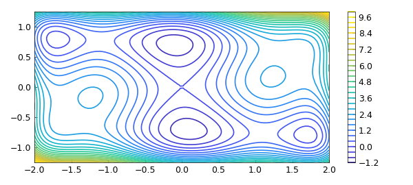
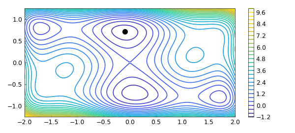
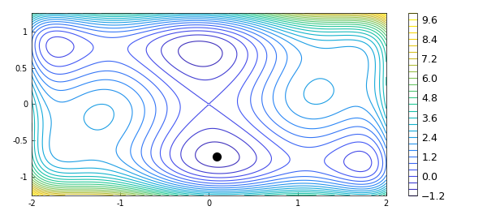

# The Dixon-Szego function in 2D optimisation

*Jari Fowkes and Nick Trefethen, November 2010*

[Original MATLAB Chebfun example](https://www.chebfun.org/examples/opt/DixonSzego.html)

Python translation: [`examples/opt/dixon_szego.py`](https://github.com/ma-gilles/chebfunjax/blob/main/examples/opt/dixon_szego.py)

## 1. 1D Chebfun solution

The Chebfun example "The Rosenbrock function in 2D optimization" shows how Chebfun can be used to minimize a function of two variables over a rectangle. The present example is adapted from that one, and simply considers another function investigated by Dixon and Szego in 1975:

```matlab
f = @(x,y) (4-2.1*x.^2+ x.^4/3).*x.^2 + x.*y + 4*(y.^2-1).*y.^2;
```

Over the rectangle $[-2,2] \times [-1.25,1.25]$, the function looks like this:

```matlab
LW = 'linewidth'; FS = 'fontsize'; MS = 'markersize';
x = linspace(-2,2); y = linspace(-1.25,1.25);
[xx,yy] = meshgrid(x,y); ff = f(xx,yy);
figure, contour(x,y,ff,30,LW,1.2), colorbar
axis([-2 2 -1.25 1.25]), hold on
```



Here is Chebfun code taken from [opt/Rosenbrock](Rosenbrock.md) to find the minimum and plot the point where it is attained. (The minimum is actually achieved at two points, because of symmetry, but Chebfun does not detect this.)

```matlab
tic
fminx0 = @(x0) min(chebfun(@(y) f(x0,y),[-1.25 1.25]));
fminx = chebfun(fminx0,[-2 2],'vectorize','splitting','on');
[minf,minx] = min(fminx)
[minf,miny] = min(chebfun(@(y) f(minx,y), [-1 3]))
toc
plot(minx,miny,'.k',MS,20)
```

```text
minf =
  -1.031628453489877
minx =
  -0.089842013100318
```



## 2. Chebfun2 solution

The above discussion was state-of-the-art Chebfun in 2010, but later it became more convenient and faster to solve such a problem with Chebfun2, as shown in the Chebfun example "The Rosenbrock function in 2D optimization (revisited)". Let us do likewise for this Dixon-Szego example. We can simply write

```matlab
tic
F = chebfun2(f,[-2,2,-1.25,1.25]);
[minf,minx] = min2(F)
toc
```

```text
minf =
  -1.031628453489880
miny =
   0.712656403020741
Elapsed time is 10.704986 seconds.
minf =
  -1.031628453489878
minx =
   0.089842013100321  -0.712656403020740
Elapsed time is 1.715555 seconds.
```

And here is a plot. Chebfun2 has made an arbitrary choice between the two equal global minima.

```matlab
hold off
contour(F,30,LW,1.2), colorbar, axis([-2 2 -1.25 1.25])
hold on, plot(minx(1),minx(2),'.k',MS,20)
```



## References

1. L. C. W. Dixon and G. P. Szego, The global optimization problem: an introduction, in L. C. W. Dixon and G. P. Szego (eds.), Towards Global Optimisation 2, North- Holland, Amsterdam 1978, pp. 1-15.

---

*Translated with [chebfunjax](https://github.com/ma-gilles/chebfunjax); prose and MATLAB code from the original example, copyright The University of Oxford and The Chebfun Developers.  Printed outputs and figures are chebfunjax's.*
