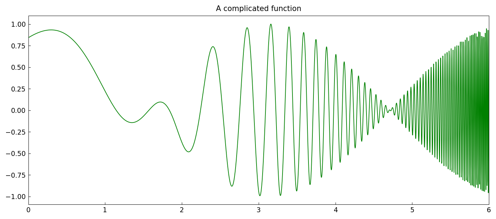
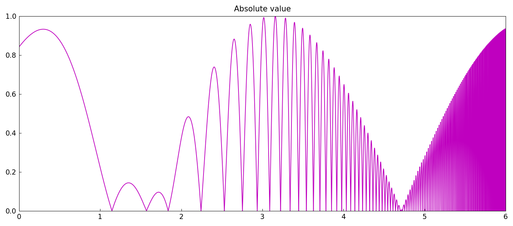
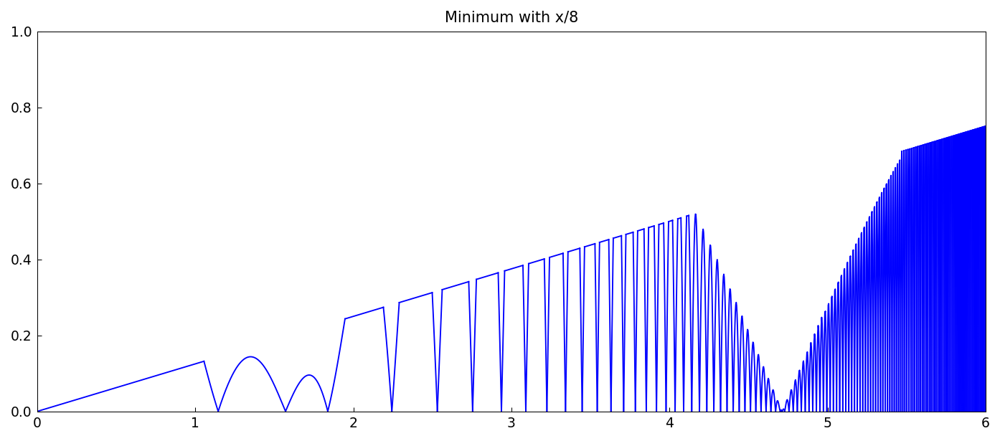
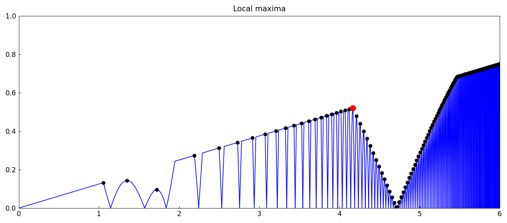

# Extrema of complicated functions

*Nick Trefethen, September 2010*

[Original MATLAB Chebfun example](https://www.chebfun.org/examples/opt/ExtremeExtrema.html)

(Chebfun example opt/ExtremeExtrema.m)

Here is a complicated oscillatory function, of length 546
(MATLAB: 551):



Its absolute value has dozens of corner breakpoints:



Taking the pointwise minimum with $x/8$ adds more:



The global maximum on $[0, 5]$, found through all that
nonsmoothness:

```text
maxval =
   0.520496207016819
maxpos =
   4.164759283173318
```

(MATLAB: 0.520496207016824 at 4.164759283173317 — 13-15 digits.)


And all the local maxima:



---

*Replicated with [chebfunjax](https://github.com/ma-gilles/chebfunjax); original
example copyright The University of Oxford and The Chebfun Developers.*
