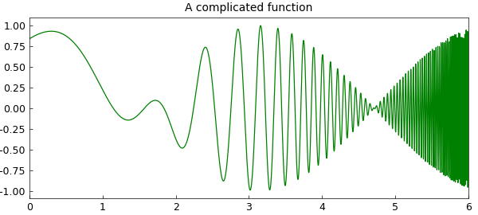
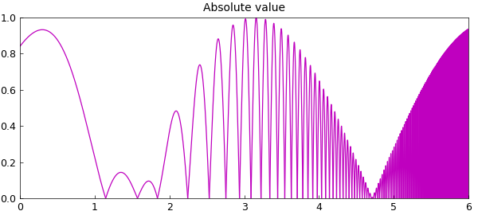
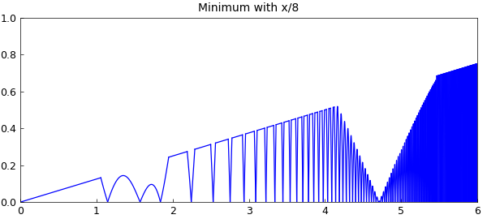
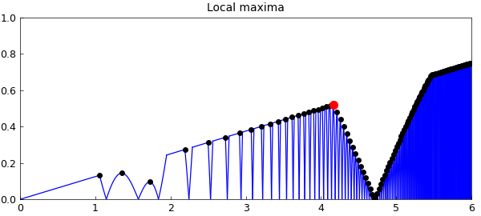

# Extrema of a complicated function

*Nick Trefethen, September 2010*

[Original MATLAB Chebfun example](https://www.chebfun.org/examples/opt/ExtremeExtrema.html)

Python translation: [`examples/opt/extreme_extrema.py`](https://github.com/ma-gilles/chebfunjax/blob/main/examples/opt/extreme_extrema.py)

Here is the function $\cos(x)\sin(e^x)$ on the interval $[0,6]$:

```matlab
tic, x = chebfun('x',[0 6]);
f = cos(x)*sin(exp(x));
length(f)
plot(f,'color',[0 .7 0])
title('A complicated function')
```

```text
ans =
   546
```



Here's its absolute value:

```matlab
g = abs(f);
ax = [0 6 0 1];
plot(g,'m'), axis(ax)
title('Absolute value')
```



Here's the minimum of that function and $x/8$:

```matlab
h = min(g,x/8);
plot(h), axis(ax)
title('Minimum with x/8')
```



We can find the maximum over the interval $[0,5]$ like this:

```matlab
MS = 'markersize';
[maxval,maxpos] = max(h{0,5})
hold on, plot(maxpos,maxval,'.r',MS,20)
title('Global maximum')
```

```text
maxval =
   0.520496207016819
maxpos =
   4.164759283173317
```


Let's add all the local maxima to the plot:

```matlab
[val,pos] = max(h,'local');
plot(pos,val,'.k',MS,10)
plot(maxpos,maxval,'.r',MS,20)
title('Local maxima')
```



These computations showcase the fact that Chebfun optimization is global -- whether in the sense of finding a global extremum, or in the sense of globally finding all the local extrema.

They also showcase the treatment of discontinuities. To find extrema, Chebfun examines zeros of the derivative. In some cases those are points where the derivative is continuous and passes through zero. In others, like the black dot near $x=1$ in the plot above, they are points where the derivative jumps from positive to negative or vice versa.

Here is the time for this whole sequence of computations:

```matlab
Total_time = toc
```

```text
Total_time =
   31.737974
```

---

*Translated with [chebfunjax](https://github.com/ma-gilles/chebfunjax); prose and MATLAB code from the original example, copyright The University of Oxford and The Chebfun Developers.  Printed outputs and figures are chebfunjax's.*
