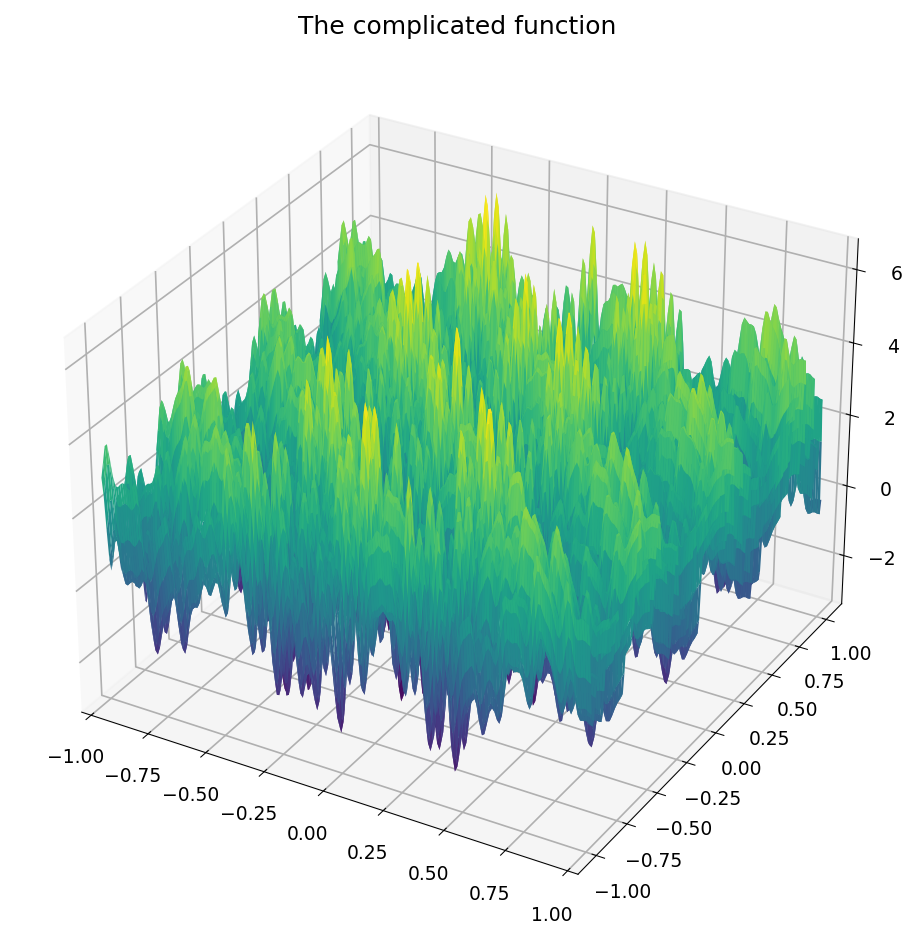
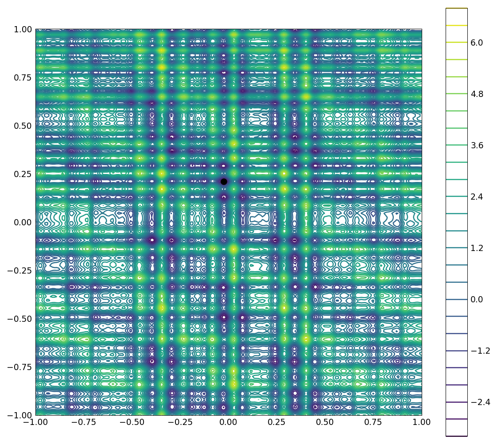
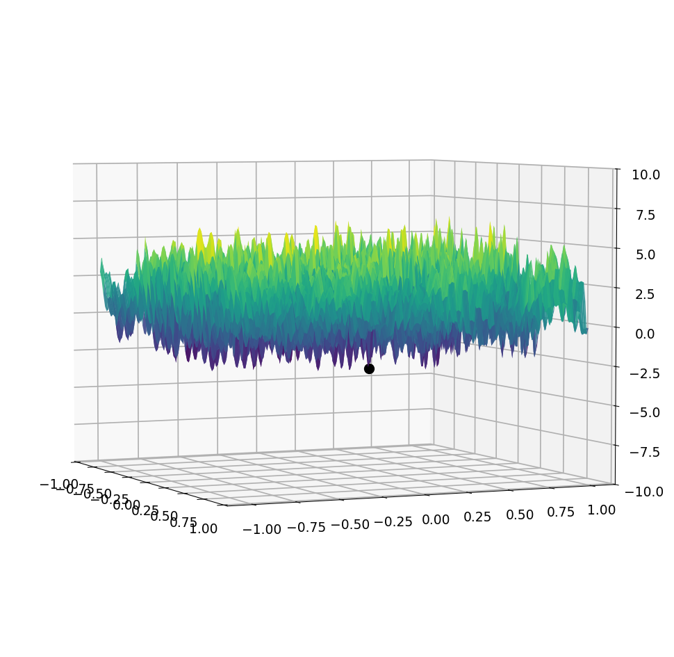

# The SIAM 100-digit challenge global minimum

*Alex Townsend, March 2013*

[Original MATLAB Chebfun example](https://www.chebfun.org/examples/opt/GlobalMinimum.html)

(Chebfun example opt/GlobalMinimum.m)

Problem 4 of the SIAM 100-Digit Challenge asks for the global minimum
of a violently oscillatory function:



Despite the oscillations the function has low rank, and chebfun2
finds the global minimum in one call:

```text
Rank of function = 4
Computed global minimum = -3.3068686474752416
Error in Chebfun2 minimum = 4.4409e-15
Total time taken = 7.0844s
```

(Rank matches MATLAB exactly; the error against the known 16-digit
answer is 4.4e-15 — two orders of magnitude better than the
published run's 4.46e-13.)





---

*Replicated with [chebfunjax](https://github.com/ma-gilles/chebfunjax); original
example copyright The University of Oxford and The Chebfun Developers.*
