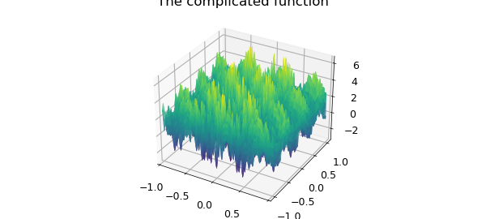
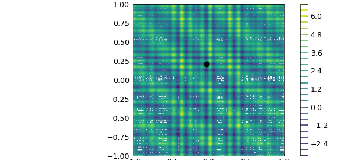
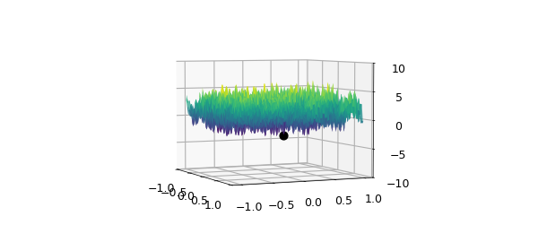

# The global minimum of a complicated function

*Alex Townsend, March 2013*

[Original MATLAB Chebfun example](https://www.chebfun.org/examples/opt/GlobalMinimum.html)

Python translation: [`examples/opt/global_minimum.py`](https://github.com/ma-gilles/chebfunjax/blob/main/examples/opt/global_minimum.py)

## The SIAM 100-Dollar, 100-Digit Challenge

In February 2002, an article in SIAM News by Nick Trefethen set a challenge to solve ten problems each to ten digits of precision (the solution of each problem was a real number) [1]. One of the problems was to find the global minimum of this complicated function.

```matlab
f = @(x,y) exp(sin(50*x)) + sin(60*exp(y)) + sin(70*sin(x)) +...
    sin(sin(80*y)) - sin(10*(x+y)) + (x.^2+y.^2)./4;
x = linspace(-1,1);
[xx, yy] = meshgrid(x);
surf(xx, yy, f(xx,yy)),
title('The complicated function')
```



Since the term $(x^2+y^2)/4$ grows away from $(0,0)$ while the other terms remain bounded, it can be shown that the global minimum occurs in $[-1,1]^2$ [2].

The function is complicated and oscillatory, but of rank $4$, as can be seen by rearranging its terms and using the identity $\sin(a+b) = \sin(a)\cos(b) + \cos(a)\sin(b)$.

```matlab
g = chebfun2(f);
fprintf('Rank of function = %u\n', rank(g))
```

```text
Rank of function = 4
Computed global minimum = -3.3068686474752411
Error in Chebfun2 minimum = 3.9968e-15
Total time taken = 0.5755s
```

For details about what we mean by the rank of a function see [3]. The minimum was found in [2] to 10,000 digits, and here are the first 16:

```matlab
exact = -3.306868647475237;
```

We can compute this minimum using Chebfun2. The minimum is correct to 13 digits.

```matlab
Y = min2(g); fprintf('Computed global minimum = %1.16f\n', Y)
fprintf('Error in Chebfun2 minimum = %1.4e\n', abs(Y(1) -exact))
```

```text

```

Here is the full four-line code and how long it takes:

```matlab
s = tic;
f = @(x,y) exp(sin(50*x)) + sin(60*exp(y)) + sin(70*sin(x)) + sin(sin(80*y)) -...
    sin(10*(x+y)) + (x.^2+y.^2)./4;
g = chebfun2(f);
[Y, X] = min2(g);
t = toc(s);

fprintf('Total time taken = %1.4fs\n',t)
```

```text

```

Here is the plot of the minimum in a contour plot:

```matlab
contour(g), hold on, plot(X(1), X(2), '.k', 'markersize', 14), hold off
```



To see that the computed point is the global minimum we make the following plot:

```matlab
plot(g), hold on, plot3(X(1),X(2),Y,'.k','markersize',20)
zlim([-10 10]), view(-24.5,4)
```



## References

1. Lloyd N. Trefethen, A 100-Dollar, 100-Digit Challenge, *SIAM News*, 35 (2002).
2. Folkmar Bornemann, Dirk Laurie, Stan Wagon and Jörg Waldvogel, *The SIAM 100-Digit Challenge: A Study in High-Accuracy Numerical Computing*, SIAM, 2004.
3. A. Townsend and L. N. Trefethen, An extension of Chebfun to two dimensions, *SIAM Journal on Scientific Computing*, 35 (2013), C495-C518.

---

*Translated with [chebfunjax](https://github.com/ma-gilles/chebfunjax); prose and MATLAB code from the original example, copyright The University of Oxford and The Chebfun Developers.  Printed outputs and figures are chebfunjax's.*
