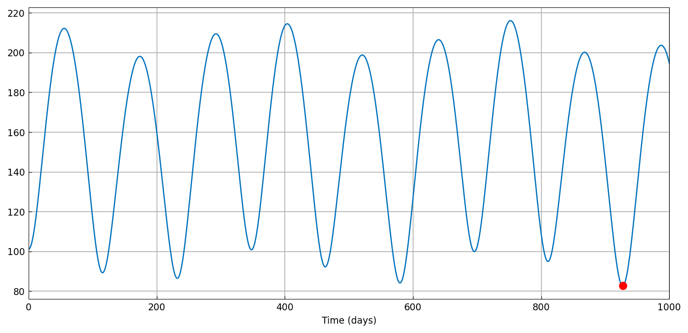
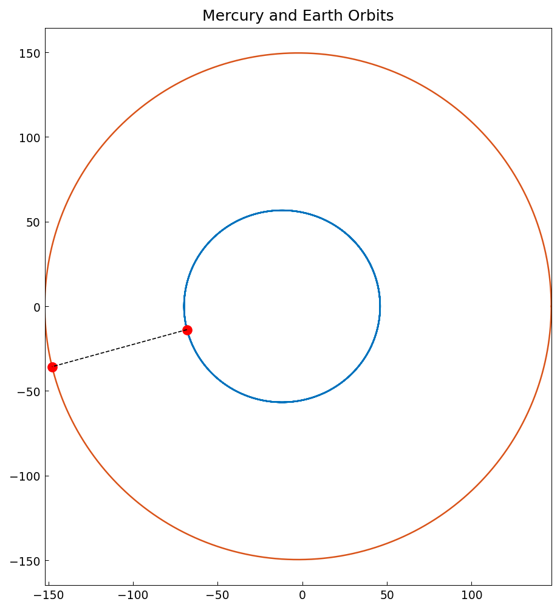

# Closest approach of Mercury and Earth

*Tonatiuh Sanchez-Vizuet, June 2014*

[Original MATLAB Chebfun example](https://www.chebfun.org/examples/opt/MercuryEarth.html)

(Chebfun example opt/MercuryEarth.m)

With elliptical-orbit approximations for Mercury and Earth, the
distance between the planets becomes a chebfun of time, and its
global minimum over 1000 days is one `min` call:

```text
min distance = 82.656196 at t = 927.124302 days
```



The orbits with the closest-approach configuration marked:



---

*Replicated with [chebfunjax](https://github.com/ma-gilles/chebfunjax); original
example copyright The University of Oxford and The Chebfun Developers.*
