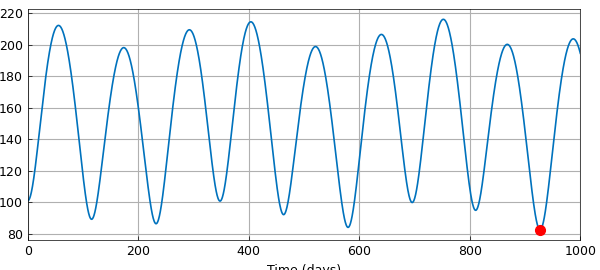
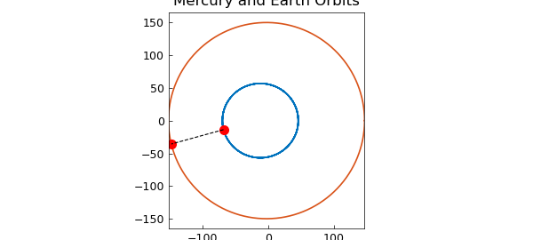

# Mercury-Earth minimum separation

*Tonatiuh Sanchez-Vizuet and Matthew Moye, June 2012*

[Original MATLAB Chebfun example](https://www.chebfun.org/examples/opt/MercuryEarth.html)

Python translation: [`examples/opt/mercury_earth.py`](https://github.com/ma-gilles/chebfunjax/blob/main/examples/opt/mercury_earth.py)

Let us take as our domain a period of 1000 days.

```matlab
dom = [0 1000];
t = chebfun('t', dom);
```

Here are some equations we shall take as the elliptical orbits of the Earth and Mercury during this period [1]:

```matlab
y_m = 56.6741*sin(2*pi*t/87.97);
x_m = -11.9084+57.9117*cos(2*pi*t/87.97);
y_e = 149.5832*sin(2*pi*t/365.25);
x_e = -2.4987 + 149.6041*cos(2*pi*t/365.25);
```

Chebfun is excellent in computing a function like the distance between the planets as a function of time:

```matlab
f = sqrt((y_m-y_e).^2 + (x_m-x_e).^2);
```

We can now compute `minval`, the minimum distance, and `mintime`, the time of its occurrence.

```matlab
[minval,mintime] = min(f);
plot(t,f)
xlabel('Time (days)')
hold on, plot(mintime,minval, '.r', 'markersize', 20)
```



Here are the parametrized orbits with the planets' positions at `mintime`.

```matlab
figure
plot(x_m, y_m), hold on
plot(x_e, y_e)
plot(x_m(mintime),y_m(mintime),'.r', 'markersize', 20)
plot(x_e(mintime),y_e(mintime),'.r', 'markersize', 20)
title('Mercury and Earth Orbits')
```



## References

1. Charles F. Van Loan, Introduction to Scientific Computing, 1997, p. 274.

---

*Translated with [chebfunjax](https://github.com/ma-gilles/chebfunjax); prose and MATLAB code from the original example, copyright The University of Oxford and The Chebfun Developers.  Printed outputs and figures are chebfunjax's.*
