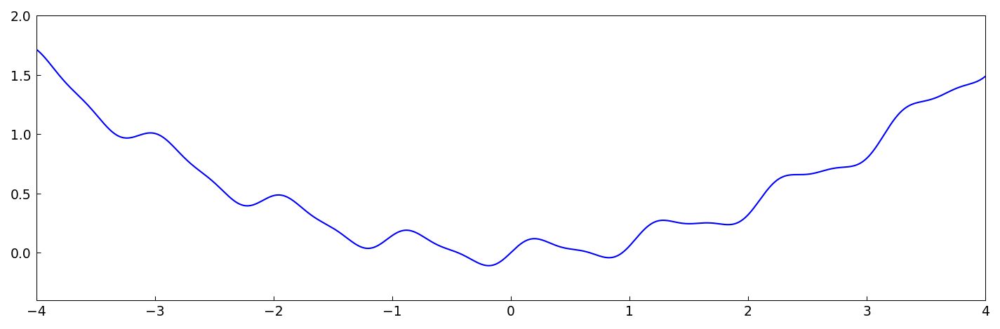
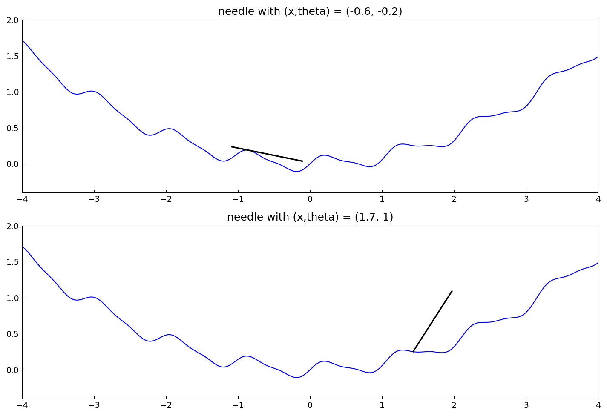
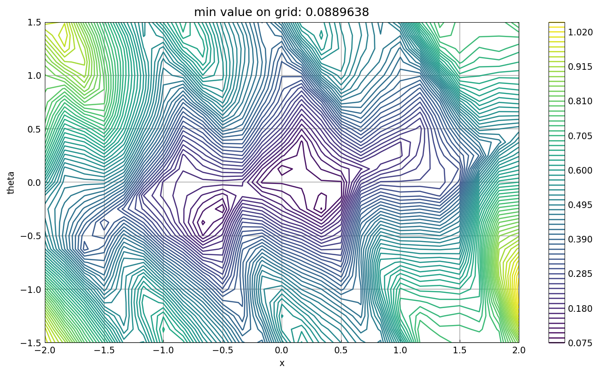
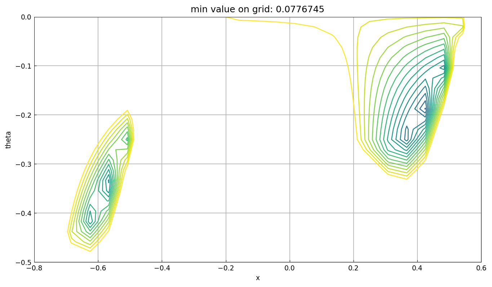
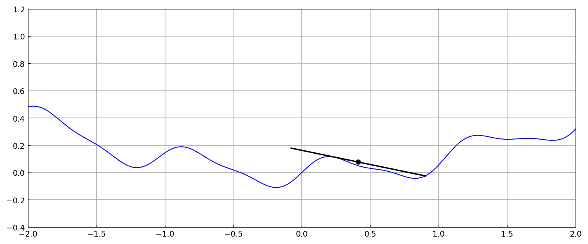

# The lowest position of a resting needle

*Nick Trefethen, October 2012*

[Original MATLAB Chebfun example](https://www.chebfun.org/examples/opt/Needle.html)

(Chebfun example opt/Needle.m)

A needle of length 1 rests on the bumpy landscape
$h(s) = 0.1s^2 + 0.1\sin 6s + 0.03\sin 12s$.  For a horizontal
position $x$ and inclination $\theta$, the resting height is the
maximum of $h$ minus the needle line over the needle's span:





The resting-height landscape over $(x, \theta)$ — a nonsmooth
surface, since the supporting contact point jumps:





Nelder-Mead polish from the promising corner gives the needle's
lowest resting position:

```text
yval =
   0.076897720345079
```

(MATLAB: 0.076897745875264 — the objective is nonsmooth at the
optimum where the needle switches support points, and the two
simplex searches settle 2.6e-8 apart.)



---

*Replicated with [chebfunjax](https://github.com/ma-gilles/chebfunjax); original
example copyright The University of Oxford and The Chebfun Developers.*
