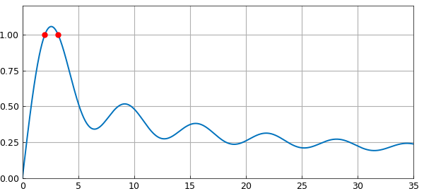
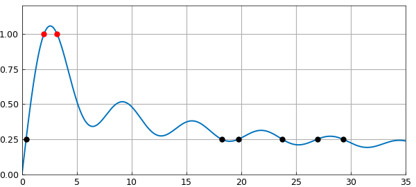

# Optimization of a parameterised integral

*Nick Hale, October 2011*

[Original MATLAB Chebfun example](https://www.chebfun.org/examples/opt/OptimInt.html)

Python translation: [`examples/opt/optim_int.py`](https://github.com/ma-gilles/chebfunjax/blob/main/examples/opt/optim_int.py)

This example shows how easy it is to solve one of the example problems from the Oxford MSc in Mathematical Modelling and Scientific Computing week 0 MATLAB 'Crash Course' using Chebfun. (And also how easy it is to make a Chebfun Example!).

**Problem.** For what values of $a$ does

$$ I(a) = \int_{-1}^1 \sin(x) + \sin(a x^2) dx = 1 ? $$

**Solution.** Define the integrand as a function of $x$ and $a$.

```matlab
F = @(x,a) sin(x) + sin(a*x.^2);
```

For a given $a$, we can compute the integral using Chebfun's `sum` command.

```matlab
I = @(a) sum(chebfun(@(x) F(x,a)));
```

We compute a chebfun of this result, for $a$ ranging from $0$ to $100$.

```matlab
Ia = chebfun(@(a) I(a),[0 100]);
```

We use Chebfun's `roots` command to find where $I(a)=1$.

```matlab
r = roots(Ia-1)
```

```text
r =
   2.011698636650799
   3.199526913460069
```

We plot this, to make sure it looks sensible.

```matlab
plot(Ia), hold on, grid on
axis([0 35 0 1.2]), set(gca,'ytick',0:.25:1)
plot(r,Ia(r),'.r');
```



Since we have $I(a)$ as a chebfun, we can do other things, like find where $I(a) = 0.25$

```matlab
r = roots(Ia-0.25)
plot(r,Ia(r),'.k'), hold off
```

```text
r =
   0.378866771015893
  18.225950880000585
  19.761174831761778
  23.753831561562009
  26.956276286229954
  29.291546747613690
```



or the value of $a$ which maximises $I(a)$

```matlab
m = max(Ia)
```

```text
m =
   1.056688680049085
```

or the standard deviation of the gaps between the local minima for $a\in [0,100]$.

```matlab
[y x] = min(Ia,'local');
f = std(diff(x(2:end-1)))
```

```text
f =
   0.005171642455007
```

---

*Translated with [chebfunjax](https://github.com/ma-gilles/chebfunjax); prose and MATLAB code from the original example, copyright The University of Oxford and The Chebfun Developers.  Printed outputs and figures are chebfunjax's.*
