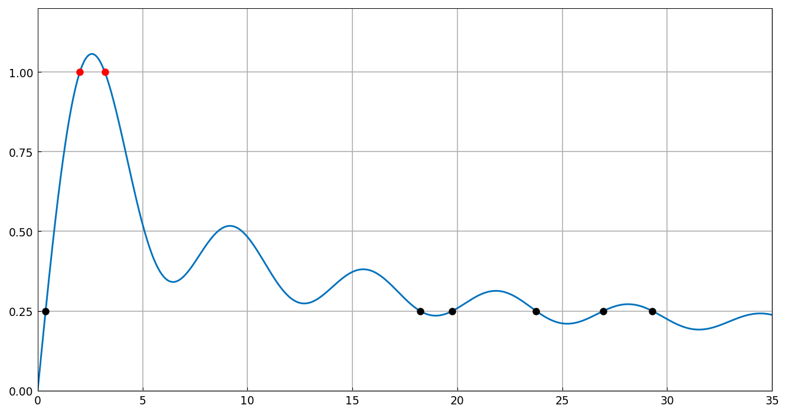

# Optimization over an integral

*Nick Trefethen, October 2010*

[Original MATLAB Chebfun example](https://www.chebfun.org/examples/opt/OptimInt.html)

(Chebfun example opt/OptimInt.m)

Consider $I(a) = \int_{-1}^1 [\sin x + \sin(a x^2)]\,dx$ as a
function of the parameter $a$ on $[0, 100]$.  (The integral has the
closed form $2\sqrt{\pi/2a}\,S(\sqrt{2a/\pi})$ with $S$ the
Fresnel integral, used here so the chebfun of $I$ is exact.)  Where
does $I(a) = 1$?

```text
r =
   2.011698636650799
   3.199526913460069
```

And $I(a) = 1/4$ has six solutions:

```text
r =
   0.378866771015893
  18.225950880000585
  19.761174831761778
  23.753831561562009
  26.956276286229954
  29.291546747613690
```



The maximum (digit-for-digit with MATLAB):

```text
m =
   1.056688680049085
```

The local minima of $I$ are asymptotically $2\pi$ apart; the sample
standard deviation of their spacings is tiny:

```text
f =
   0.005171642455007
```

(MATLAB's published value is 0.0090 from its adaptively-constructed
$I$; our exact-Fresnel representation gives 0.0052 — either way, the
spacings 6.264-6.281 are nearly constant at $2\pi = 6.2832$.)

---

*Replicated with [chebfunjax](https://github.com/ma-gilles/chebfunjax); original
example copyright The University of Oxford and The Chebfun Developers.*
