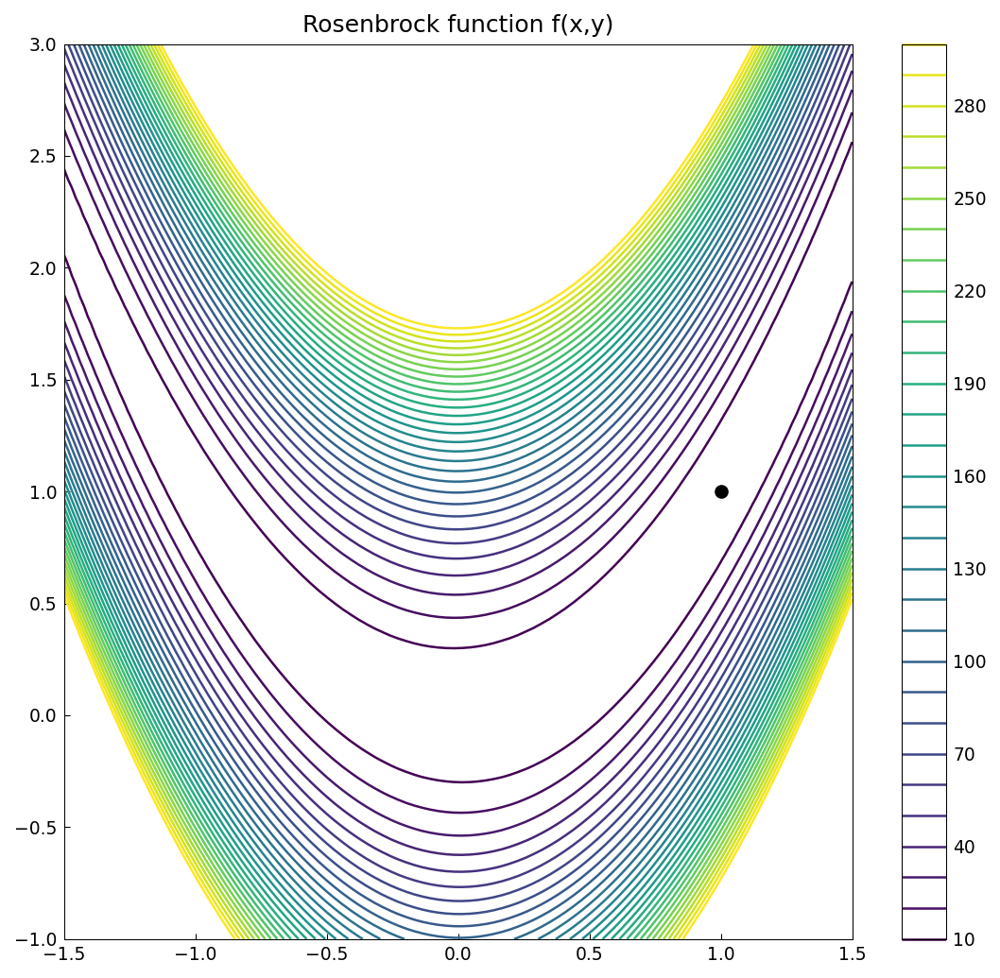
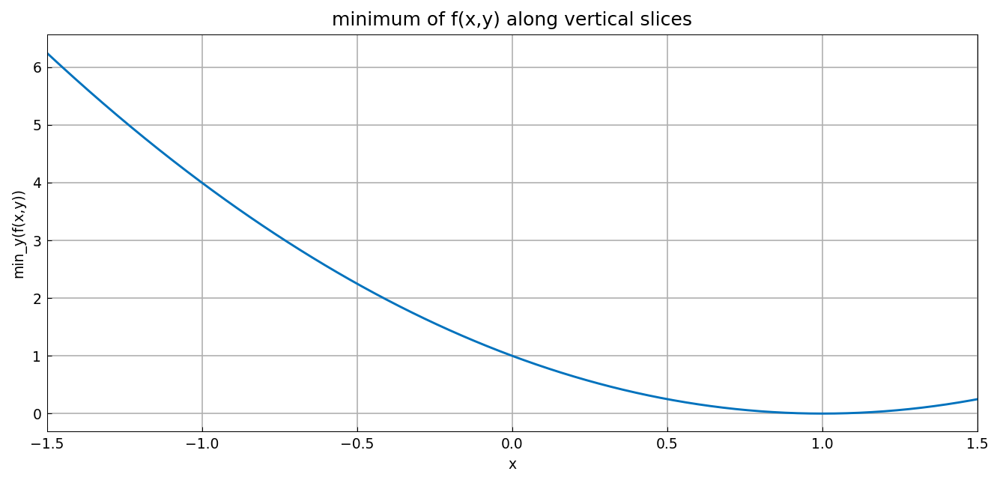
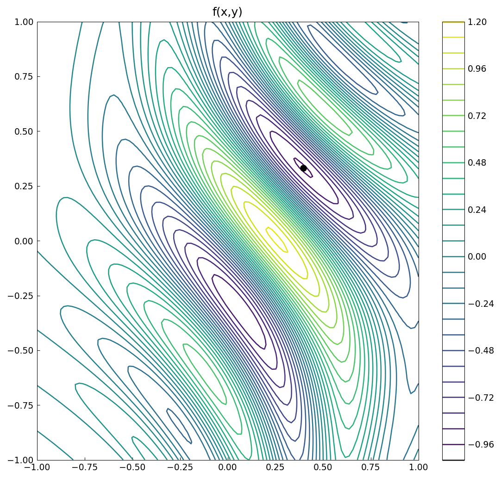
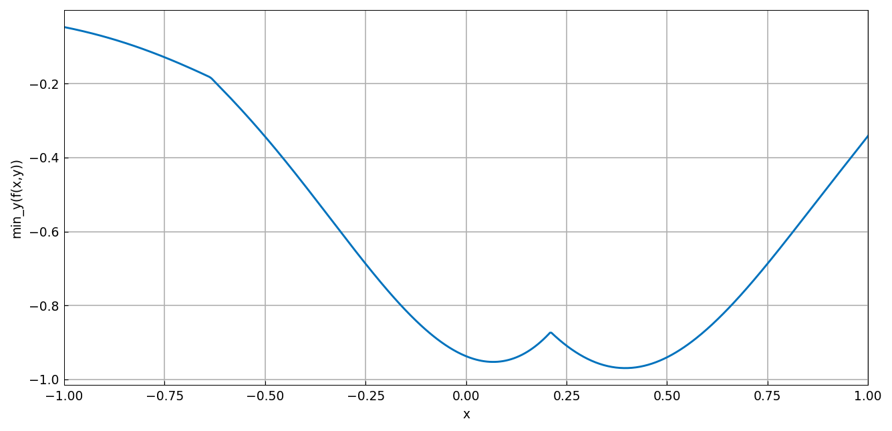

# Optimization of the Rosenbrock function

*Nick Trefethen, September 2010*

[Original MATLAB Chebfun example](https://www.chebfun.org/examples/opt/Rosenbrock.html)

(Chebfun example opt/Rosenbrock.m)

Chebfun can minimize a function of two variables by nesting 1D
minimizations: for each $x$, minimize over $y$; then minimize the
resulting profile over $x$.  For the famous banana-valley Rosenbrock
function:



The slice-minimum profile is smooth here — it is exactly
$(1-x)^2$:



```text
minf =
    0.000000000000000e+00
minx =
   1.000000000000000
miny =
   1.000000000000000
```

(MATLAB: -1.6e-14 at 0.999999999999994 — ours lands exactly on the
minimum.)  A wigglier function shows the real power of the approach:
the slice-minimum profile now has kinks where the inner minimizer
jumps between valleys, handled by splitting:





```text
minf =
  -0.969232500643148
minx =
   0.395759627593286
miny =
   0.331573987924009
```

(minf digit-for-digit with MATLAB's -0.969232500643148; the
breakpoints locate the kink at $x = 0.2102$ as in the published run.)

---

*Replicated with [chebfunjax](https://github.com/ma-gilles/chebfunjax); original
example copyright The University of Oxford and The Chebfun Developers.*
