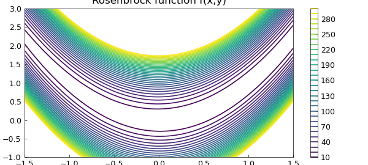
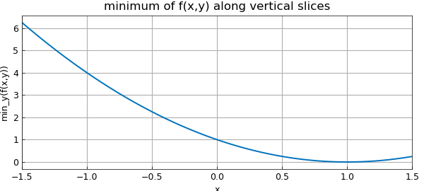
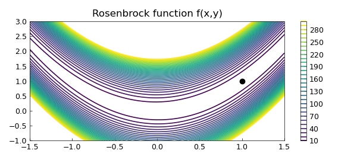
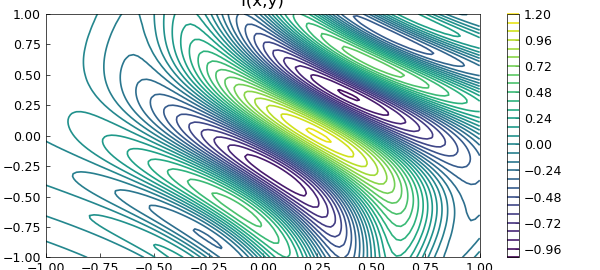
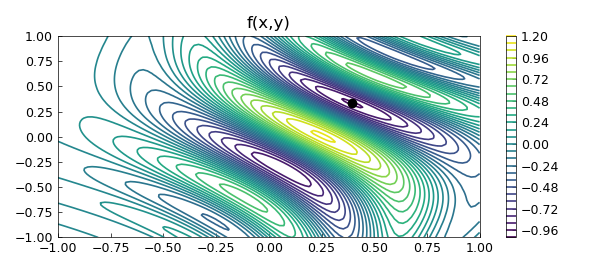

# The Rosenbrock function in 2D optimisation

*Nick Trefethen, October 2010*

[Original MATLAB Chebfun example](https://www.chebfun.org/examples/opt/Rosenbrock.html)

Python translation: [`examples/opt/rosenbrock.py`](https://github.com/ma-gilles/chebfunjax/blob/main/examples/opt/rosenbrock.py)

## 1. The Rosenbrock function

Chebfun can often do quite a good job of minimizing or maximizing a function defined on a 2D rectangle. Since the introduction of Chebfun2 in 2013, this would normally done with Chebfun2, but this example, originally written in 2010, uses 1D Chebfun to do the job. The "Rosenbrock revisited" Example treats the same problem more properly, and more efficiently, with Chebfun2 [3].

The example we consider is the famous and challenging "Rosenbrock function":

```matlab
f = @(x,y) (1-x).^2 + 100*(y-x.^2).^2;
```

First let's plot it to get an idea:

```matlab
x = linspace(-1.5,1.5); y = linspace(-1,3);
[xx,yy] = meshgrid(x,y); ff = f(xx,yy);
levels = 10:10:300;
MS = 'markersize';
figure, contour(x,y,ff,levels), colorbar
axis([-1.5 1.5 -1 3]), axis square, hold on
title('Rosenbrock function f(x,y)')
```



It's obvious from the formula that the minimum value is $0$, taken at $x=y=1$. In 1D Chebfun, we can find this by taking slices. If $x_0$ is a constant, then the minimum of $f(x_0,y)$ over all $y$ can be obtained like this:

```matlab
fminx0 = @(x0) min(chebfun(@(y) f(x0,y),[-1 3]));
```

Now we can make a chebfun representing `fminx` as a function of $x$:

```matlab
fminx = chebfun(fminx0,[-1.5 1.5],'splitting','on');
figure, plot(fminx)
xlabel('x'), ylabel('min_y(f(x,y))')
title('minimum of f(x,y) along vertical slices')
```



The global minimum of $f(x,y)$ is the minimum of `fminx`:

```matlab
format long
[minf,minx] = min(fminx)
```

```text
minf =
    0
minx =
   1.000000000000000
```

The variable `minx` represents the $x$-coordinate of the minimum. We can find the $y$ coordinate like this:

```matlab
[minf,miny] = min(chebfun(@(y) f(minx,y), [-1 3]))
```

```text
minf =
    0
miny =
   1.000000000000000
```

Let's show the contour plot again, with the minimum point:

```matlab
close, plot(minx,miny,'.k',MS,14)
```



## 2. A function with several local minima

Why did we put `splitting on` in this computation? It wasn't actually necessary in this case, but it would be necessary for more general functions $f(x,y)$ having several local extrema, because then the function `fminx` might not be smooth.

For example, consider this function defined on the square $[-1,1]\times[-1,1]$:

```matlab
f = @(x,y) exp(x-2*x.^2-y.^2).*sin(6*(x+y+x.*y.^2));
x = linspace(-1,1); y = linspace(-1,1);
[xx,yy] = meshgrid(x,y); ff = f(xx,yy);
figure, contour(x,y,ff,30), colorbar
axis([-1 1 -1 1]), axis square, hold on
title('f(x,y)')
```



We define `fminx0` and `fminx` as before. Because of the lack of smoothness and the consequent need for edge detection, this computation takes a little while:

```matlab
tic
fminx0 = @(x0) min(chebfun(@(y) f(x0,y),[-1 1]));
fminx = chebfun(fminx0,[-1 1],'splitting','on');
figure, plot(fminx)
xlabel('x'), ylabel('min_y(f(x,y))')
title('minimum of f(x,y) along vertical slices')
toc
```

```text
Elapsed time is 7.944629 seconds.
```


Here are the breakpoints that Chebfun has introduced:

```matlab
fminx.ends
```

```text
ans =
  Columns 1 through 3
  -1.000000000000000  -0.635879980369327   0.210235767954138
  Column 4
   1.000000000000000
```

We can now quickly compute the global minimum as before:

```matlab
[minf,minx] = min(fminx)
[minf,miny] = min(chebfun(@(y) f(minx,y), [-1 3]))
```

```text
minf =
  -0.969232500643148
minx =
   0.395759633465399
minf =
  -0.969232500643147
miny =
   0.331573983161214
```

And here's the plot:

```matlab
close, plot(minx,miny,'.k',MS,14)
```



## References

1. H. H. Rosenbrock, "An automatic method for finding the greatest or least value of a function", Computer Journal 3 (1960), 175-184.
2. S. Scheuring, Global Optimization in the Chebfun System, thesis, MSc in Mathematical Modelling and Scientific Computing, Oxford University, 2008.
3. Chebfun Example [opt/Rosenbrock2](Rosenbrock2.md)

---

*Translated with [chebfunjax](https://github.com/ma-gilles/chebfunjax); prose and MATLAB code from the original example, copyright The University of Oxford and The Chebfun Developers.  Printed outputs and figures are chebfunjax's.*
