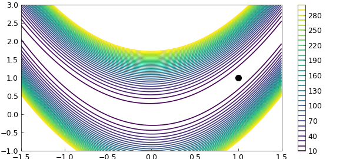
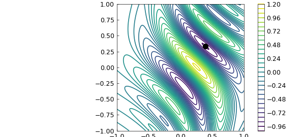
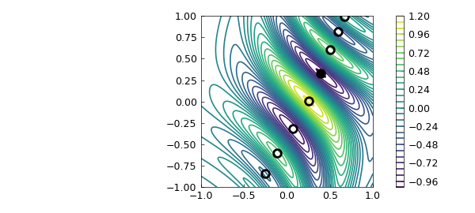
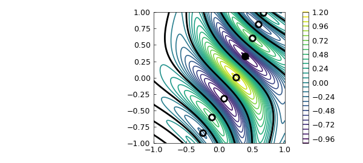
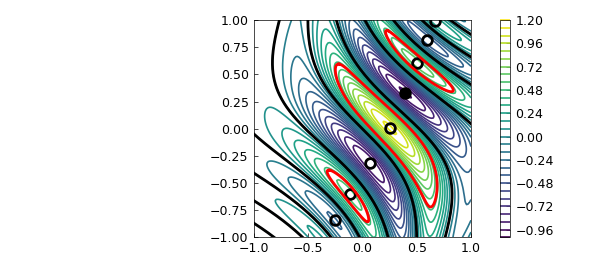

# The Rosenbrock function in 2D optimisation (revisited)

*Nick Hale, March 2013*

[Original MATLAB Chebfun example](https://www.chebfun.org/examples/opt/Rosenbrock2.html)

Python translation: [`examples/opt/rosenbrock2.py`](https://github.com/ma-gilles/chebfunjax/blob/main/examples/opt/rosenbrock2.py)

## 1. The Rosenbrock function

One of the very first Chebfun examples [2] demonstrated how standard 1D Chebfun can do a reasonable job of minimizing or maximizing a function defined on a 2D rectangle, such as the Rosenbrock function [1]:

```matlab
f = @(x,y) (1-x).^2 + 100*(y-x.^2).^2;
```

With the introduction of Chebfun2 in 2013, this task became much simpler.

```matlab
F = chebfun2(f, [-1.5 1.5 -1 3]);
[minf, minx] = min2(F)
```

```text
minf =
     -5.684341886080801e-14
minx =
   0.999999999999780   0.999999999999545
```

We can plot the function and the computed minimum like this:

```matlab
LW = 'LineWidth';  lw = 1;
MS = 'MarkerSize'; ms = 20;
contour(F, 10:10:300, LW, lw), colorbar, shg
hold on, plot(minx(1), minx(2), '.k', MS, ms), hold off
```



## 2. A function with several local minima

The example [2] explained how Chebfun computed these results: by taking maxima along 1D slices, and then taking the maximum of these results. For functions with multiple local minima, like the one below, this meant the `splitting on` flag needed to be set.

```matlab
f = @(x,y) exp(x-2*x.^2-y.^2).*sin(6*(x + y + x.*y.^2));
```

Chebfun2 uses a different algorithm for locating maxima and minima, and so splitting is not required in this case. The following computation is much faster than before.

```matlab
tic
F = chebfun2(f);
[minf, minx] = min2(F)
toc
```

```text
minf =
  -0.969232500643149
minx =
   0.395759627595279   0.331573987891013
Elapsed time is 3.502184 seconds.
```

Here is a plot, again with the computed global minimum.

```matlab
contour(F,30, LW, lw), colorbar, hold on
plot(minx(1), minx(2), '.k', MS, ms)
```



In fact, since Chebfun2 is really working with a 2D representation, we can investigate more deeply.

For example we can compute all the stationary points of $f$ and add these to our contour plot:

```matlab
tp = roots(grad(F))
plot(tp(:,1), tp(:,2), 'ko', MS, 12, LW, 2)
```

```text
tp =
  -0.254107550759406  -0.842267634382986
  -0.112229538510300  -0.603133543918096
   0.067365721534432  -0.317601643415144
   0.253778760811323   0.007586184707215
   0.395759627601439   0.331573987886839
   0.504693529063452   0.601204260241065
   0.595308872488359   0.817030764537072
   0.672904440396165   0.994413300108118
```



We can make chebfuns of the zero level curves of $F$:

```matlab
g = roots(F);
plot(g, 'k', LW, 2), shg
```



Or we can even make chebfuns of the $.5$ level curves of $F$:

```matlab
g = roots(F - .5);
plot(g, 'r', LW, 2), shg
```



## References

1. H. H. Rosenbrock, "An automatic method for finding the greatest or least value of a function", *Computer Journal*, 3 (1960), 175-184.
2. Chebfun Example [opt/Rosenbrock](Rosenbrock.md)

---

*Translated with [chebfunjax](https://github.com/ma-gilles/chebfunjax); prose and MATLAB code from the original example, copyright The University of Oxford and The Chebfun Developers.  Printed outputs and figures are chebfunjax's.*
