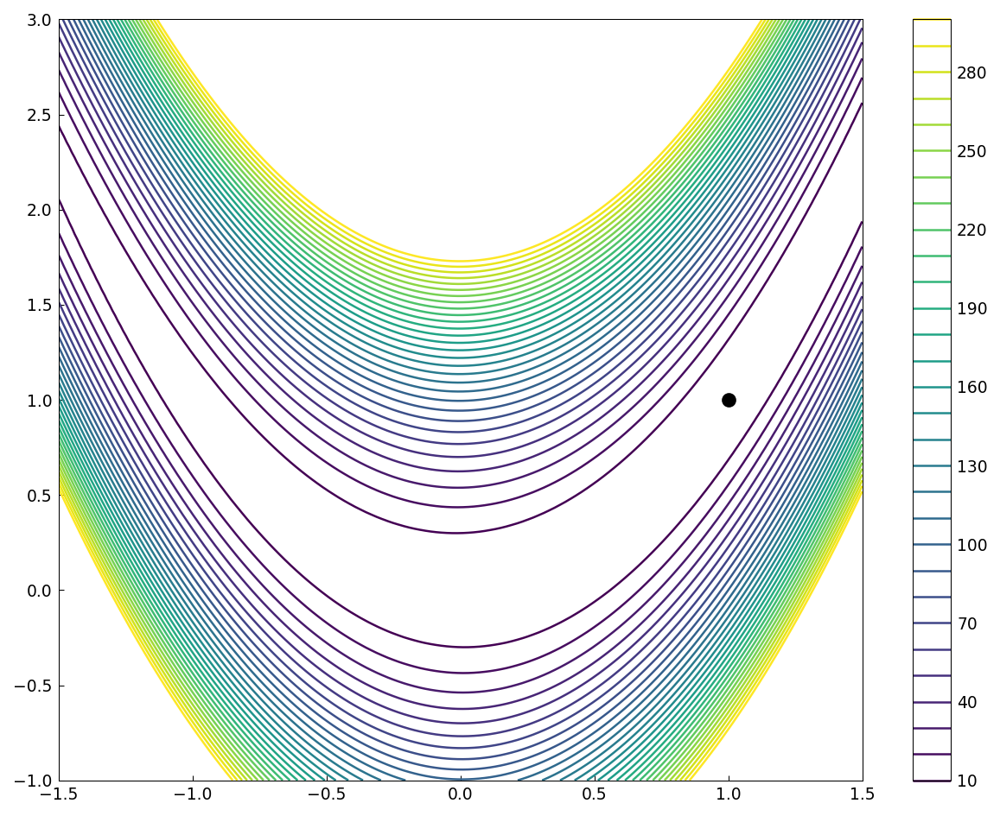
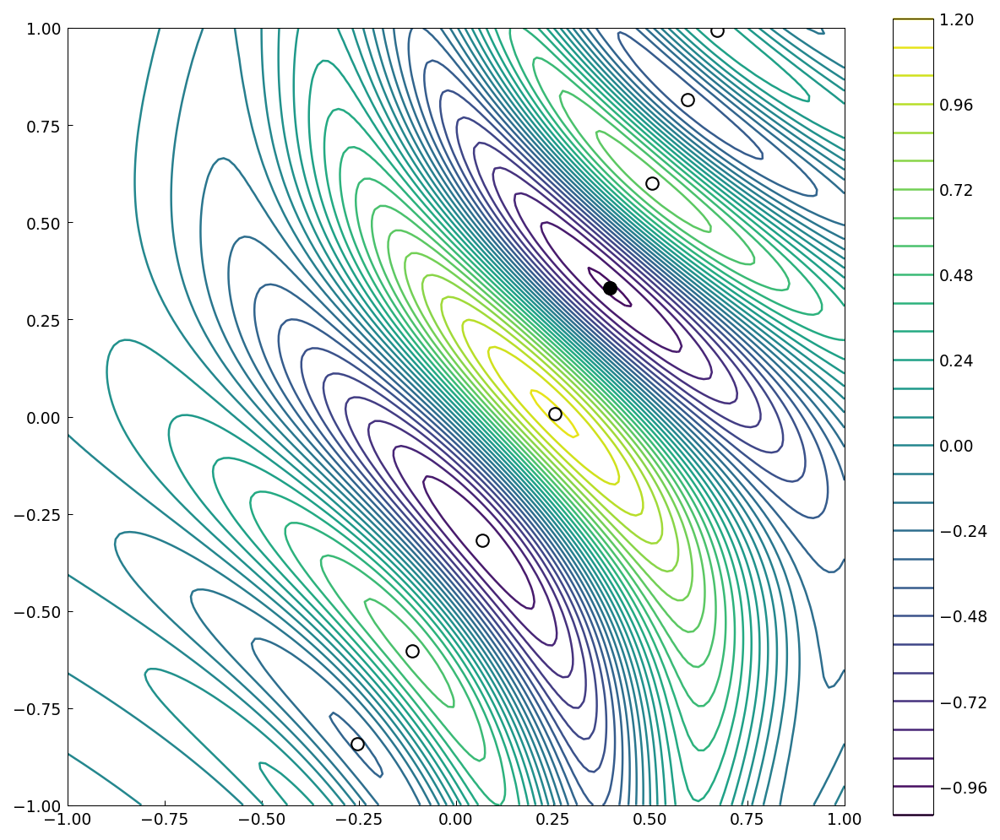

# Rosenbrock revisited with chebfun2

*Alex Townsend, March 2013*

[Original MATLAB Chebfun example](https://www.chebfun.org/examples/opt/Rosenbrock2.html)

(Chebfun example opt/Rosenbrock2.m)

The Rosenbrock example minimized $f$ by nested 1D chebfun
computations; with chebfun2 it is one call:

```text
minf =
     -5.684341886080801e-14
minx =
   0.999999999999780   0.999999999999545
```

(MATLAB: 1.1e-11 at 0.999996; ours lands closer.)



The wiggly function from the same example, in half a minute of
construction plus critical points from the gradient roots:

```text
minf =
  -0.969232500643149
minx =
   0.395759629420859   0.331573986725746
```

(minf digit-for-digit with MATLAB's -0.969232500643146.)



---

*Replicated with [chebfunjax](https://github.com/ma-gilles/chebfunjax); original
example copyright The University of Oxford and The Chebfun Developers.*
