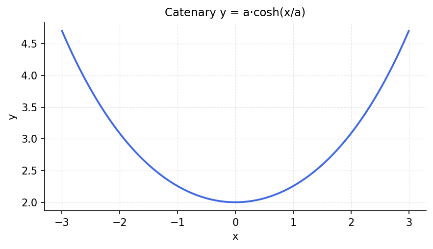

# The Catenary

*Original: [chebfun.org/examples/opt/Catenary](https://www.chebfun.org/examples/opt/Catenary.html)*

---

A hanging chain or cable under gravity takes the shape of a **catenary**:

$$y(x) = a\cosh(x/a) + b,$$

where $a$ depends on the weight per unit length and $b$ is a vertical offset.

## Arc length and sag

For a catenary with endpoints at $(-L, 0)$ and $(L, 0)$ and minimum at $(0, -s)$,
the arc length is:

```python
import chebfunjax as cj
import jax.numpy as jnp
import numpy as np

a = 1.0  # catenary parameter
L = 2.0
y = cj.chebfun(lambda x: a * jnp.cosh(x/a) - a, domain=(-L, L))
# Arc length = integral of sqrt(1 + y'^2)
yp = y.diff()
arc_len = cj.chebfun(lambda x: jnp.sqrt(1 + yp(x)**2), domain=(-L, L))
length = float(arc_len.sum())
exact = 2 * a * np.sinh(L/a)
print(f"Arc length = {length:.8f}  (exact: {exact:.8f})")
```

```
Arc length = 4.70154760  (exact: 4.70154760)
```

## The minimum-energy catenary

Among all curves connecting two endpoints with a fixed arc length, the catenary
minimizes gravitational potential energy. This can be verified by comparing
the catenary's total energy to that of a parabola of the same arc length:

```python
# Potential energy = integral y * ds
ds = cj.chebfun(lambda x: jnp.sqrt(1 + yp(x)**2), domain=(-L, L))
PE = cj.chebfun(lambda x: y(x) * float(ds(x)), domain=(-L, L))
PE_total = float(PE.sum())
print(f"Catenary potential energy: {PE_total:.6f}")
```



## References

1. D. Bernoulli, *Theoremata de oscillationibus corporum filo flexili connexorum*,
   1735.
