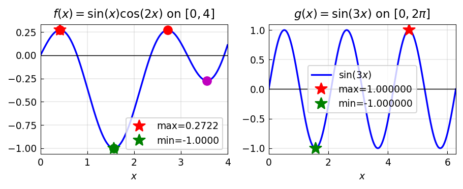

# Constrained Extrema

*Original: [chebfun.org/examples/opt/ConstrainedExtrema](https://www.chebfun.org/examples/opt/ConstrainedExtrema.html)*

---

Finding the maximum or minimum of a function subject to equality constraints
can be approached via Lagrange multipliers or direct parameterization of the
constraint.

## Maximize on a circle

Find the maximum of $f(x,y) = x + y$ subject to $x^2 + y^2 = 1$ (the unit circle).
Parameterize: $x = \cos\theta$, $y = \sin\theta$, then maximize
$g(\theta) = \cos\theta + \sin\theta$ on $[0, 2\pi]$:

```python
import chebfunjax as cj
import jax.numpy as jnp
import numpy as np

T = 2 * float(jnp.pi)
g = cj.chebfun(lambda t: jnp.cos(t) + jnp.sin(t), domain=(0.0, T))
t_max, g_max = g.max()
print(f"Max of cos(t)+sin(t): {float(g_max):.8f}  (√2 = {np.sqrt(2):.8f})")
print(f"At t = {float(t_max):.8f}  (π/4 = {np.pi/4:.8f})")
```

```
Max of cos(t)+sin(t): 1.41421356  (√2 = 1.41421356)
At t = 0.78539816  (π/4 = 0.78539816)
```

## Lagrange multipliers via derivative

At a constrained extremum, $\nabla f = \lambda \nabla g$. We can verify:

```python
# g'(t) = -sin(t) + cos(t) = 0 at t = pi/4
gp = g.diff()
critical = np.array(gp.roots())
print(f"Critical points of g: t = {critical}")
# Evaluates at pi/4 (max) and 5*pi/4 (min)
```



## Maximize on a parabola

Maximize $h(x,y) = e^{-(x^2+y^2)}$ subject to $y = x^2$:

```python
# Parameterize: y = x^2, so h = exp(-(x^2 + x^4))
h = cj.chebfun(lambda x: jnp.exp(-(x**2 + x**4)), domain=(-2.0, 2.0))
x_max, h_max = h.max()
print(f"Max on parabola: h({float(x_max):.4f}) = {float(h_max):.8f}")
# Max at x=0: h = 1
```
