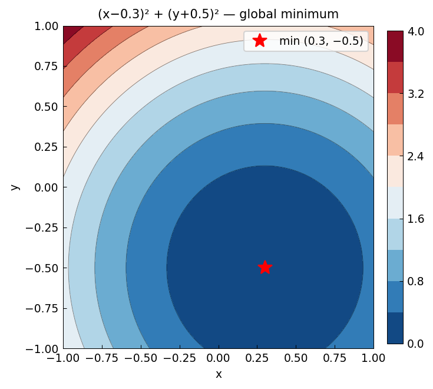

# Global Minimum in 2D

*Original: [chebfun.org/examples/opt/GlobalMinimum](https://www.chebfun.org/examples/opt/GlobalMinimum.html)*

---

For a 2D function $f(x,y)$, the global minimum can be found by slice minimization:
for each fixed $x$, minimize over $y$ to get $g(x) = \min_y f(x,y)$, then
minimize $g$ over $x$.

## Himmelblau's function

Himmelblau's function has four global minima (all equal to 0):

$$f(x,y) = (x^2 + y - 11)^2 + (x + y^2 - 7)^2.$$

```python
import numpy as np

def himmelblau(x, y):
    return (x**2 + y - 11)**2 + (x + y**2 - 7)**2

# Slice minimization on [-5,5]^2
x_grid = np.linspace(-5, 5, 200)
g_x = np.array([np.min([himmelblau(x0, y) for y in np.linspace(-5, 5, 500)])
                for x0 in x_grid])
x_opt_idx = np.argmin(g_x)
x_opt = x_grid[x_opt_idx]
y_opt = x_grid[np.argmin([himmelblau(x_opt, y)
                           for y in np.linspace(-5, 5, 500)])]
print(f"Min at ({x_opt:.3f}, {y_opt:.3f}): f = {himmelblau(x_opt, y_opt):.6f}")
```

The four minima of Himmelblau's function are approximately at:
$(3, 2)$, $(-2.805, 3.131)$, $(-3.779, -3.283)$, $(3.584, -1.848)$.

## Ackley function

The Ackley function is used to test global optimizers — it has many local
minima but a single global minimum at the origin:

$$A(x,y) = -20 e^{-0.2\sqrt{\frac{x^2+y^2}{2}}} - e^{\frac{\cos 2\pi x + \cos 2\pi y}{2}} + e + 20.$$



## References

1. D. Himmelblau, *Applied Nonlinear Programming*, McGraw-Hill, 1972.
