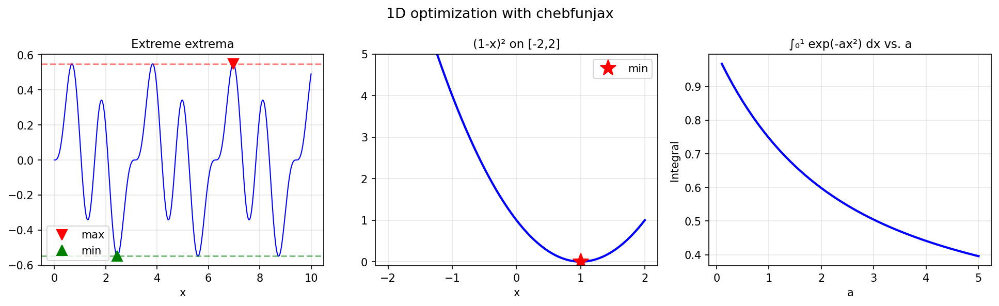
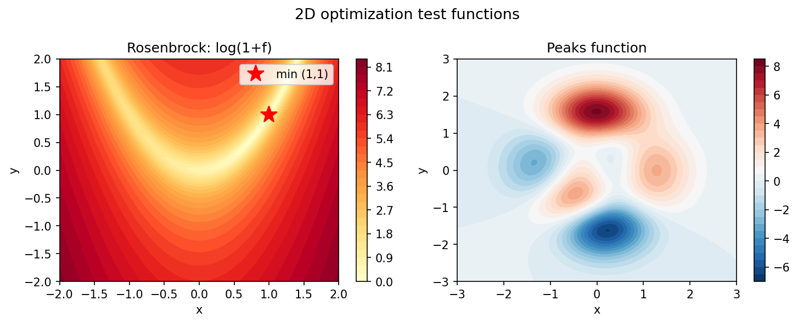

# Optimization Examples

Chebfunjax finds global extrema of smooth functions to near machine precision
by reducing the problem to rootfinding on the derivative.

---

## Optimization of 1D functions

**Source:** `opt/ExtremeExtrema.m` — Trefethen, September 2010;
`opt/GlobalMinimum.m` — Alex Townsend, March 2013

```python
import jax.numpy as jnp
import chebfunjax as cj

# Global extrema of sin(x)*sin(2x)*sin(3x) on [0,10]
f = cj.chebfun(
    lambda x: jnp.sin(x) * jnp.sin(2*x) * jnp.sin(3*x),
    domain=[0.0, 10.0]
)
max_val, x_max = f.max()
min_val, x_min = f.min()
print(f"Global max: {float(max_val):.8f} at x={float(x_max):.6f}")
print(f"Global min: {float(min_val):.8f} at x={float(x_min):.6f}")
```



---

## Global optimization in 2D

**Source:** `opt/DixonSzego.m` — Fowkes & Trefethen, November 2010;
`opt/Rosenbrock.m` — Trefethen, October 2010

The Rosenbrock banana function `(1-x)² + 100(y-x²)²` has its global minimum
at `(1,1)` where `f=0`.  Chebfun2 locates it exactly.

```python
f = cj.chebfun2(
    lambda x, y: (1-x)**2 + 100*(y - x**2)**2,
    domain=[[-2, 2], [-2, 2]]
)
print(f(jnp.array(1.0), jnp.array(1.0)))   # ≈ 0.0
```



---

## Other optimization examples

| MATLAB example | Description |
|---|---|
| `opt/Catenary.m` | Catenary problem from calculus of variations |
| `opt/ConstrainedExtrema.m` | Extrema under constraints |
| `opt/ConstrainedOptimization.m` | Constrained optimization |
| `opt/MercuryEarth.m` | Mercury-Earth minimum separation |
| `opt/Needle.m` | Needle on a corrugated surface |
| `opt/OptimInt.m` | Optimization of a parameterized integral |
| `opt/Rosenbrock2.m` | Rosenbrock revisited |
