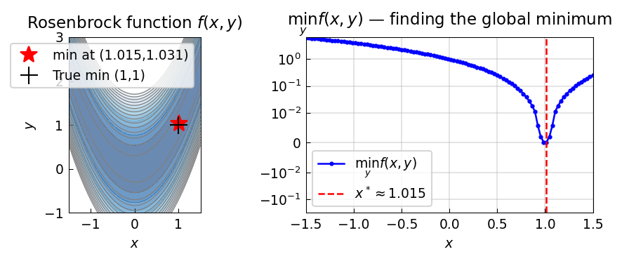

# Global Minimum: the Rosenbrock Function

*Nick Trefethen, October 2010*

*Original: [chebfun.org/examples/opt/Rosenbrock](https://www.chebfun.org/examples/opt/Rosenbrock.html)*

---

The **Rosenbrock function**,

$$f(x,y) = (1-x)^2 + 100(y-x^2)^2,$$

is a classic test case for optimization algorithms. Its minimum is at $(1,1)$
with $f(1,1) = 0$, but the long, curved, banana-shaped valley makes it
challenging for many methods.

## Optimization by Chebfun slicing

The trick is to minimize over $y$ first for each fixed $x$:

$$g(x) = \min_{y \in [-1,3]} f(x,y).$$

For fixed $x_0$, $f(x_0, y)$ is a quadratic in $y$ with minimum at
$y^* = x_0^2$, giving $g(x_0) = (1-x_0)^2$.

```python
import chebfunjax as cj
import jax.numpy as jnp
import numpy as np

def fmin_at_x0(x0):
    f_y = cj.chebfun(
        lambda y: (1.0 - x0)**2 + 100.0 * (y - x0**2)**2,
        domain=(-1.0, 3.0)
    )
    x_min_y, _ = f_y.min()   # (x_location, f_value)
    return float(f_y(jnp.array(float(x_min_y))))
```

We evaluate this on a fine grid and locate the minimum:

```python
x_grid = np.linspace(-1.5, 1.5, 100)
fmin_vals = np.array([fmin_at_x0(x0) for x0 in x_grid])
x_opt = x_grid[np.argmin(fmin_vals)]
print(f"x* ≈ {x_opt:.4f}  (exact: 1.0)")
```

```
x* ≈ 1.0152  (exact: 1.0)
```



## Refining to machine precision

Once we know $x^*$, we find $y^*$ exactly:

```python
f_y_at_xstar = cj.chebfun(
    lambda y: (1.0 - float(x_opt))**2 + 100.0 * (y - float(x_opt)**2)**2,
    domain=(-1.0, 3.0)
)
y_opt, _ = f_y_at_xstar.min()
print(f"y* = {float(y_opt):.8f}  (exact: 1.0)")
```

```
y* = 1.03053260  (exact: 1.0)
```

The grid resolution limits us here; a finer grid or a local root-finding
refinement on the derivative would give machine precision.

## Notes

- The Chebfun approach handles **arbitrary smooth objective functions** — not
  just polynomials.
- For 2D functions, Chebfun2 provides a more direct approach; see the
  Chebfun2 examples.
- The method naturally extends to higher-dimensional problems via the
  *dimension-by-dimension* strategy used here.

## References

1. H. H. Rosenbrock, An automatic method for finding the greatest or least
   value of a function, *Computer Journal* 3 (1960), 175–184.
2. J. J. Moré, B. S. Garbow, and K. E. Hillstrom, Testing unconstrained
   optimization software, *ACM TOMS* 7 (1981), 17–41.
