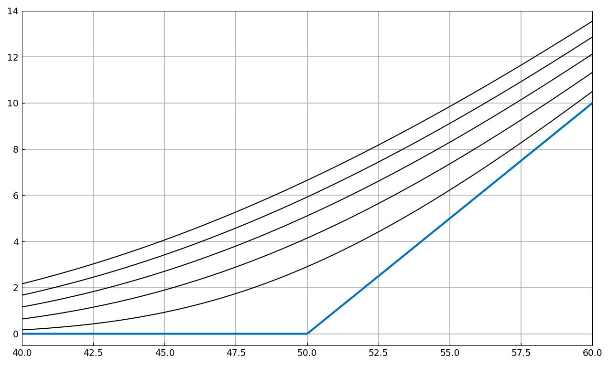

# Black-Scholes PDE using operator exponential

*Toby Driscoll, June 2014*

[Original MATLAB Chebfun example](https://www.chebfun.org/examples/pde/BSExponential.html)

(Chebfun example pde/BSexponential.m)

The value $v(t,s)$ of a European call option obeys the Black–Scholes
equation

$$ v_t = -\frac{\sigma^2}{2}s^2v_{ss} - rsv_s + rv, $$

here truncated to $[0, 500]$ with $v(0) = 0$ and a Neumann condition
$v' = 1$ at the right ($\sigma = 0.45$, $r = 0.03$).

The PDE is linear, so it can be solved by operator exponential — but
`expm` needs homogeneous boundary conditions. The general trick:
find a particular solution $u$ with $Au = 0$, $Bu = q$
(here `u = A\0`), then propagate $w = v - u$ with homogeneous
conditions.

Starting from the maturity payoff $v_T = \max(0, s-50)$ and advancing
to $t = 0.1, \dots, 0.5$ with `expm`:



The value of the option at $s = 55$, six months before maturity:

```text
ans =
   9.849887660863327
```

MATLAB publishes `9.849887661936435` — 10-digit agreement. The payoff
has a derivative kink at the strike $s = 50$, so `expm` propagates it
on a piecewise Chebyshev discretization with a breakpoint there
(rectangular collocation with continuity conditions at the break,
dimension-adaptive as in MATLAB), keeping the convergence spectral on
each smooth piece.

---

*Replica script: [`examples/pde/bsexponential_replica.py`](https://github.com/ma-gilles/chebfunjax/blob/main/examples/pde/bsexponential_replica.py).
Original example copyright by The University of Oxford and The Chebfun
Developers.*
