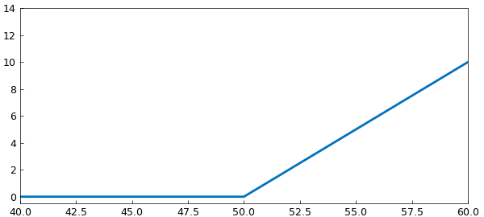
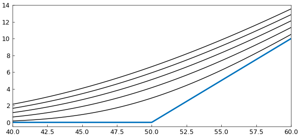

# Black-Scholes PDE using operator exponential

*Toby Driscoll, June 2014*

[Original MATLAB Chebfun example](https://www.chebfun.org/examples/pde/BSExponential.html)

Python translation: [`examples/pde/bsexponential.py`](https://github.com/ma-gilles/chebfunjax/blob/main/examples/pde/bsexponential.py)

The Black-Scholes partial differential equation is the foundation of much of modern finance. Suppose you have a European-style call option (right to buy) for a certain stock, to be exercised at a time $T$ in the future. Then, as a function of the stock price $s$, the value $v(t,s)$ of the option is governed by $$ v_t = -\frac{\sigma^2}{2}s^2v_{ss} -rsv_s + rv, \quad s>0, \quad t > 0, $$ subject to $$ v(0, T) = 0, \quad v(t, s)\rightarrow s \text{ as } s\rightarrow \infty. $$

It's much more convenient for us to work on a finite domain, so we will truncate and replace the asymptotic condition with a Neumann condition.

```matlab
d = [0 500];
s = chebfun('s', d);
sigma = 0.45;  r = 0.03;
A = chebop(@(s,v) -sigma^2/2*s.^2.*diff(v,2) - r*s.*diff(v) + r*v, d);
A.lbc = 0;
A.rbc = @(v) diff(v) - 1;    % replaces v->s as s->infinity
```

Because the PDE is linear, we can solve it using an operator exponential (i.e., $C_0$ semigroup) via `expm`. However, that function requires homogeneous boundary conditions, in the form $Bv=q$.

There is a very general trick to remove the nonhomoegeneous conditions, by finding a particular solution. Suppose $u(s)$ satisfies $Au=0$, $Bu=q$. Then $(v-u)_t = v_t=Av = A(v-u)$, and $B(u-v)=0$. Hence one can propagate $w=v-u$ with homogeneous conditions in combination with the solution of a boundary value problem for $u$.

```matlab
u = A\0;      % u satisfies u_t = A*u = 0, B*u = q.
A.rbc = 0;    % Homogenous BCs.
```

At the final time, the value of the option is the positive part of the difference between the strike price (for us, 50) and the stock price.

```matlab
vT = max( 0, s-50 );
clf
plot(vT, [40 60]), hold on, ylim([-.5 14])
wT = vT - u;  % Adjusted variable - satisfies w_t = A*w, B*w = 0.
```



We can now evaluate at any time directly (not by marching) using the operator exponential implemented by `expm`. Advance in time to $t = 0.1, 0.2, ..., 0.5$ using `expm`:

```matlab
for t = 0.1:0.1:0.5
   w = expm(A, -t, wT);
   v = w + u;
   plot(v, [40 60], 'k')
end
```



The value of this option if $s=55$, six months before the maturity date, is

```matlab
v(55)
```

```text
ans =
   9.849887660874174
```

Note that the initial condition for $w$ is piecewise defined. Thus, `w` will be piecewise at all times in Chebfun.

```matlab
w
```

```text
w =
   chebfun column (2 smooth pieces)
       interval       length     endpoint values
[       0,      50]       29   2.3e-11      -43
[      50,   5e+02]       64       -43  4.9e-15
vertical scale =  49    Total length = 93
```

However, the solution is actually smooth.

```matlab
wss = diff(w,2);
jump2 = wss(50+100*eps) - wss(50-100*eps)
```

```text
jump2 =
    -5.317025080636695e-09
```

---

*Translated with [chebfunjax](https://github.com/ma-gilles/chebfunjax); prose and MATLAB code from the original example, copyright The University of Oxford and The Chebfun Developers.  Printed outputs and figures are chebfunjax's.*
