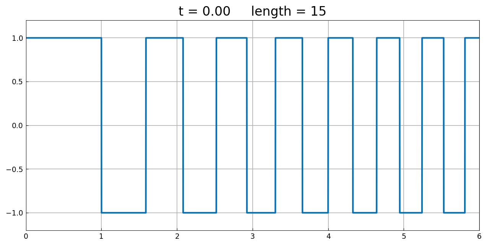
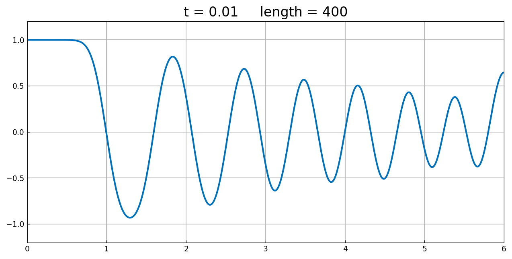
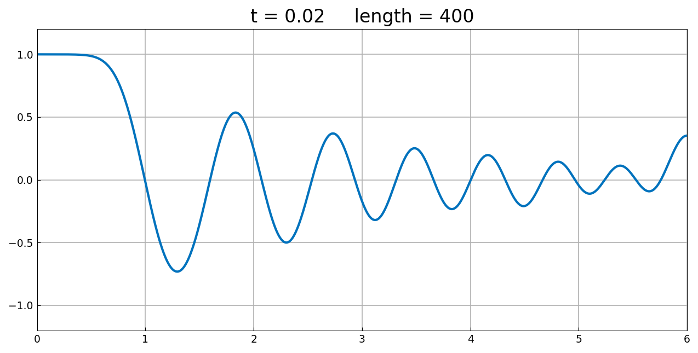
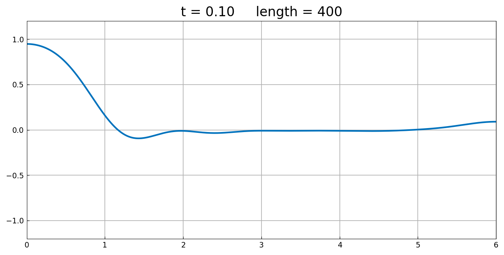

# Heat equation via expm

*Nick Trefethen, October 2010*

[Original MATLAB Chebfun example](https://www.chebfun.org/examples/pde/Erosion.html)

(Chebfun example pde/Erosion.m)

The heat equation $u_t = u_{xx}$ on $[0,6]$ with Neumann boundary
conditions, treated as $u(t) = e^{tL}u(0)$ via `expm`. The initial
function is quite irregular:

At $t = 0.01$ the narrower spikes have lost more amplitude than the
wider ones:

At $t = 0.02$, the rightmost maximum has extra amplitude, since it
effectively corresponded to a wider initial spike thanks to the
Neumann boundary condition:

At $t = 0.1$, not much of the original structure is left — our curve
matches the published one point for point (peak $0.95$ at the left
wall, undershoot $-0.09$ near $x = 1.4$, the small rise to $0.09$ at
the right):

*(MATLAB's titles also report the adaptively-simplified chebfun
length dropping to 52; our `expm` returns its fixed collocation
size — a cosmetic difference only.)*

---

*Replica script: [`examples/pde/erosion_replica.py`](https://github.com/ma-gilles/chebfunjax/blob/main/examples/pde/erosion_replica.py).
Original example copyright by The University of Oxford and The Chebfun
Developers.*
