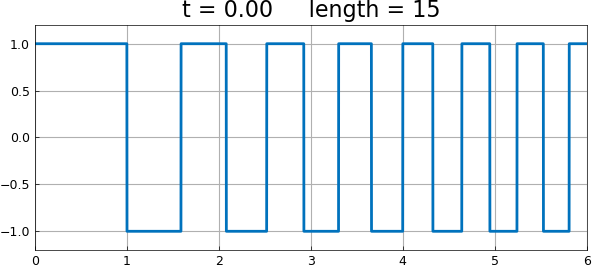
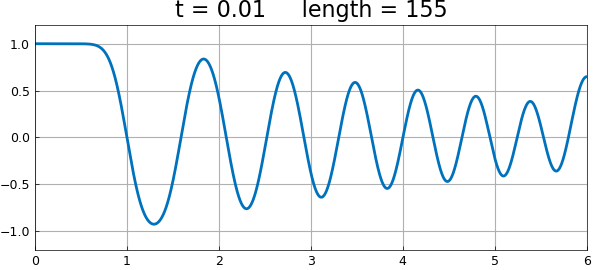
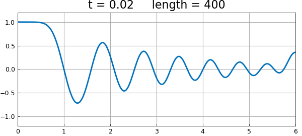
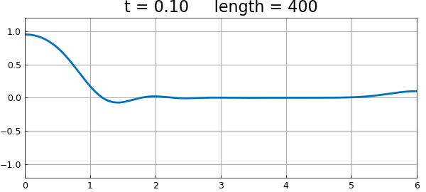

# Heat equation via expm

*Nick Trefethen, October 2010*

[Original MATLAB Chebfun example](https://www.chebfun.org/examples/pde/Erosion.html)

Python translation: [`examples/pde/erosion.py`](https://github.com/ma-gilles/chebfunjax/blob/main/examples/pde/erosion.py)

A well-known PDE problem is the heat equation initial boundary-value problem posed for $x\in [a, b]$ and $t>0$,

$$ u_t = u_{xx}, ~~~~ u(x, 0) = u_0(x) $$

with suitable boundary conditions. We can regard this as a time-dependent linear process

$$ u_t = Lu $$

where $L$ is the operator $d^2/dx^2$ on $[a, b]$ with the same boundary conditions. The solution is

$$ u(t) = \exp(tL) u(0). $$

In Chebfun we can implement this idea using the `expm` command to compute the operator exponential. Here is an example with Neumann boundary conditions on the interval $[0, 6]$. We start with quite an irregular initial function.

```matlab
d = [0, 6];
u = chebfun(@(x) sign((-1).^floor(x.^1.5)), d, 'splitting', 'on');
LW = 'linewidth'; lw = 2; FS = 'fontsize'; fs = 16;
clf, plot(u, LW, lw), grid on
title(sprintf('t = %4.2f     length = %d', 0, length(u)), FS, fs)
ax = [0 6 -1.2 1.2]; axis(ax)
```



Here's the solution at $t = 0.01$. Notice that the narrower spikes have lost more amplitude than the wider ones.

```matlab
L = chebop(d);            % operator on domain [0, 6]
L.op = @(u) diff(u, 2);   % 2nd-derivative operator
L.lbc = @(u) diff(u);     % Neumann BC at left
L.rbc = @(u) diff(u);     % Neumann BC at right
dt = 0.01;
u = expm(L, dt, u);       % exponential of the operator
plot(u, LW, lw), axis(ax), grid on
title(sprintf('t = %4.2f     length = %d', 0.01, length(u)), FS, fs)
```



Here is the solution at $t = 0.02$. The rightmost maximum has extra amplitude, since it effectively corresponded to a wider initial spike thanks to the Neumann boundary condition.

```matlab
u = expm(L, dt, u);
plot(u, LW, lw), axis(ax), grid on
title(sprintf('t = %4.2f     length = %d', 0.02, length(u)), FS, fs)
```



At $t=0.1$, there is not much of the original structure left. The length of the chebfun has also been reduced.

```matlab
u = expm(L, 8*dt, u);
plot(u, LW, lw), axis(ax), grid on
title(sprintf('t = %4.2f     length = %d', 0.1, length(u)), FS, fs)
```



---

*Translated with [chebfunjax](https://github.com/ma-gilles/chebfunjax); prose and MATLAB code from the original example, copyright The University of Oxford and The Chebfun Developers.  Printed outputs and figures are chebfunjax's.*
