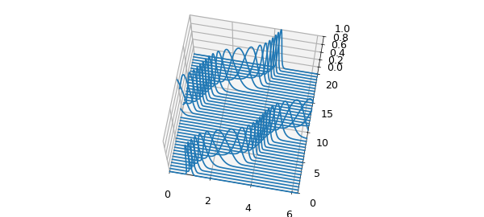
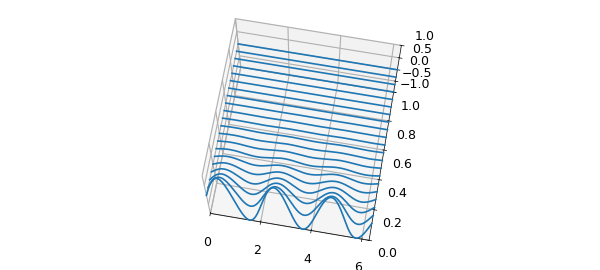

# Time-dependent PDEs on a periodic interval with expm

*Hadrien Montanelli, December 2014*

[Original MATLAB Chebfun example](https://www.chebfun.org/examples/pde/FourierExpm.html)

Python translation: [`examples/pde/fourierexpm.py`](https://github.com/ma-gilles/chebfunjax/blob/main/examples/pde/fourierexpm.py)

```matlab
LW = 'linewidth'; dom = [0 2*pi];
```

Consider the time-dependent PDE

$$ u_t = \mathcal{L}u, $$

on $[0,2\pi]\times[0,\infty)$, with a given periodic initial condition $u(x,0)$. We seek periodic solutions $u(x,t)$. If the operator $\mathcal{L}$ is semi-bounded, this problem is well-posed [1], and the unique solution is given by

$$ u(x,t) = e^{\mathcal{L}t}u(x,0). $$

Two examples of well-posed problems are the convection equation, $\mathcal{L}u=c(x)u_x$, and the heat equation, $\mathcal{L}u=u_{xx}$.

Consider first the convection equation

$$ u_t = c(x)u_x, $$

on $[0,2\pi]\times[0, 20]$, with $c(x)= -\frac{1}{5}-\sin^2(x-1)$, periodic boundary conditions, and initial condition $u(x,0)=\exp(-100(x-1)^2)$.

```matlab
T = 20; dt = 0.5;
t = [0:dt:T];
c = chebfun(@(x) -(1/5 + sin(x-1).^2), dom);
L = chebop(@(x,u) c.*diff(u, 1), dom);
L.bc = 'periodic';
u0 = chebfun(@(x) exp(-100*(x-1).^2), dom);
u = expm(L, t, u0);
figure, waterfall(u, t, LW, 2)
view(10, 70), axis([0 2*pi 0 T 0 1])
```



This example from [2] shows the propagation of the initial condition at variable speed, which remains coherent and clean.

Consider now the heat equation

$$ u_t = u_{xx}, $$

on $[0,2\pi]\times[0, 1]$, with periodic boundary conditions, and initial condition $u(x,0)=\sin(3x)$. We can solve it in Chebfun as follows with the `expm` command.

```matlab
T = 1; dt = 0.05;
t = [0:dt:T];
L = chebop(@(u) diff(u, 2), dom);
L.bc = 'periodic';
u0 = chebfun(@(x) sin(3*x), dom);
u = expm(L, t, u0);
figure, waterfall(u, t, LW, 2)
view(10, 70), axis([0 2*pi 0 T -1 1])
```



The diffusion has done its job: the solution at $T=1$ has very small amplitude.

```matlab
norm(u{end}, inf)
```

```text
ans =
     1.234097184743636e-04
```

## References

1. J. S. Hesthaven, S. Gottlieb, and D. Gottlied, *Spectral Methods for Time-Dependent Problems*, Cambridge University Press, New York, 2007.
2. L. N. Trefethen, *Spectral Methods in MATLAB*, SIAM, Philadelphia, 2000.

---

*Translated with [chebfunjax](https://github.com/ma-gilles/chebfunjax); prose and MATLAB code from the original example, copyright The University of Oxford and The Chebfun Developers.  Printed outputs and figures are chebfunjax's.*
