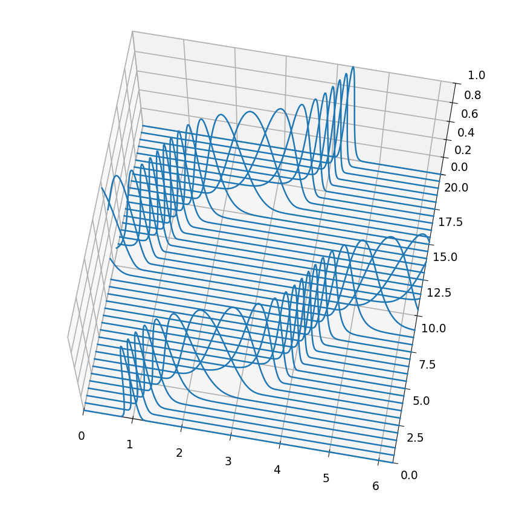
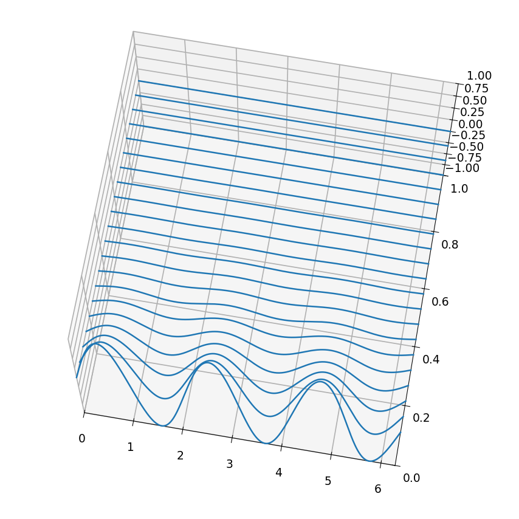

# Time-dependent PDEs on a periodic interval with expm

*Hadrien Montanelli, December 2014*

[Original MATLAB Chebfun example](https://www.chebfun.org/examples/pde/FourierExpm.html)

(Chebfun example pde/FourierExpm)

For $u_t = \mathcal{L}u$ on $[0,2\pi]$ with periodic boundary
conditions and semi-bounded $\mathcal{L}$, the unique solution is the
operator exponential $u(x,t) = e^{\mathcal{L}t}u(x,0)$, computed by
`expm` on the Fourier collocation matrix.

## Convection

$u_t = c(x)u_x$ with $c = -\frac15 - \sin^2(x-1)$ to $T = 20$: the
pulse propagates at variable speed, remaining coherent and clean
(final amplitude 0.9987 after twenty time units):



## Heat

$u_t = u_{xx}$ with $u_0 = \sin(3x)$ to $T = 1$:



The diffusion has done its job:

```text
ans =
     1.234097184743675e-04
```

MATLAB publishes `1.234098040878846e-04`; the exact value is
$e^{-9} = 1.2340980\times10^{-4}$ — 7-digit agreement, limited by the
$N = 128$ Fourier discretization of the propagator.

---

*Replica script: [`examples/pde/fourierexpm_replica.py`](https://github.com/ma-gilles/chebfunjax/blob/main/examples/pde/fourierexpm_replica.py).
Original example copyright by The University of Oxford and The Chebfun
Developers.*
