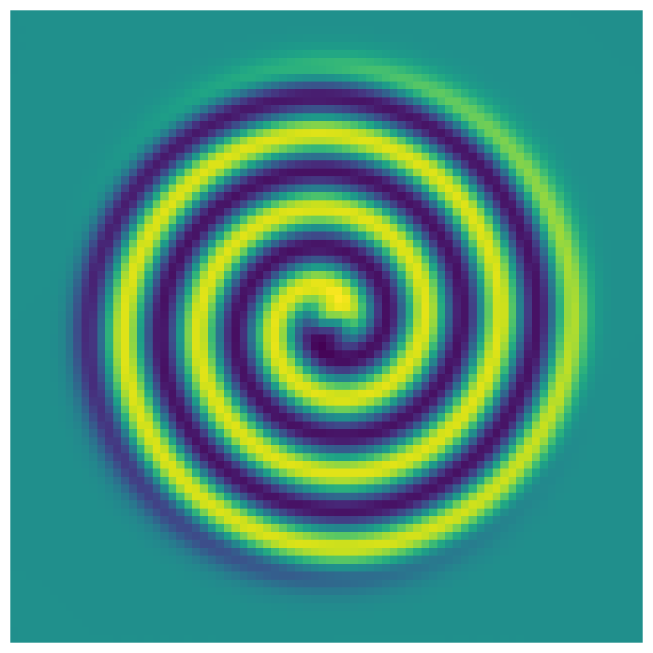
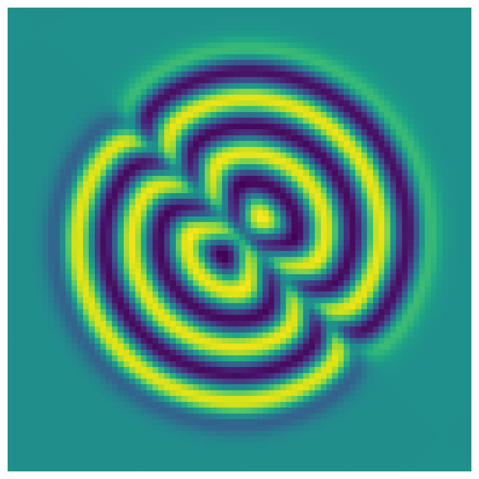
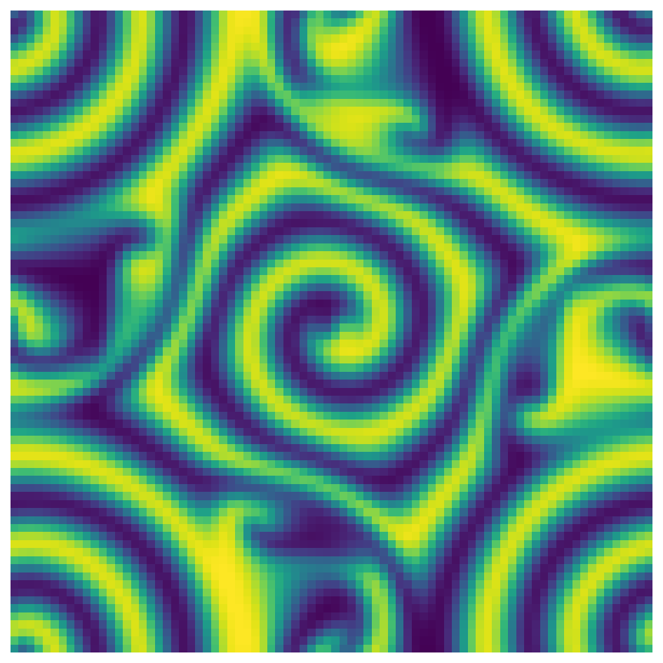
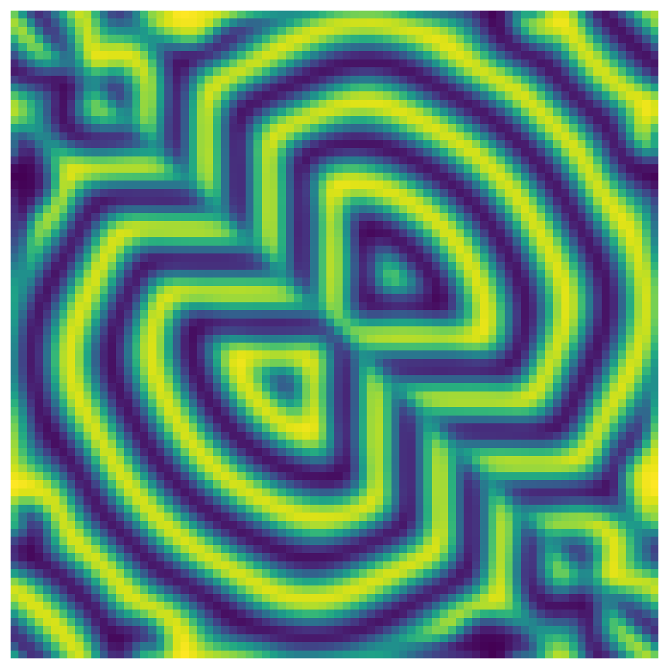
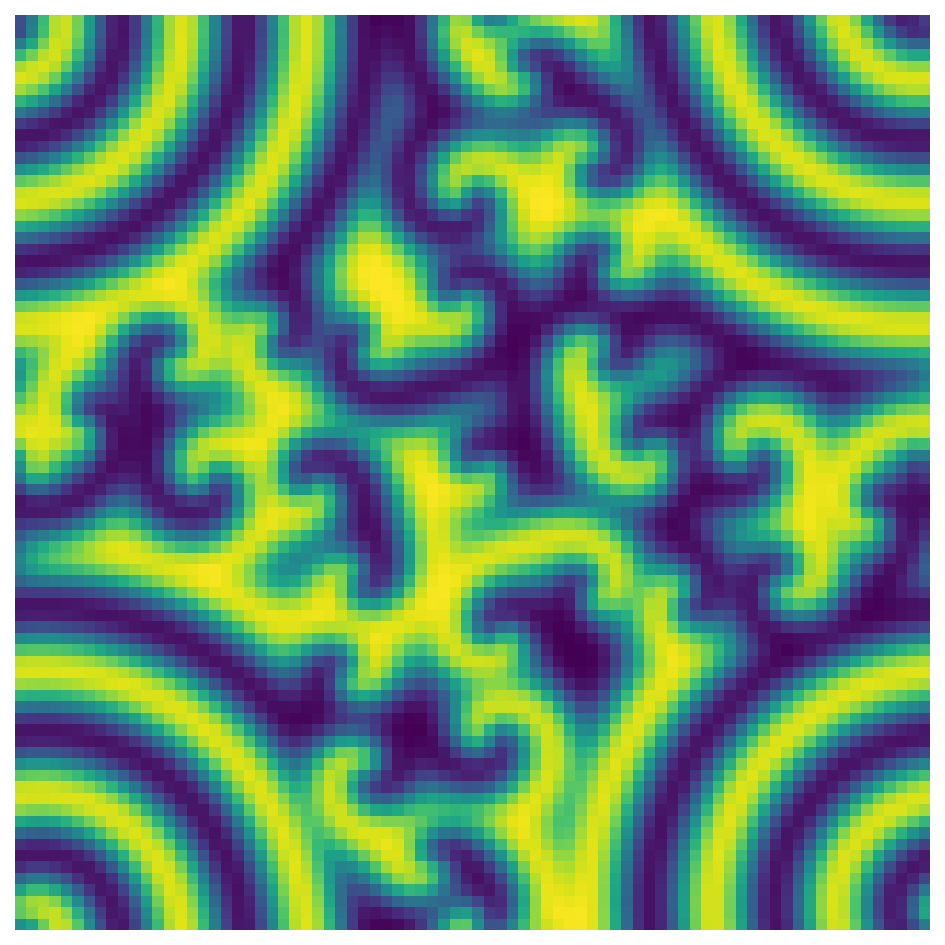
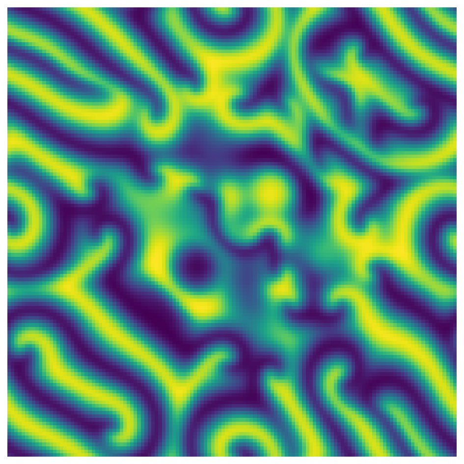
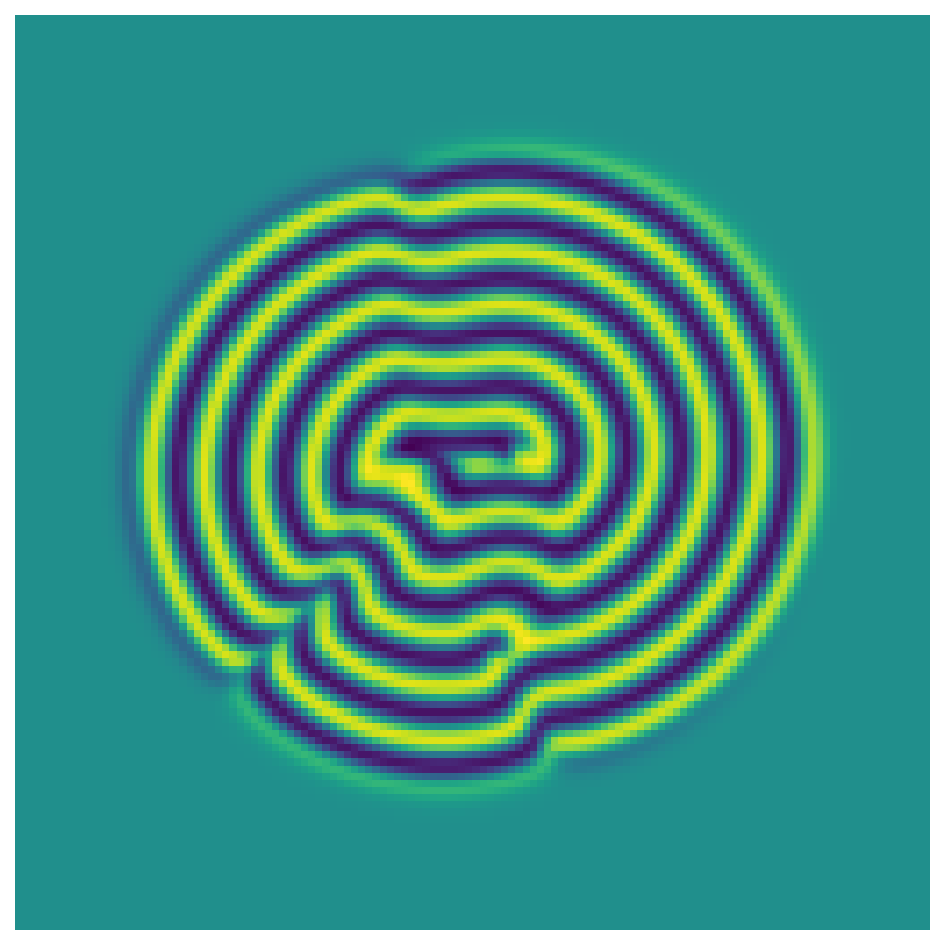
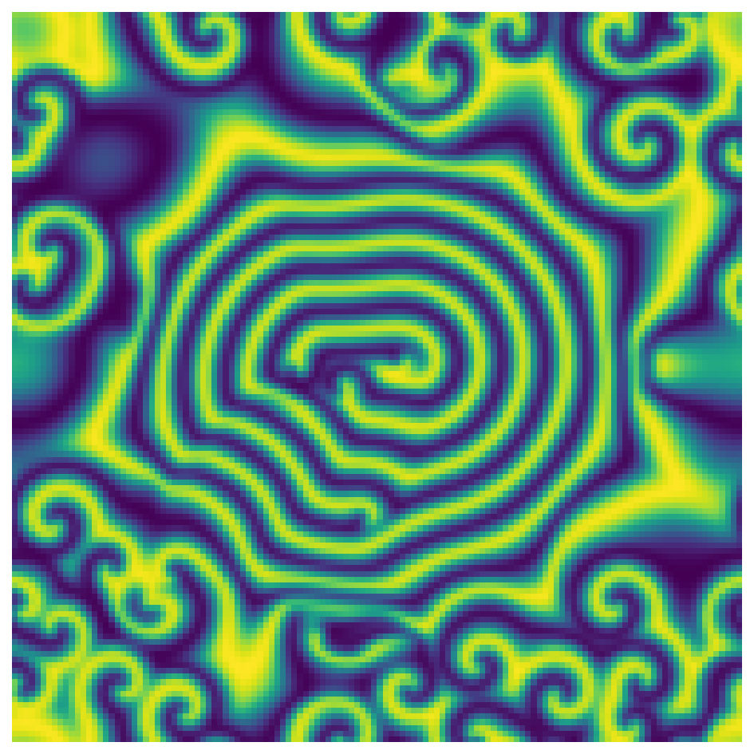
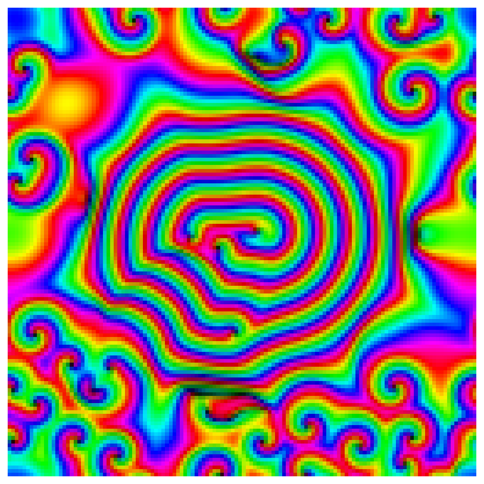

# Complex Ginzburg-Landau equation in 2D

*Nick Trefethen, May 2016*

[Original MATLAB Chebfun example](https://www.chebfun.org/examples/pde/GinzburgLandau.html)

(Chebfun Example pde/GinzburgLandau.m)

The complex Ginzburg–Landau equation,

$$ u_t = \Delta u + u - (1+1.5i)\,u|u|^2, $$

is a scalar PDE in a complex variable, much used in the study of
chaotic processes in fluid mechanics.

## 2. Non-chaotic solutions

On $[-50,50]^2$ with $u_0 = (ix+y)e^{-0.03(x^2+y^2)}$
($N = 80$, $\Delta t = 1/20$), 16 time units give a pretty spiral —
ours matches the published one **arm-for-arm** (same chirality, same
number of turns):



The analogous real initial condition $(x+y)e^{-0.03(x^2+y^2)}$:



## 3. Beginnings of chaos

At $t = 48$ the function values pass across the periodic boundary:
remnants of the spiral in the middle, more complicated behavior in
the corners; for the real initial condition the diagonal line of
symmetry is preserved — quantitatively:

```text
diagonal symmetry error at t=48: 7.84e-03
```




## 4. Chaos

At $t = 96$ (second image at $N = 128$ — plausible but, as the
example notes, not converged; the symmetry line is lost):




## 5. A bigger canvas

Two spirals on $[-100,100]^2$ at $t = 30$, then $t = 60$ (of
questionable accuracy), and the psychedelic phase portrait:





Total times: 2.4 s + 4.5 s + 15.8 s + 4.2 s (MATLAB publishes
1.6 / 3.9 / 15.2 / 8.8 s — comparable throughout).

---

*Replica script: [`examples/pde/ginzburglandau_replica.py`](https://github.com/ma-gilles/chebfunjax/blob/main/examples/pde/ginzburglandau_replica.py).
Original example copyright by The University of Oxford and The Chebfun
Developers.*
