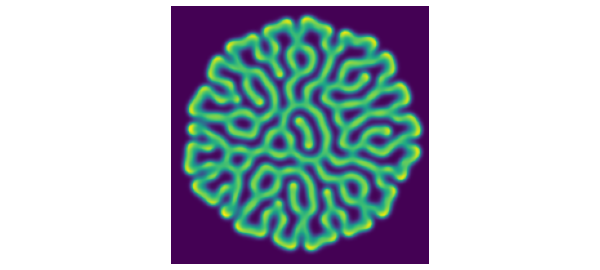
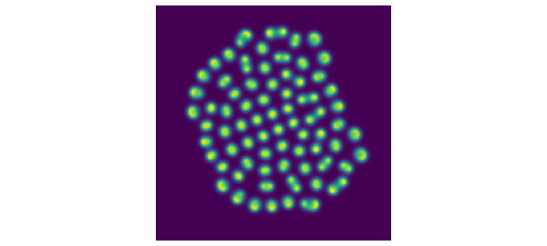
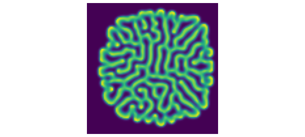
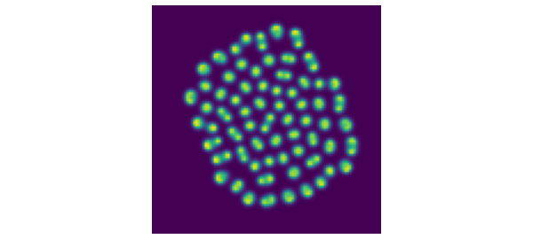

# Gray-Scott equations in 2D

*Nick Trefethen, April 2016*

[Original MATLAB Chebfun example](https://www.chebfun.org/examples/pde/GrayScott.html)

Python translation: [`examples/pde/grayscott.py`](https://github.com/ma-gilles/chebfunjax/blob/main/examples/pde/grayscott.py)

## 1. Rolls

The Gray-Scott equations are a pair of coupled reaction-diffusion equations that lead to interesting patterns [1,2,3]. Let us look at two examples in 2D.

The equations are $$ u_t = \varepsilon_1\Delta u + b(1-u) - uv^2, \quad v_t = \varepsilon_2\Delta v - dv + uv^2, $$ where $\Delta$ is the Laplacian and $\varepsilon_1, \varepsilon_2,b,d$ are parameters. To begin with we choose these values.

```matlab
ep1 = 0.00002; ep2 = 0.00001;
b = 0.04; d = 0.1;
```

We now solve up to $t=3500$ with `spin2` and plot the $v$ variable. What beautiful, random-seeming "rolls" (or "fingerprints") appear!

```matlab
dom = [-1 1 -1 1]; x = chebfun('x',dom(1:2)); tspan = [0 3500];
S = spinop2(dom,tspan);
S.lin = @(u,v) [ep1*lap(u); ep2*lap(v)];
S.nonlin = @(u,v) [b*(1-u)-u.*v.^2;-d*v+u.*v.^2];
S.init = chebfun2v(@(x,y) 1-exp(-80*((x+.05).^2+(y+.02).^2)), ...
                   @(x,y) exp(-80*((x-.05).^2+(y-.02).^2)),dom);
tic, u = spin2(S,200,2,'plot','off');
plot(u{2}), view(0,90), axis equal, axis off
time_in_seconds = toc
```

```text
time_in_seconds =
   31.007739305
```



## 2. Spots

If we change the values of the parameters just a bit, the nature of the solution changes fundamentally. Now we see spots instead of rolls.

```matlab
b = 0.025; d = 0.085;
S.nonlin = @(u,v) [b*(1-u)-u.*v.^2;-d*v+u.*v.^2];
tic, u = spin2(S,200,2,'plot','off');
plot(u{2}), view(0,90), axis equal, axis off
time_in_seconds = toc
```

```text
time_in_seconds =
   30.845691204
```



## 3. Decay

Not all choices of parameters lead to interesting pictures. With $b = 0.02$ and $d = 0.08$, for example, the functions converge to constants.

## 4. Speedups on coarser grids

The initial conditions in the simulations above were chosen with a line of symmetry tilted at a certain angle from the axis. For a dynamical process so sensitive as this to small perturbations, this provides a challenging test of accuracy: is the symmetry preserved? If we coarsen the grid to $100\times 100$, we can speed up the computations fourfold and still get plausible looking answers--which indeed can be argued to be in some sense scientifically correct. They are clearly not mathematically correct, however, as the symmetry is broken. Here we illustrate this effect with rolls. Note that the solution looks approximately the same as before, but the details are different and the symmetry has been lost. Moreover, the overall shape of the solution looks suspiciously a little bit square -- a hint of some spurious grid alignment.

```matlab
b = 0.04; d = 0.1;
S.nonlin = @(u,v) [b*(1-u)-u.*v.^2;-d*v+u.*v.^2];
tic, u = spin2(S,100,2,'plot','off');
plot(u{2}), view(0,90), axis equal, axis off
time_in_seconds = toc
```

```text
time_in_seconds =
   11.226735592
```



We get a similar effect with spots:

```matlab
b = 0.025; d = 0.085;
S.nonlin = @(u,v) [b*(1-u)-u.*v.^2;-d*v+u.*v.^2];
tic, u = spin2(S,100,2,'plot','off');
plot(u{2}), view(0,90), axis equal, axis off
time_in_seconds = toc
```

```text
time_in_seconds =
   9.770115376
```



## 5. References

[1] P. Gray and S. K. Scott, *Chemical Oscillations and Instabilities: Non-linear Chemical Kinetics*, v. 21 of International Series of Monographs on Chemistry, 1994.

[2] L. N. Trefethen and K. Embree, editors, article 23 on "The Gray-Scott equations", *The (Unfinished) PDE Coffee Table Book*, `https://people.maths.ox.ac.uk/trefethen/pdectb.html`.

[3] H. Montanelli and N. Bootland, *Solving periodic semilinear stiff PDEs in 1D, 2D and 3D with exponential integrators*, submitted, 2016.

---

*Translated with [chebfunjax](https://github.com/ma-gilles/chebfunjax); prose and MATLAB code from the original example, copyright The University of Oxford and The Chebfun Developers.  Printed outputs and figures are chebfunjax's.*
