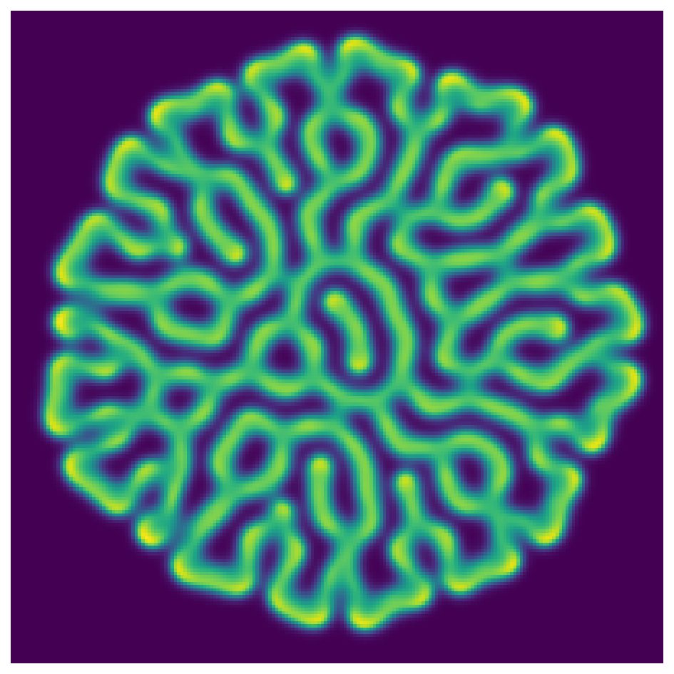
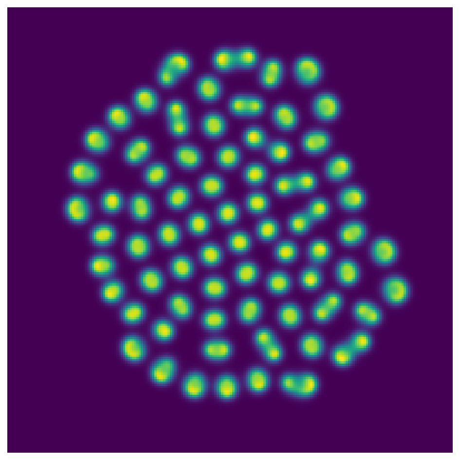
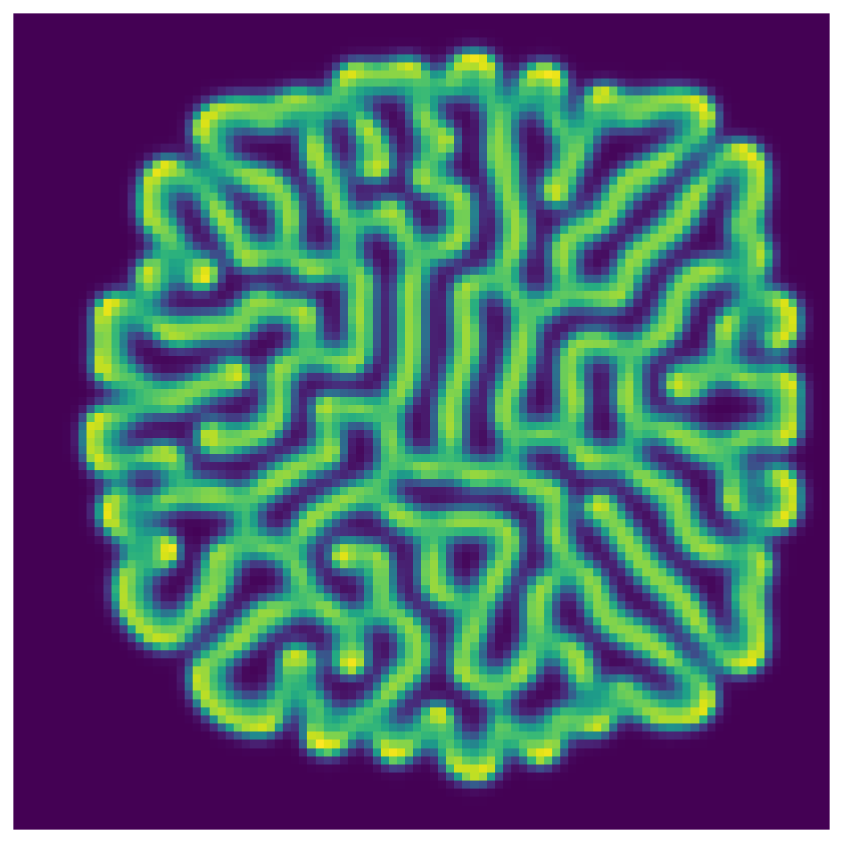
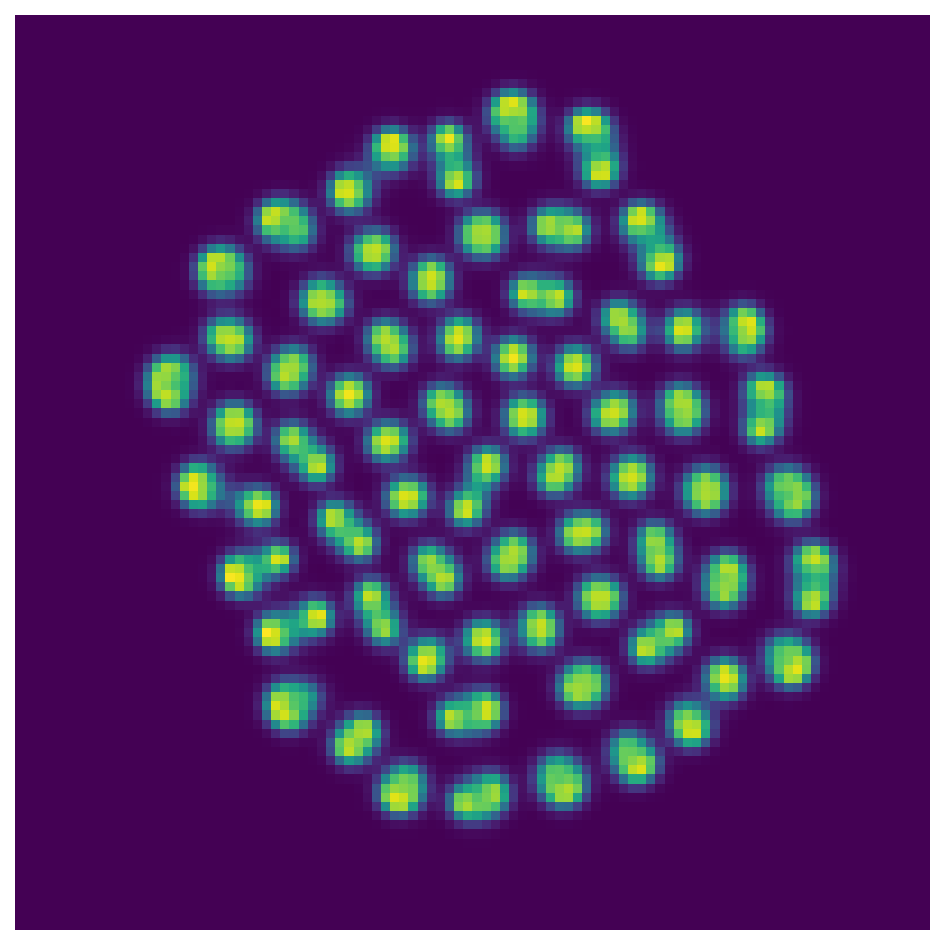

# Gray-Scott equations in 2D

*Nick Trefethen, April 2016*

[Original MATLAB Chebfun example](https://www.chebfun.org/examples/pde/GrayScott.html)

(Chebfun Example pde/GrayScott.m)

## 1. Rolls

The Gray–Scott reaction–diffusion system

$$ u_t = \varepsilon_1\Delta u + b(1-u) - uv^2, \qquad
v_t = \varepsilon_2\Delta v - dv + uv^2 $$

with $\varepsilon_1 = 2\times10^{-5}$,
$\varepsilon_2 = 10^{-5}$, $b = 0.04$, $d = 0.1$, solved to
$t = 3500$ with `spin2` ($N = 200$, $\Delta t = 2$) — beautiful,
random-seeming "fingerprint" rolls:



```text
time_in_seconds =
   33.645130873
```

(MATLAB publishes 40.9 s.) The labyrinth details differ from the
published print — the example's own section 4 stresses that this
process is so sensitive that even the finest details are not
"mathematically correct" at any fixed resolution — but the pattern
class, disk radius, and roll wavelength match.

## 2. Spots

With $b = 0.025$, $d = 0.085$, spots instead of rolls:



## 4. Speedups on coarser grids

The initial condition has a mirror symmetry across a tilted line —
the example's accuracy test is whether that symmetry survives. We can
make the test quantitative by reflecting the computed $v$ across the
line and measuring the relative difference:

```text
N=200: sym rel err = 0.014
N=100: sym rel err = 0.705
```

At $N = 200$ the symmetry is preserved (1.4%, mostly interpolation
error of the check itself); at $N = 100$ the fourfold-faster run
looks plausible but the symmetry is destroyed — "scientifically
correct" but not mathematically so, exactly as published:




---

*Replica script: [`examples/pde/grayscott_replica.py`](https://github.com/ma-gilles/chebfunjax/blob/main/examples/pde/grayscott_replica.py).
Original example copyright by The University of Oxford and The Chebfun
Developers.*
