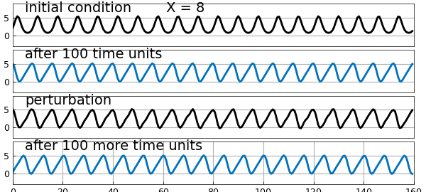
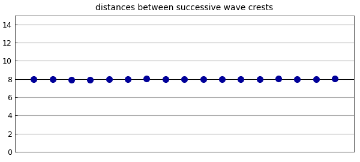
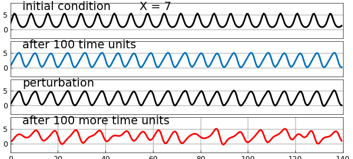
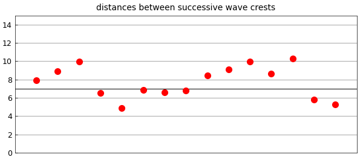
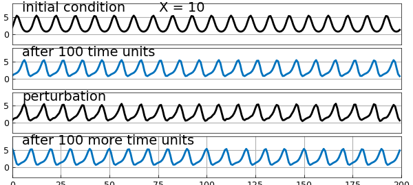
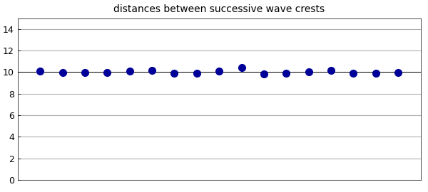
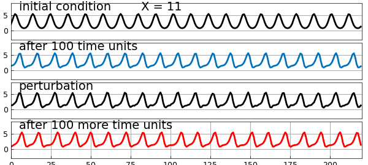
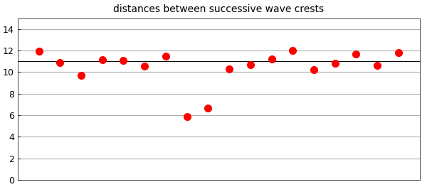

# Kuramoto-Sivashinsky traveling waves

*Nick Trefethen, March 2017*

[Original MATLAB Chebfun example](https://www.chebfun.org/examples/pde/KSWave.html)

Python translation: [`examples/pde/kswave.py`](https://github.com/ma-gilles/chebfunjax/blob/main/examples/pde/kswave.py)

## 1. Standard KS equation

The *Kuramoto-Sivashinsky equation,* $$ u_t = -(u^2/2)_x - u_{xx} - u_{xxxx} , $$ is famous for its chaotic solutions. One of them is illustrated by Chebfun's built-in demo, which uses these parameters:

```matlab
S = spinop('ks')
```

```text
crest gaps: mean 7.994 std 0.035 (X = 8)
crest gaps: mean 7.725 std 1.694 (X = 7)
crest gaps: mean 10.007 std 0.147 (X = 10)
crest gaps: mean 10.480 std 1.616 (X = 11)
```

The KS equation also has traveling wave solutions, however, and some of them are stable. A recent contribution in this area is by Blake Barker and coauthors [1]. For example, suppose we look for a solution with period $X=8$ on a domain of length $20X$. In the figure below, the first panel shows the the initial condition $U(x) = 2\exp(\sin(2\pi x/X)).$ The second panel shows the traveling wave that results after 100 time units. The third panel shows the latter function perturbed by a random function. Finally we run for 100 more time units from this perturbed state, and find that the regular wave form is restored.

```matlab
S.tspan = [0 100]; npts = 256; dt = 0.02;
LW = 'linewidth'; lw = 4;
CO = 'color';
MS = 'markersize'; ms = 32;
FS = 'fontsize'; fs = 26;
XT = 'xtick'; YT = 'ytick';
X = 8; S.domain = [0 20*X];

S.init = chebfun(@(x) 2*exp(sin(2*pi*x/X)),S.domain);
subplot(4,1,1), plot(S.init,'k',LW,lw), ylim([-3 9]), grid on
text(5,6.6,'initial condition',FS,fs), set(gca,XT,[],YT,[0 5])
text(10*X,6.6,['X = ' num2str(X)],FS,fs)

u = spin(S,npts,dt,'plot','off');
subplot(4,1,2), plot(u,LW,lw), ylim([-3 9]), grid on
text(5,6.6,'after 100 time units',FS,fs), set(gca,XT,[],YT,[0 5])

S.init = u + .1*randnfun(2,S.domain);
subplot(4,1,3), plot(S.init,'k',LW,lw), ylim([-3 9]), grid on
text(5,6.6,'perturbation',FS,fs), set(gca,XT,[],YT,[0 5])

u = spin(S,npts,dt,'plot','off');
subplot(4,1,4), plot(u,LW,lw), ylim([-3 9]), grid on
text(5,6.6,'after 100 more time units',FS,fs), set(gca,YT,[0 5])
```



To see the regularity of the wave, we can plot the distances from each local maximum to the next. They are not perfectly constant, but the variation is small.

```matlab
format short, format compact
[a,b] = max(u,'local'); d = diff(b)';
clf, plot([0 length(d)-1],X*[1 1],'k',LW,.7), hold on
plot(d(2:end-1),'.',MS,ms,CO,[0 0 .6]), set(gca,XT,[])
grid on, axis([0 length(d)-1 0 15]), hold off
title('distances between successive wave crests')
```



By contrast, let's try the same experiment but with an initial wave of period $X = 7$. Again in 100 time units we settle down to a traveling wave. This time, however, the perturbation excites an instability, and we end with an apparently chaotic waveform.

```matlab
X = 7; S.domain = [0 20*X];

S.init = chebfun(@(x) 2*exp(sin(2*pi*x/X)),S.domain);
subplot(4,1,1), plot(S.init,'k',LW,lw), ylim([-3 9]), grid on
text(5,6.6,'initial condition',FS,fs), set(gca,XT,[],YT,[0 5])
text(10*X,6.6,['X = ' num2str(X)],FS,fs)

u = spin(S,npts,dt,'plot','off');
subplot(4,1,2), plot(u,LW,lw), ylim([-3 9]), grid on
text(5,6.6,'after 100 time units',FS,fs), set(gca,XT,[],YT,[0 5])

S.init = u + .1*randnfun(2,S.domain);
subplot(4,1,3), plot(S.init,'k',LW,lw), ylim([-3 9]), grid on
text(5,6.6,'perturbation',FS,fs), set(gca,XT,[],YT,[0 5])

u = spin(S,npts,dt,'plot','off');
subplot(4,1,4), plot(u,'r',LW,lw), ylim([-3 9]), grid on
text(5,6.6,'after 100 more time units',FS,fs), set(gca,YT,[0 5])
```



The distances between wave crests vary greatly.

```matlab
[a,b] = max(u,'local'); d = diff(b)';
clf, plot([0 length(d)-1],X*[1 1],'k',LW,.7), hold on
plot(d(2:end-1),'.r',MS,ms), set(gca,XT,[])
grid on, axis([0 length(d)-1 0 15]), hold off
title('distances between successive wave crests')
```



## 2. Generalized KS equation

This much had been done by earlier authors. The emphasis of [1] is actually on the *generalized KS equation*, $$ u_t = -(u^2/2)_x - \delta(u_{xx} - u_{xxxx}) - \varepsilon u_{xxx}, $$ where $\delta$ and $\varepsilon$ are nonnegative diffusion and dispersion constants, respectively. Again, stable traveling waves may occur. Here for $\delta=0.8$ and $\varepsilon = 0.6$ we find a stable wave with wavelength $X=10$.

```matlab
X = 10; S.domain = [0 20*X];
delta = 0.8; ep = 0.6;
S.lin = @(u) delta*(-diff(u,2)-diff(u,4)) - ep*diff(u,3);

S.init = chebfun(@(x) 2*exp(sin(2*pi*x/X)),S.domain);
subplot(4,1,1), plot(S.init,'k',LW,lw), ylim([-3 9]), grid on
text(5,7.2,'initial condition',FS,fs), set(gca,XT,[],YT,[0 5])
text(10*X,7.2,['X = ' num2str(X)],FS,fs)

u = spin(S,npts,dt,'plot','off');
subplot(4,1,2), plot(u,LW,lw), ylim([-3 9]), grid on
text(5,7.2,'after 100 time units',FS,fs), set(gca,XT,[],YT,[0 5])

S.init = u + .1*randnfun(2,S.domain);
subplot(4,1,3), plot(S.init,'k',LW,lw), ylim([-3 9]), grid on
text(5,7.2,'perturbation',FS,fs), set(gca,XT,[])

u = spin(S,npts,dt,'plot','off');
subplot(4,1,4), plot(u,LW,lw), ylim([-3 9]), grid on
text(5,7.2,'after 100 more time units',FS,fs), set(gca,YT,[0 5])
```



The distances between wave crests are reasonably uniform again.

```matlab
[a,b] = max(u,'local'); d = diff(b)';
clf, plot([0 length(d)-1],X*[1 1],'k',LW,.7), hold on
plot(d(2:end-1),'.',MS,ms,CO,[0 0 .6]), set(gca,XT,[])
grid on, axis([0 length(d)-1 0 15]), hold off
title('distances between successive wave crests')
```



On the other hand let's change $X$ to $11$ (we've picked this number by looking at Figure 6a in [1]). Again the final curve is no longer periodic, though one has to look a bit more closely to see this. Note the irregular gaps between the local maxima.

```matlab
X = 11; S.domain = [0 20*X];

S.init = chebfun(@(x) 2*exp(sin(2*pi*x/X)),S.domain);
subplot(4,1,1), plot(S.init,'k',LW,lw), ylim([-3 9]), grid on
text(5,7.2,'initial condition',FS,fs), set(gca,XT,[],YT,[0 5])
text(10*X,7.2,['X = ' num2str(X)],FS,fs)

u = spin(S,npts,dt,'plot','off');
subplot(4,1,2), plot(u,LW,lw), ylim([-3 9]), grid on
text(5,7.2,'after 100 time units',FS,fs), set(gca,XT,[],YT,[0 5])

S.init = u + .1*randnfun(2,S.domain);
subplot(4,1,3), plot(S.init,'k',LW,lw), ylim([-3 9]), grid on
text(5,7.2,'perturbation',FS,fs), set(gca,XT,[],YT,[0 5])

u = spin(S,npts,dt,'plot','off');
subplot(4,1,4), plot(u,'r',LW,lw), ylim([-3 9]), grid on
text(5,7.2,'after 100 more time units',FS,fs), set(gca,YT,[0 5])
```



The distances between wave crests vary more.

```matlab
[a,b] = max(u,'local'); d = diff(b)';
clf, plot([0 length(d)-1],X*[1 1],'k',LW,.7), hold on
plot(d(2:end-1),'.r',MS,ms), set(gca,XT,[])
grid on, axis([0 length(d)-1 0 15]), hold off
title('distances between successive wave crests')
```



## 3. Reference

B. Barker, M. A. Johnson, P. Noble, L. M. Rodrigues, and K. Zumbrun, Nonlinear modulational stability of peroidic traveling-wave solutions of the generalized Kuramoto-Sivashinsky equation, *Physica D* 258 (2013), 11-46.

---

*Translated with [chebfunjax](https://github.com/ma-gilles/chebfunjax); prose and MATLAB code from the original example, copyright The University of Oxford and The Chebfun Developers.  Printed outputs and figures are chebfunjax's.*
