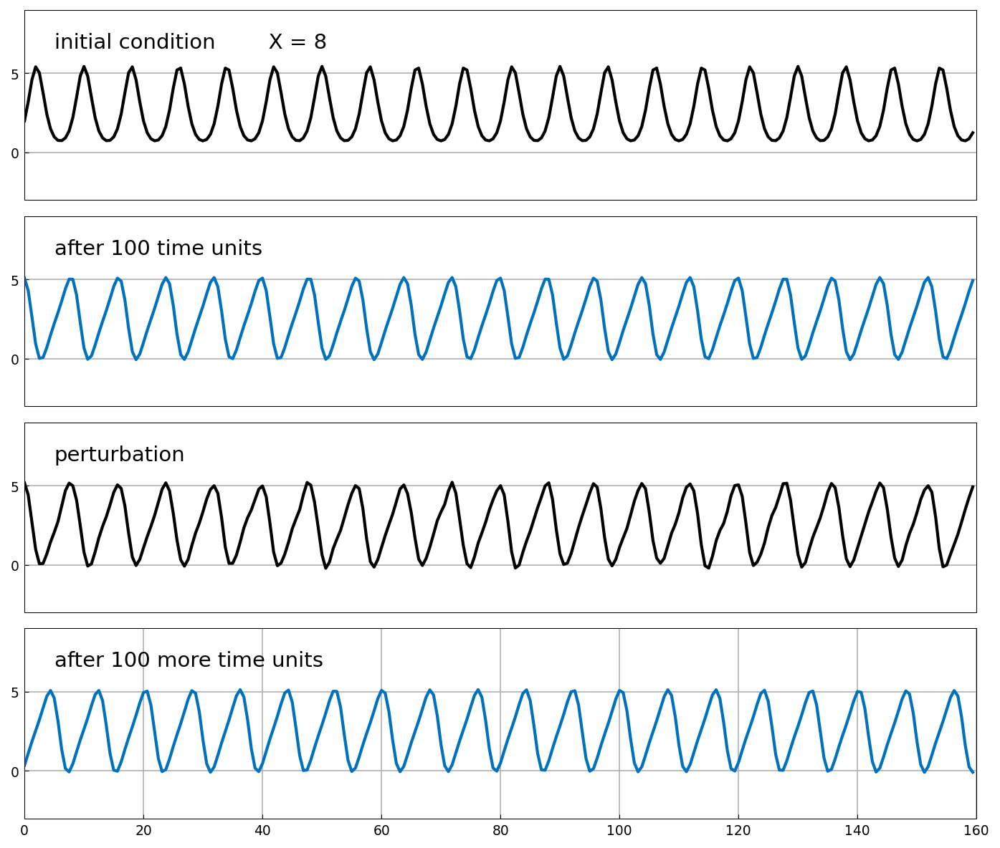
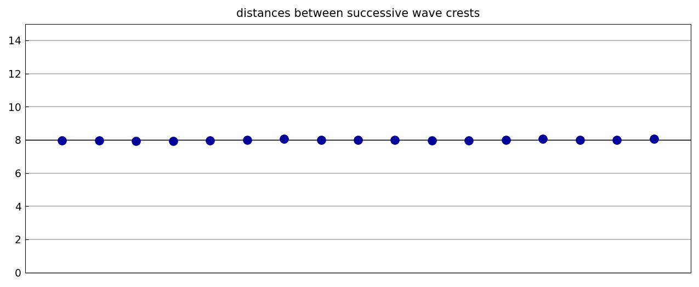
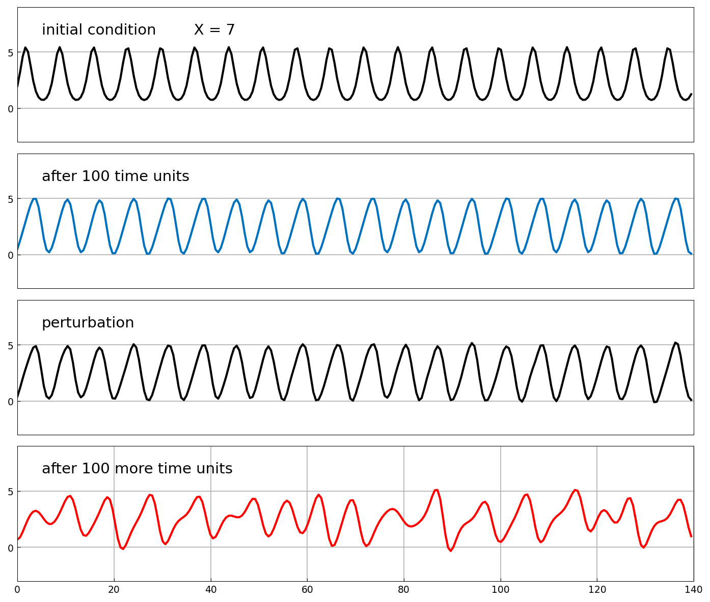
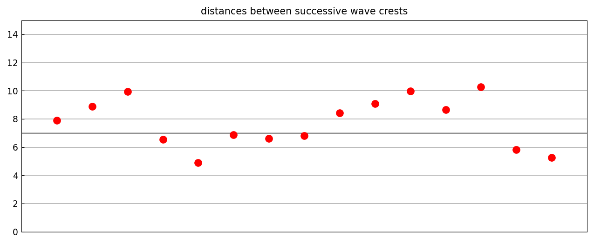
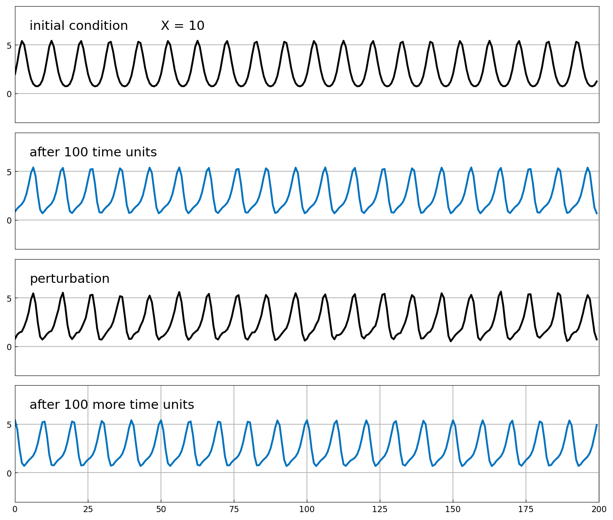
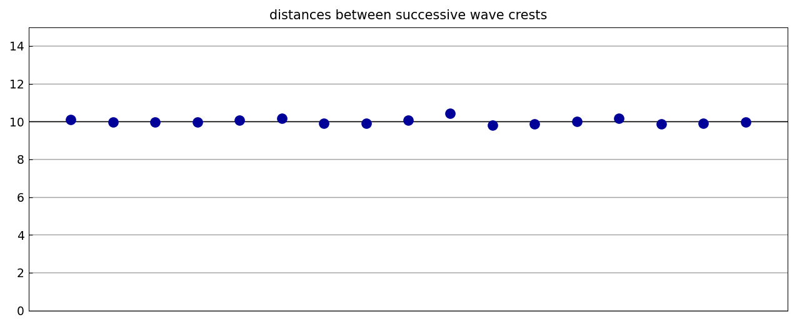
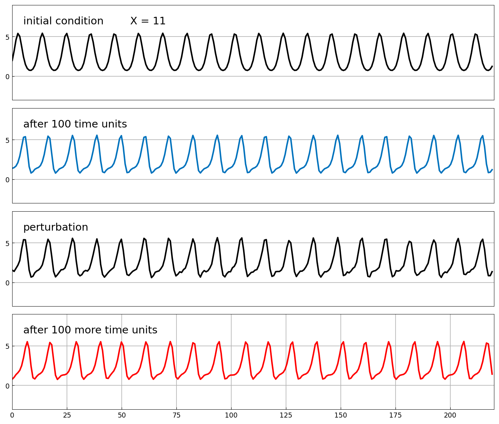
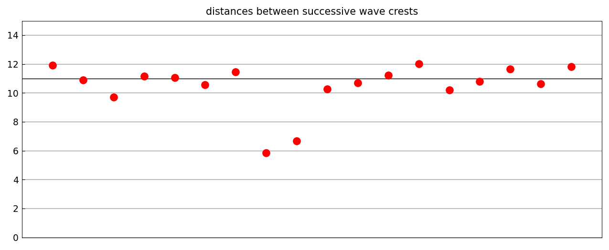

# Traveling waves of the KS and generalized KS equations

*Nick Trefethen*

[Original MATLAB Chebfun example](https://www.chebfun.org/examples/pde/KSWave.html)

(Chebfun Example pde/KSWave.m)

## 1. The KS equation

The Kuramoto–Sivashinsky equation has stable traveling-wave
solutions. With initial wave $U(x) = 2e^{\sin(2\pi x/X)}$ of period
$X = 8$ on a domain of length $20X$ ($N = 256$, $\Delta t = 0.02$),
the wave that emerges after 100 time units survives a random
perturbation — the regular wave form is restored:



The distances between successive wave crests stay nearly constant:



```text
crest gaps: mean 7.994 std 0.035 (X = 8)
```

With $X = 7$ the perturbation excites an instability, and we end with
an apparently chaotic waveform:




```text
crest gaps: mean 7.725 std 1.694 (X = 7)
```

## 2. Generalized KS equation

$$ u_t = -(u^2/2)_x - \delta(u_{xx} + u_{xxxx}) - \varepsilon u_{xxx} $$

with $\delta = 0.8$, $\varepsilon = 0.6$ (Barker et al., *Physica D*
2013). $X = 10$ gives a stable wave; $X = 11$ (their Figure 6a) does
not:






```text
crest gaps: mean 10.007 std 0.147 (X = 10)
crest gaps: mean 10.480 std 1.616 (X = 11)
```

All four stability verdicts match the published example; the
perturbations are JAX `randnfun` samples (MATLAB's rng stream is not
reproducible), so the chaotic panels are samples of the same law.

---

*Replica script: [`examples/pde/kswave_replica.py`](https://github.com/ma-gilles/chebfunjax/blob/main/examples/pde/kswave_replica.py).
Original example copyright by The University of Oxford and The Chebfun
Developers.*
