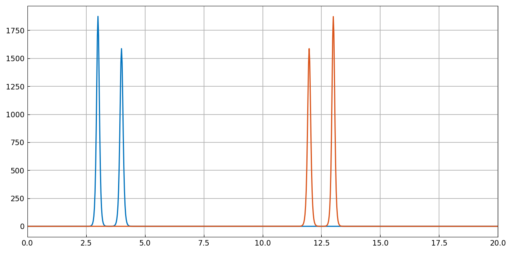
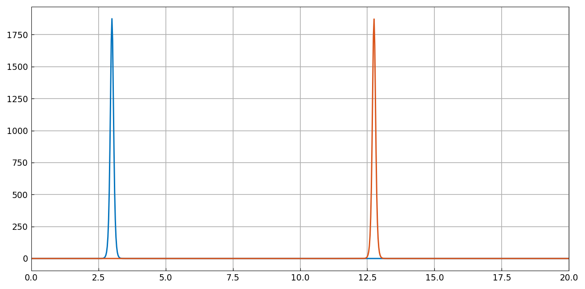
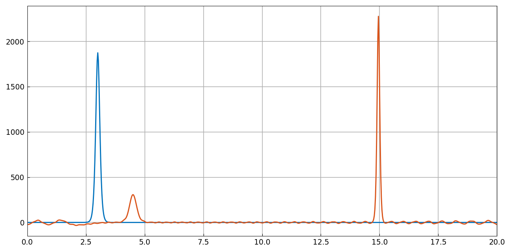
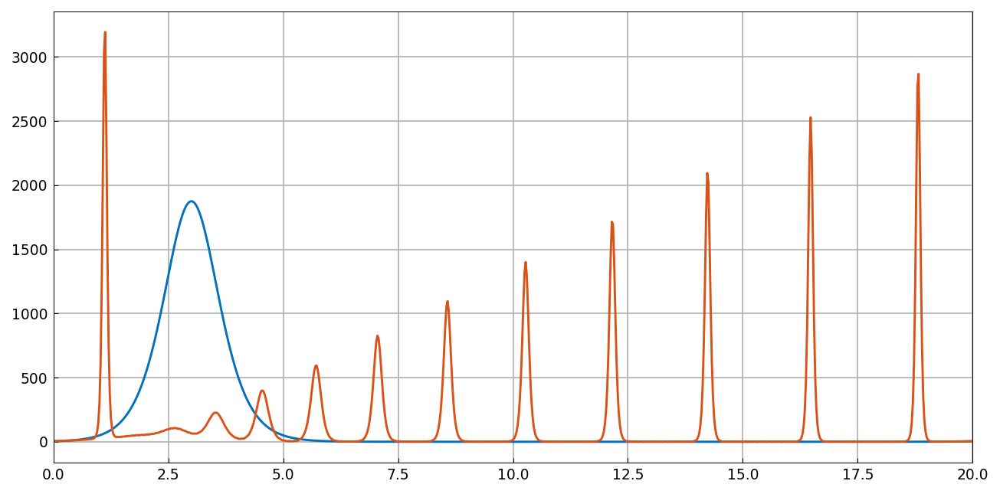
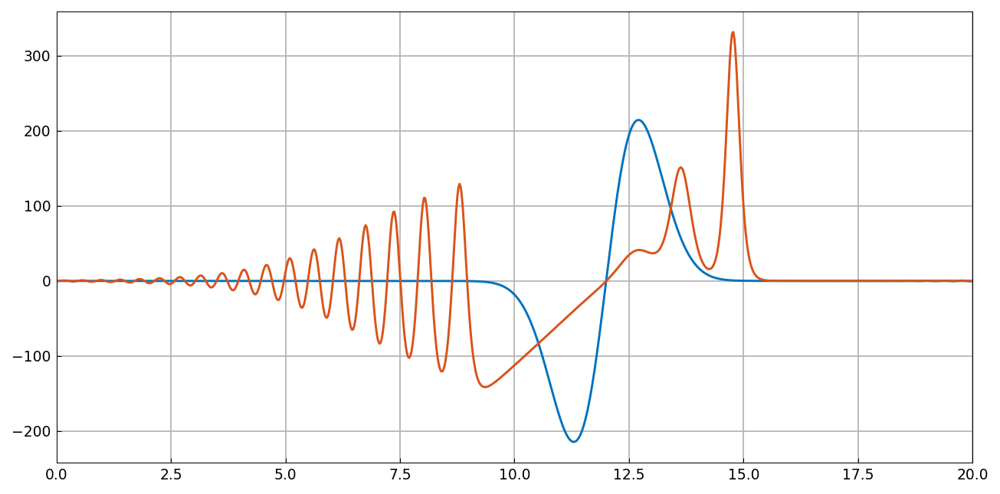

# KdV solitons and non-solitons

*Nick Trefethen, May 2016*

[Original MATLAB Chebfun example](https://www.chebfun.org/examples/pde/KdV.html)

(Chebfun Example pde/KdV.m)

## 1. Soliton solutions

`spin` (ETDRK4, Fourier spectral) solves the KdV equation

$$ u_t = -0.5(u^2)_x - u_{xxx} $$

on $[0,20]$ with a two-soliton initial condition ($A = 25$, $B = 23$,
$N = 800$, $\Delta t = 5\times10^{-6}$). The taller soliton overtakes
the slower one around $t = 0.0078$ and is as far ahead as it was
behind by $t = 0.0156$:



```text
time_in_seconds =
   3.841674328
```

(MATLAB publishes 1.40 s.)

## 2. Amplitude and speed



```text
initial_amplitude =
        1875
final_amplitude =
     1.874048195184031e+03
predicted_speed =
   625
observed_speed =
     6.248377333333334e+02
```

MATLAB publishes `1.874048194434761e+03` and
`6.248377320106790e+02` — **9 and 8 digit agreement**: the two ETDRK4
trajectories are numerically identical. (This required matching
MATLAB `spin`'s default of *no* dealiasing; with 2/3-rule dealiasing
the sharp soliton's amplitude lands at 1871.7 instead.)

## 3. Non-soliton solutions

A wider pulse breaks into a big soliton, a slow small one, and
non-soliton radiation; wider still gives a beautiful soliton train;
and an odd random-ish initial condition:





## 4. Conservation laws

For the last run, four conserved quantities (values at $t = t_{\max}$
vs $t = 0$):

```text
conserved1: u = -4.5e-14           u0 = 1.8e-14
conserved2: u = 7.833213357987e+04   u0 = 7.833213358222e+04
conserved3: u = -2.349964008126e+05  u0 = -2.349964007467e+05
conserved4: u = 6.512069540200e+08   u0 = 6.512069540223e+08
```

MATLAB publishes `7.833213357987507e+04 / 7.833213358221899e+04`,
`-2.349964008126170e+05 / -2.349964007466422e+05`,
`6.512069540200268e+08 / 6.512069540223168e+08` — **13-digit
agreement on every value**, including the same tiny conservation
drifts of the discretization.

---

*Replica script: [`examples/pde/kdv_replica.py`](https://github.com/ma-gilles/chebfunjax/blob/main/examples/pde/kdv_replica.py).
Original example copyright by The University of Oxford and The Chebfun
Developers.*
