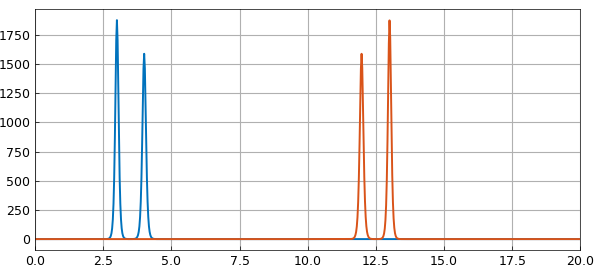
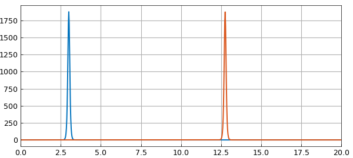
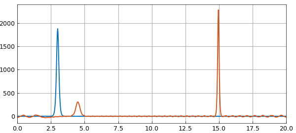
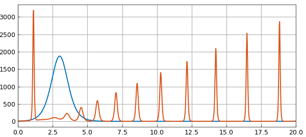
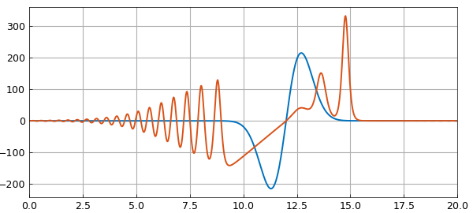

# KdV solitons and non-solitons

*Nick Trefethen, May 2016*

[Original MATLAB Chebfun example](https://www.chebfun.org/examples/pde/KdV.html)

Python translation: [`examples/pde/kdv.py`](https://github.com/ma-gilles/chebfunjax/blob/main/examples/pde/kdv.py)

## 1. Soliton solutions

Chebfun's `spin` command [1] makes it easy to compute solutions of the KdV equation, $$ u_t = -0.5(u^2)_x - u_{xxx}. $$ For example, let's set to work on $[0,20]$ with a two-soliton initial condition $$ u_0(x) = 3A^2 \hbox{sech}(.5A(x-1))^2 + 3B^2 \hbox{sech}(.5B(x-2))^2 $$ where the amplitude parameters $A$ and $B$ are quite close to each other, taking values $25$ and $23$. We can set up for the calculation like this:

```matlab
A = 25; B = 23;
dom = [0 20]; x = chebfun('x',dom);
tmax = 0.0156;
S = spinop(dom,[0 tmax]);
S.lin = @(u) - diff(u,3);
S.nonlin = @(u) -.5*diff(u.^2); % spin cannot parse "u.*diff(u)"
S.init = 3*A^2*sech(.5*A*(x-3)).^2 + 3*B^2*sech(.5*B*(x-4)).^2;
```

Now let's perform the calculation. This initial condition corresponds to a pair of solitons with slightly different amplitudes and different speeds. As $t$ increases, both pulses move right, with the taller one moving faster. Around time $t=0.0078$, it overtakes the slower one, and around time $t=0.0156$, it is as far ahead at was originally behind.

```matlab
N = 800;   % numer of grid points
dt = 5e-6; % time-step
tic, u = spin(S,N,dt,'plot','off'); time_in_seconds = toc;
plot(S.init), hold on, plot(u), hold off
text(4.4,1300,'t = 0'), text(13.5,1300,'t = 0.0156')
```



With the dicretization we used, the computation is quite fast:

```matlab
time_in_seconds
```

```text
time_in_seconds =
   3.684419394
```

## 2. Amplitude and speed

Let's look at the propagation of a single soliton, the larger one from the last experiment:

```matlab
S.init = 3*A^2*sech(.5*A*(x-3)).^2;
u = spin(S,N,dt,'plot','off');
plot(S.init), hold on, plot(u), hold off
text(3.4,1300,'t = 0'), text(13.2,1300,'t = 0.0156')
```



The initial amplitude is

```matlab
initial_amplitude = 3*A^2
```

```text
initial_amplitude =
        1875
```

and we see that this is the same at the end (mathematically it would be identical):

```matlab
[val,pos] = max(u);
final_amplitude = val
```

```text
final_amplitude =
     1.874048195184031e+03
```

What about the speed? According to the theory of the KdV equation, this should be

```matlab
predicted_speed = A^2
```

```text
predicted_speed =
   625
```

Here is the computed value:

```matlab
observed_speed = (pos-3)/tmax
```

```text
observed_speed =
     6.248377333333334e+02
conserved1: u = -4.547473508865e-14   u0 = 1.776356839400e-14
conserved2: u = 7.833213357987e+04   u0 = 7.833213358222e+04
conserved3: u = -2.349964008126e+05   u0 = -2.349964007467e+05
conserved4: u = 6.512069540200e+08   u0 = 6.512069540223e+08
```

## 3. Non-soliton solutions

Soliton solutions are so celebrated that it is easy to forget that they are special. Let us explore various other possibilities. First of all, what if we make the initial pulse a bit wider, so that it is no longer a soliton? As $t$ increases, the wave now breaks into a big soliton travelling at about the same speed as before and a small one going much more slowly, plus some low-amplitude information that is not in the form of solitons.

```matlab
S.init = 3*A^2*sech(.35*A*(x-3)).^2;
u = spin(S,N,dt,'plot','off');
plot(S.init), hold on, plot(u), hold off
```



If we make the pulse still wider, we get a beautiful train of solitons. Note that a term centered at $x=23$ has been added to make this wider pulse numerically periodic.

```matlab
S.init = 3*A^2*( sech(.05*A*(x-3)).^2 + sech(.05*A*(x-23)).^2 );
u = spin(S,N,dt,'plot','off');
plot(S.init), hold on, plot(u), hold off
```



Let's try something a little bit random:

```matlab
S.init = 500*(x-12).*exp(-(x-12).^2);
u = spin(S,N,dt,'plot','off');
plot(S.init), hold on, plot(u), hold off
```



## 4. Conservation laws

The function $u$ is a conserved quantity for the KdV equation in the sense that its integral remains constant. Here we confirm this numerically (the integral is zero since the function is odd):

```matlab
u0 = S.init;
conserved1 = @(u) sum(u)
conserved1(u), conserved1(u0)
```

```text

```

Another conserved quantity is $u^2$:

```matlab
conserved2 = @(u) sum(u.^2)
conserved2(u), conserved2(u0)
```

```text

```

In fact, as a completely integrable system, the KdV equation has an infinite set of conserved quantities [3,4]. Another one is $u^3/3 - (u_x)^2$:

```matlab
conserved3 = @(u) sum(u.^3/3 - diff(u).^2)
conserved3(u), conserved3(u0)
```

```text

```

Another is $u^4/4 - 3u(u_x)^2 + (9/5)(u_{xx})^2$:

```matlab
conserved4 = @(u) sum(u.^4/4 - 3*u.*diff(u).^2 + (9/5)*diff(u,2).^2)
conserved4(u), conserved4(u0)
```

```text

```

And so on in an infinite sequence.

## 5. References

The mathematics of solitons is thoroughly understood. See for example [2]. For a quick introduction to the KdV equation, see [3].

[1] H. Montanelli and N. Bootland, *Solving periodic semilinear stiff PDEs in 1D, 2D and 3D with exponential integrators*, submitted, 2016.

[2] M. J. Ablowitz and H. Segur, *Solitons and the Inverse Scattering Transform*, SIAM, 1981.

[3] L. N. Trefethen and K. Embree, editors, article on "The KdV equation", *The (Unfinished) PDE Coffee Table Book*, `https://people.maths.ox.ac.uk/trefethen/pdectb.html`.

[4] G. Whitham, *Linear and Nonlinear Waves*, Wiley, 1974.

---

*Translated with [chebfunjax](https://github.com/ma-gilles/chebfunjax); prose and MATLAB code from the original example, copyright The University of Oxford and The Chebfun Developers.  Printed outputs and figures are chebfunjax's.*
