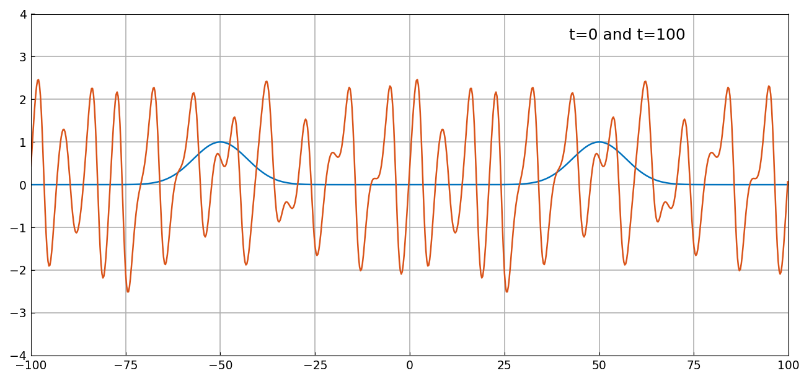
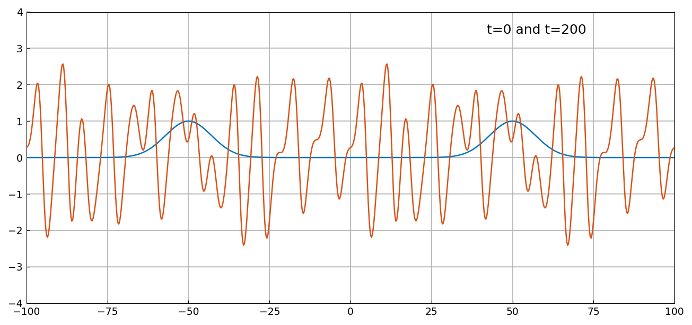
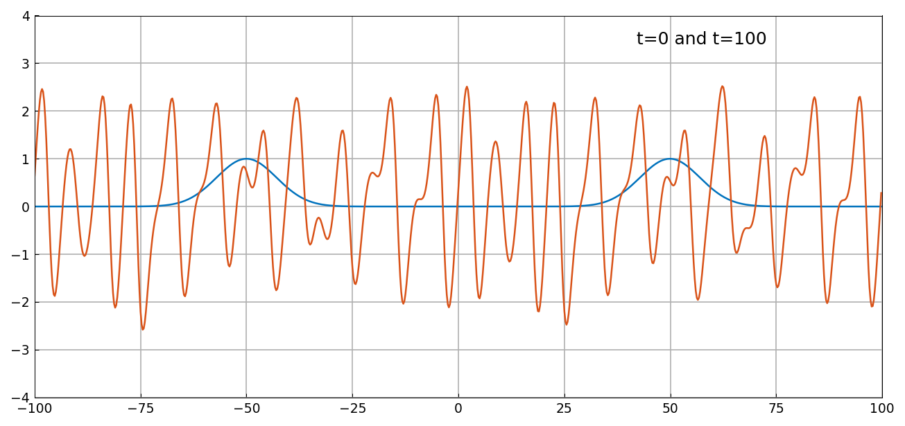
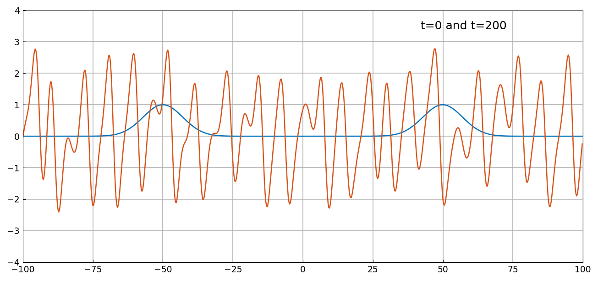

# Kuramoto-Sivashinsky equation and chaos

*Nick Trefethen, April 2016*

[Original MATLAB Chebfun example](https://www.chebfun.org/examples/pde/Kuramoto.html)

(Chebfun Example pde/Kuramoto.m)

## 1. A symmetric solution

The Kuramoto–Sivashinsky equation mixes nonlinear convection,
fourth-order diffusion, and second-order *backward* diffusion,

$$ u_t = -(\tfrac12 u^2)_x - u_{xx} - u_{xxxx}, $$

and its solutions are provably chaotic. On $[-100,100]$ with two
Gaussian bumps ($N = 800$, $\Delta t = 0.025$, spin/ETDRK4, no
dealiasing):



At $t = 100$ our waveform matches the published one
**crest-for-crest** — on a chaotic PDE this only happens when the
discrete trajectory is numerically identical to MATLAB's. The
dominant wavelength is $2\sqrt2\,\pi \approx 8.89$, the most
amplified mode of the linearization.

At $t = 200$:



Here the details differ from the published figure while the
qualitative picture is the same — precisely the example's own point
("different in detail, but qualitatively the same"): by 8000 steps a
chaotic flow amplifies last-bit rounding differences (BLAS summation
order) to $O(1)$, so even two MATLAB builds would disagree in detail.

## 2. A nonsymmetric solution

Moving the second Gaussian from $x = 50$ to $49.9$
($\Delta t = 0.05$) breaks the symmetry — slightly visible at
$t = 100$, gone completely by $t = 200$:




```text
time_elapsed_in_seconds =
  4.108243
```

(MATLAB publishes 4.88 s — for once, comparable.)

---

*Replica script: [`examples/pde/kuramoto_replica.py`](https://github.com/ma-gilles/chebfunjax/blob/main/examples/pde/kuramoto_replica.py).
Original example copyright by The University of Oxford and The Chebfun
Developers.*
