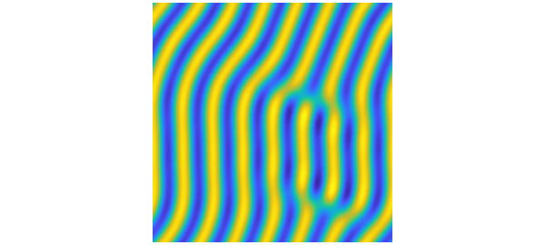
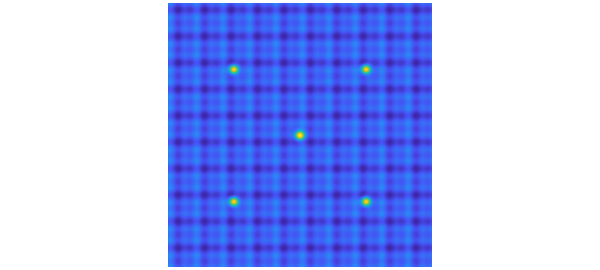
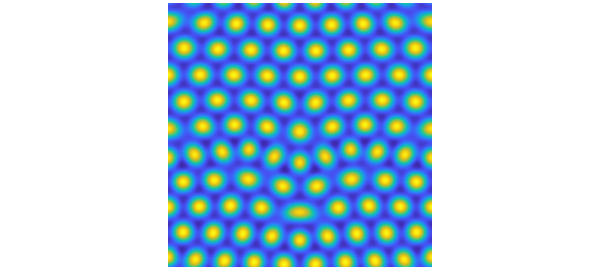
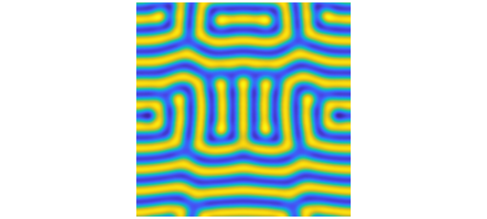
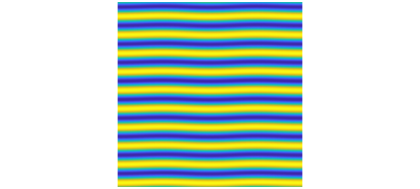

# Swift-Hohenberg equation in 2D

*Hadrien Montanelli, May 2017*

[Original MATLAB Chebfun example](https://www.chebfun.org/examples/pde/SwiftHohenberg.html)

Python translation: [`examples/pde/swifthohenberg.py`](https://github.com/ma-gilles/chebfunjax/blob/main/examples/pde/swifthohenberg.py)

## 1. Introduction

Chebfun's `spin2` and `spinop2` codes include a number of preloaded examples. One of them is the 2D Swift-Hohenberg equation, which we can run by typing `spin2('sh')`. It uses the following `spinop2` object:

```matlab
S = spinop2('sh')
```

```text
S =
  spinop2 with properties:

     domain: [0 50 0 50]
       init: [InfxInf chebfun2]
        lin: @(u)-2*lap(u)-biharm(u)
     nonlin: @(u)-.9*u-u.^3
      tspan: [0 800]
    numVars: 1
```

From here we see that the version of the equation in Chebfun is $$ u_t = ru - (1 + \Delta)^2u + gu^2 - u^3, $$ with $r = 0.1$ and $g=0$. This equation was derived by Swift and Hohenberg in 1977 to study thermal fluctuations on a fluid near the Rayleigh-Benard convective instability [1]. The function $u$ is the temperature field in a plane horizontal layer of fluid heated from below. The parameter $r$ measures how far the temperature is above the minimum temperature required for convection: for $r<0$, the heating is too small to cause convection, while for $r>0$, convection occurs. The parameter $g$ controls the strength of the quadratic nonlinearity. The Swift-Hohenberg equation is an example of a PDE that exhibits pattern formation, including stripes, spots and spirals.

The preloaded demo uses a `randndfun2` as initial condition on the domain $[0, 50]\times[0, 50]$, runs to $t=800$ and leads to the so-called convection rolls. In this example, let us run the simulation to $t=1200$.

```matlab
S.tspan = [0 1200];
N = 128; dt = 1;
u = spin2(S, N, dt, 'plot', 'off');
plot(u), view(0,90), axis equal, axis off
```



Note that we set `'plot'` to `'off'` to avoid the default movie mode. The output `u` is the solution at the final time $t=1200$ and is a `chebfun2`:

```matlab
u
```

```text
u =
   chebfun2 object  (trig)
       domain                 rank       corner values
[   0,  50] x [   0,  50]       81     [-0.11 -0.11 -0.11 -0.11]
vertical scale = 0.43
```

We will discover what effect $r$ and $g$ have on the resulting patterns during our investigations below.

## 2. Spots, spirals and stripes

Let us construct a `spinop2` corresponding to $r=10^{-2}$ and $g=1$, on the domain $[0, 20\pi]\times[0, 20\pi]$ and with time interval $[0, 200]$:

```matlab
dom = [0 20*pi 0 20*pi];
tspan = [0 200];
S = spinop2(dom, tspan);
S.lin = @(u) -2*lap(u) - biharm(u);
r = 1e-2; g = 1;
S.nonlin = @(u) (-1 + r)*u + g*u.^2 - u.^3;
```

Let us take an initial condition corresponding to the sum of a sine/cosine function and five Gaussian bumps:

```matlab
u0 = 1/20*chebfun2(@(x,y) cos(x) + sin(2*x) + sin(y) + cos(2*y), dom, 'trig');
u0 = u0 + chebfun2(@(x,y) exp(-((x-5*pi).^2 + (y-5*pi).^2)), dom, 'trig');
u0 = u0 + chebfun2(@(x,y) exp(-((x-5*pi).^2 + (y-15*pi).^2)), dom, 'trig');
u0 = u0 + chebfun2(@(x,y) exp(-((x-15*pi).^2 + (y-15*pi).^2)), dom, 'trig');
u0 = u0 + chebfun2(@(x,y) exp(-((x-15*pi).^2 + (y-5*pi).^2)), dom, 'trig');
u0 = u0 + chebfun2(@(x,y) exp(-((x-10*pi).^2 + (y-10*pi).^2)), dom, 'trig');
S.init = u0;
```

The initial condition looks like this:

```matlab
plot(S.init), view(0,90), axis equal, axis off
```



Let us run the simulation:

```matlab
u = spin2(S, 96, 2e-1, 'plot', 'off');
plot(u), view(0,90), axis equal, axis off
```



Note that we used $N=96$ points in each direction and a time-step $dt=0.2$. The values $r=10^{-2}$ and $g=1$ lead to spots, known as convection cells. When the fluid is heated, it expands and becomes less dense. The colder, denser part of the fluid descends to settle below the warmer. This causes the warmer fluid to rise and generates this pattern.

To check that the computation is correct, we can increase the number of grid points and decrese the time-step, and compute the relative error between the two solutions:

```matlab
v = spin2(S, 128, 1e-1, 'plot', 'off');
error = norm(u-v)/norm(v);
fprintf('Relative error: %1.2e\n', error)
```

```text
Relative error: 3.63e-04
```

For the same value of $g=1$ but with $r=0.7$, we get spirals:

```matlab
r = 7e-1; g = 1;
S.nonlin = @(u) (-1 + r)*u + g*u.^2 - u.^3;
u = spin2(S, 96, 2e-1, 'plot', 'off');
clf, plot(u), view(0,90), axis equal, axis off
```



Finally, for $r=10^{-1}$, $g=0$, the solution as $t=200$ is a set of stripes:

```matlab
S.tspan = [0 200];
r = 1e-1; g = 0;
S.nonlin = @(u) (-1 + r)*u + g*u.^2 - u.^3;
u = spin2(S, 100, 2e-1, 'plot', 'off');
plot(u), view(0,90), axis equal, axis off
```



Like the solution of the preloaded demo, this solution represents a set of convection rolls where each yellow stripe is the hot fluid coming up, and each blue stripe is the cold fluid going down.

## 3. References

[1] J. Swift and P. C. Hohenberg, *Hydrodynamic fluctuations at the convective instability*, Phys. Rev. A, 15 (1977), pp. 319-328.

---

*Translated with [chebfunjax](https://github.com/ma-gilles/chebfunjax); prose and MATLAB code from the original example, copyright The University of Oxford and The Chebfun Developers.  Printed outputs and figures are chebfunjax's.*
