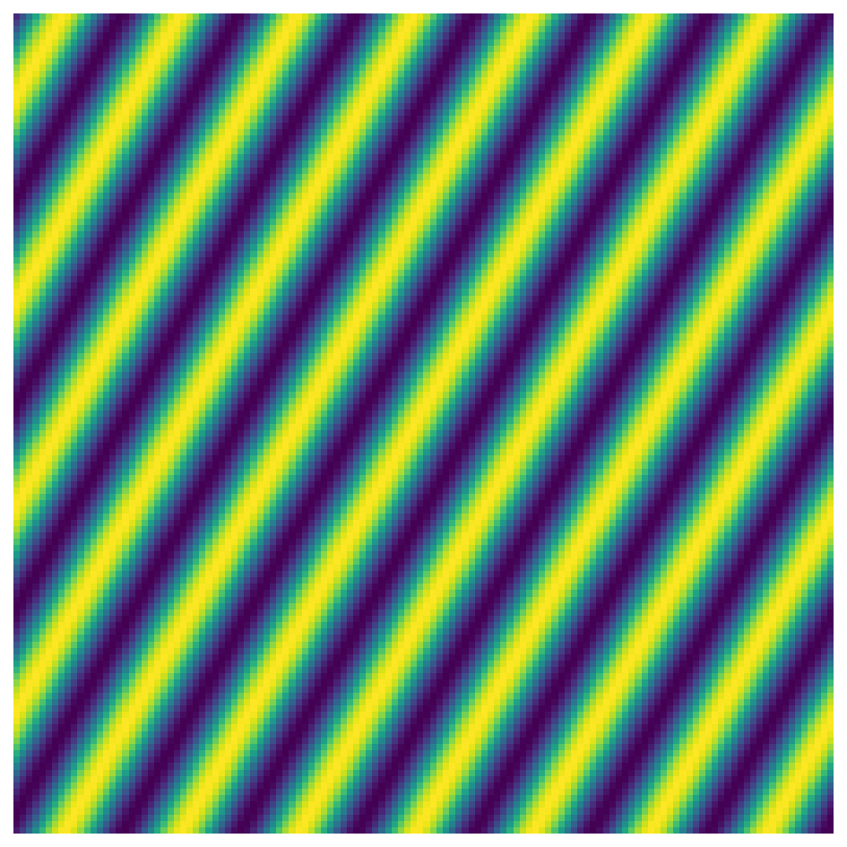
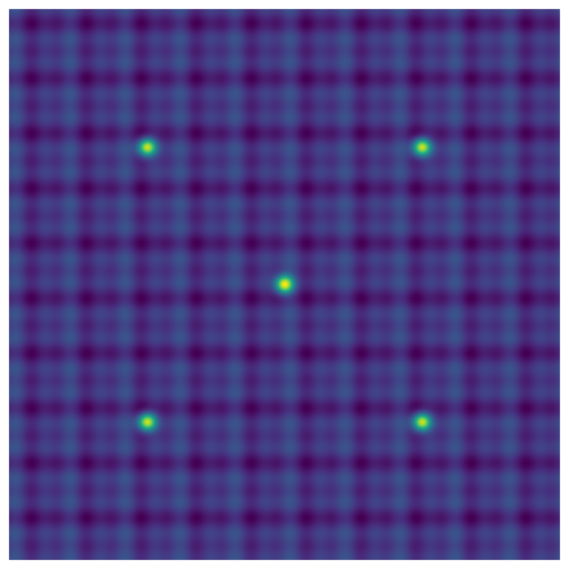
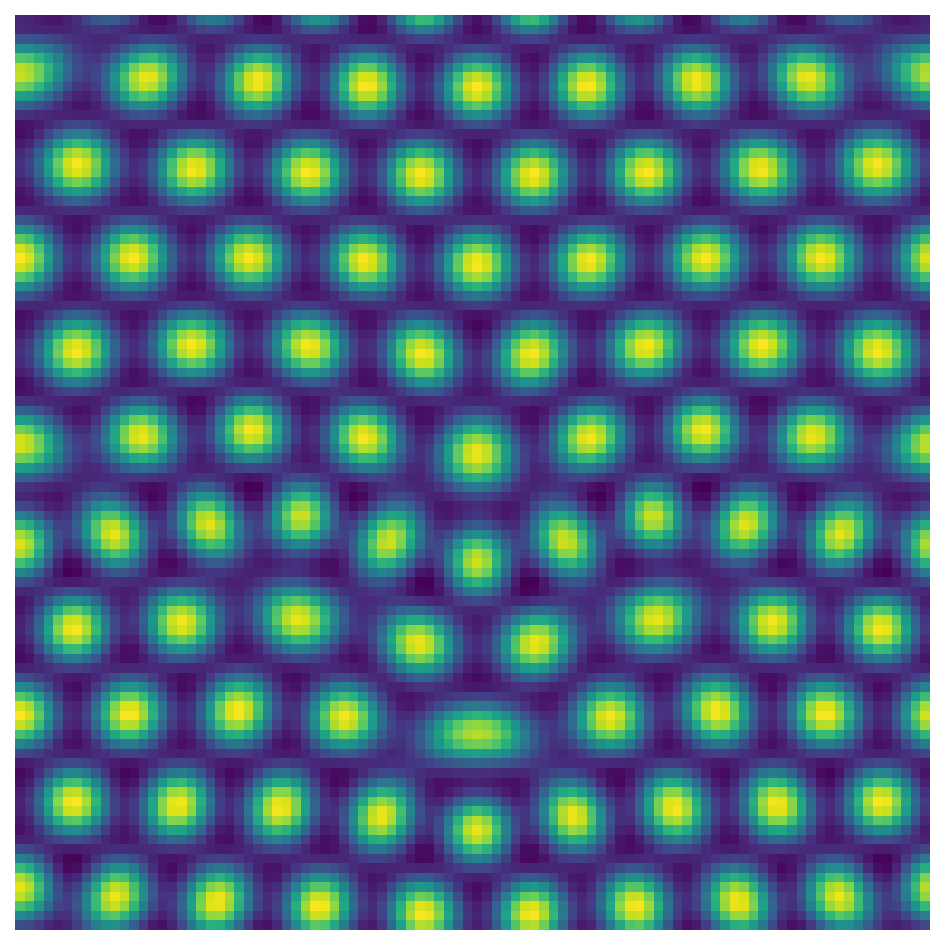
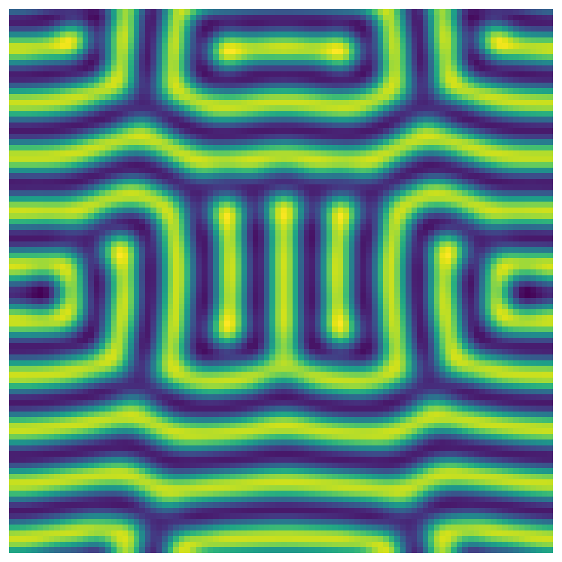
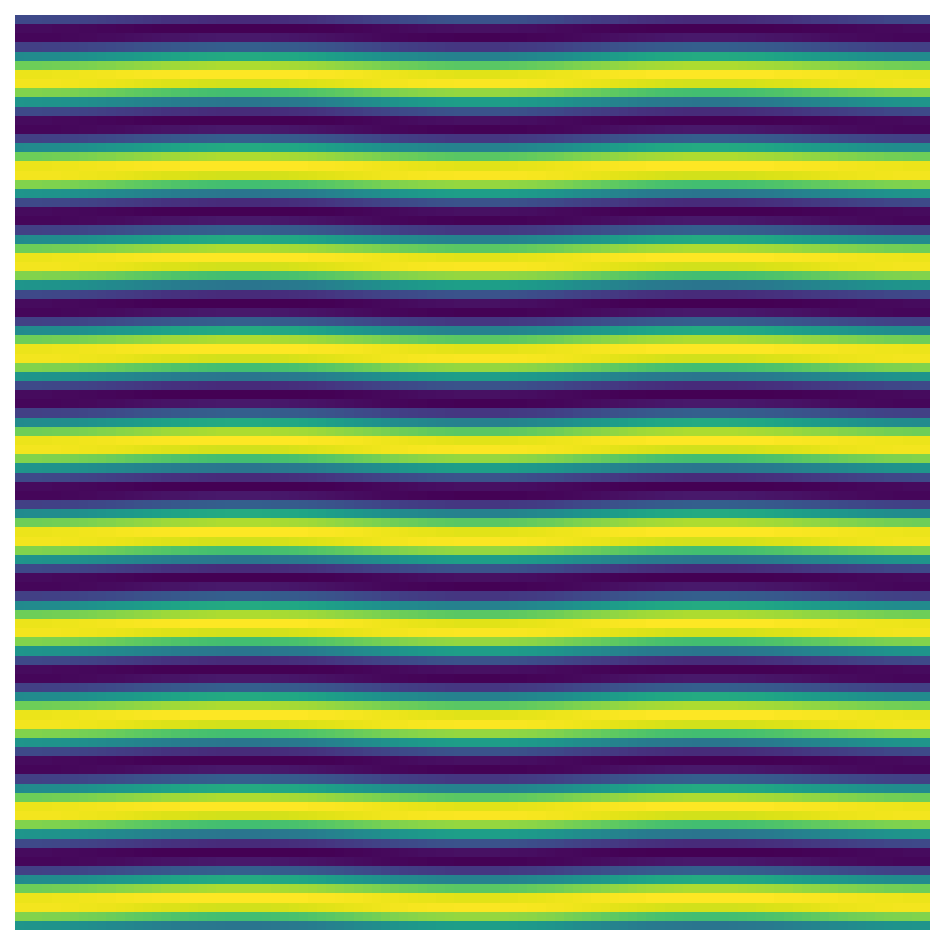

# Swift-Hohenberg equation in 2D

*Hadrien Montanelli, May 2017*

[Original MATLAB Chebfun example](https://www.chebfun.org/examples/pde/SwiftHohenberg.html)

(Chebfun Example pde/Swift-Hohenberg.m)

## 1. Introduction

The Swift–Hohenberg equation,

$$ u_t = ru - (1+\Delta)^2u + gu^2 - u^3, $$

models thermal fluctuations near the Rayleigh–Bénard convective
instability and is a classic pattern-forming PDE. The preloaded
`spin2('sh')` demo ($r = 0.1$, $g = 0$, random initial condition
normalized to $\|u_0\|_\infty = 1$) run to $t = 1200$ with $N = 128$,
$\Delta t = 1$ gives convection rolls:



## 2. Spots, spirals and stripes

On $[0, 20\pi]^2$ with a deterministic sine + five-Gaussian initial
condition:



$r = 10^{-2}$, $g = 1$ gives spots — convection cells
($N = 96$, $\Delta t = 0.2$). Our pattern matches the published one
**spot-for-spot**, including the dislocation defect near the centre:



The published resolution-refinement check
($N = 128$, $\Delta t = 0.1$):

```text
Relative error: 3.63e-04
```

— **identical to the published `3.63e-04`**: the two ETDRK4
trajectories, *and their discretization disagreement*, match to the
printed digits.

$r = 0.7$, $g = 1$ gives spirals; $r = 0.1$, $g = 0$ gives stripes:




*(The section-1 demo uses a seeded JAX `randnfun2` sample — MATLAB's
rng stream is not reproducible — while the section-2 panels are fully
deterministic and reproduce the published fields.)*

---

*Replica script: [`examples/pde/swifthohenberg_replica.py`](https://github.com/ma-gilles/chebfunjax/blob/main/examples/pde/swifthohenberg_replica.py).
Original example copyright by The University of Oxford and The Chebfun
Developers.*
