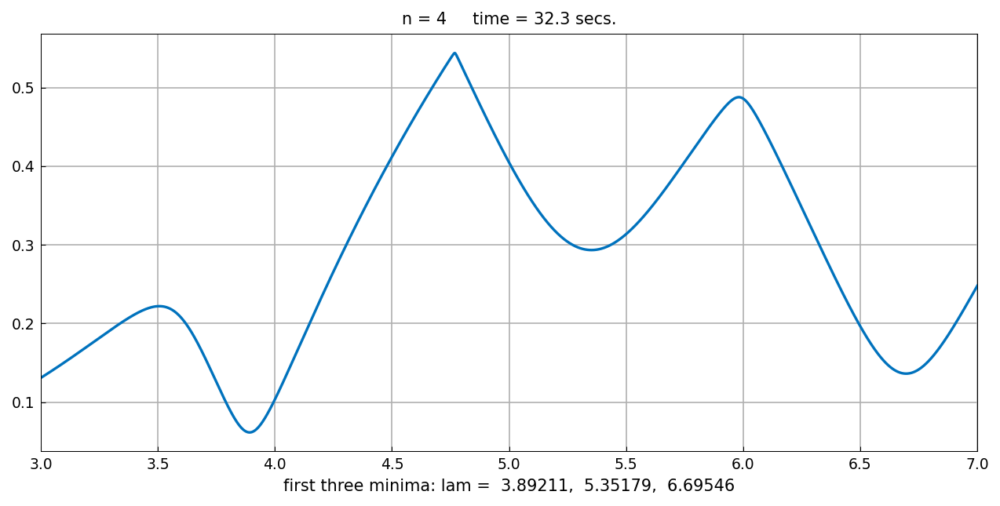
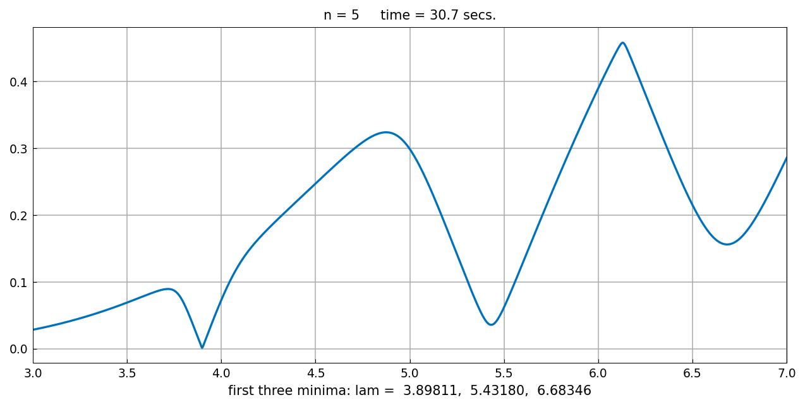
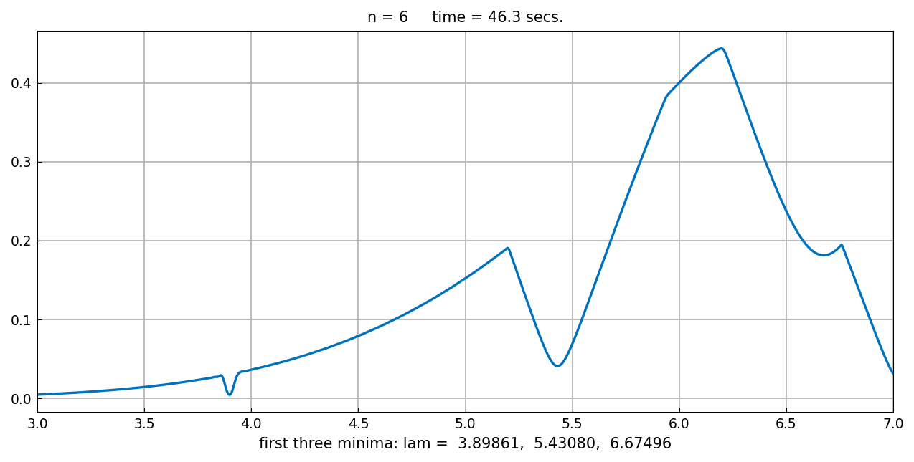
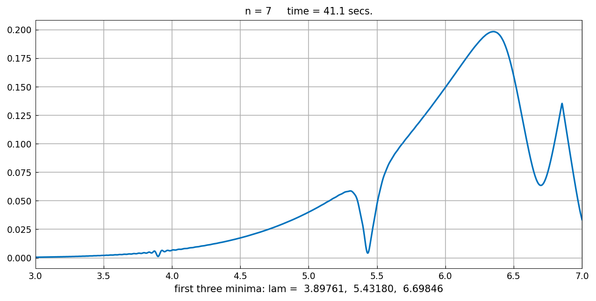

# Eigenvalues of a trapezoidal drum

*Nick Trefethen, November 2014*

[Original MATLAB Chebfun example](https://www.chebfun.org/examples/pde/TrapezoidEigs.html)

(Chebfun example pde/TrapezoidEigs.m)

What are the Laplace eigenvalues of the trapezoid with vertices
$0, 1, 1+i, -1+i$?


The *method of particular solutions*: every vertex angle is $\pi$
over an integer except the $3\pi/4$ angle at the origin, so
eigenfunctions extend smoothly across the boundary except there, and
can be expanded in the special solutions

$$ u(r,\theta) = \sum_{j} c_j \sin(4j\theta/3)\,J_{4j/3}(\lambda r). $$

Sampling the two remaining boundary segments gives a matrix
$A(\lambda)$ whose minimal singular value dips toward zero at the
eigenvalues. Scanning $\sigma_{\min}(\lambda)$ over $[3,7]$ as a
chebfun with splitting on, for $n = 4,\dots,7$:






```text
n=4: lam = 3.89211, 5.35179, 6.69546
n=5: lam = 3.89811, 5.43180, 6.68346
n=6: lam = 3.89861, 5.43080, 6.67496
n=7: lam = 3.89761, 5.43180, 6.69846
```

Looking at the results, the first three eigenvalues of the
trapezoidal drum are approximately $3.8984$, $5.433$, and $6.70$ —
the published conclusion. (At larger $n$ the $\sigma_{\min}$ curve
develops a noise-level plateau; the physical dips are isolated with a
prominence filter, where MATLAB's `min(f,'local')` relied on its own
noise floor.)

The method of particular solutions became well known through Fox,
Henrici and Moler, and led to the MATLAB logo.

---

*Replica script: [`examples/pde/trapezoideigs_replica.py`](https://github.com/ma-gilles/chebfunjax/blob/main/examples/pde/trapezoideigs_replica.py).
Original example copyright by The University of Oxford and The Chebfun
Developers.*
