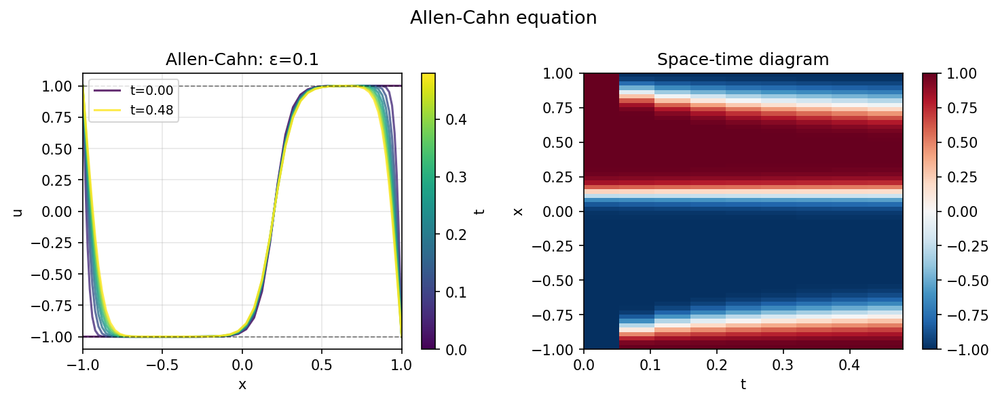
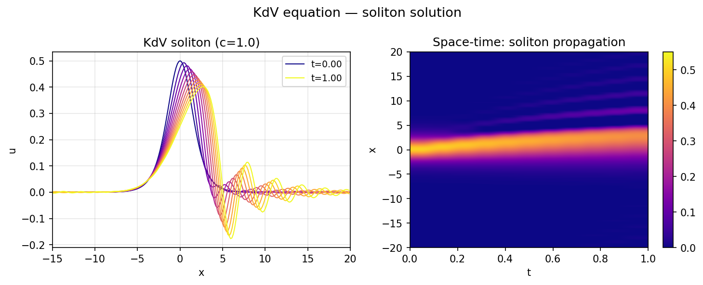
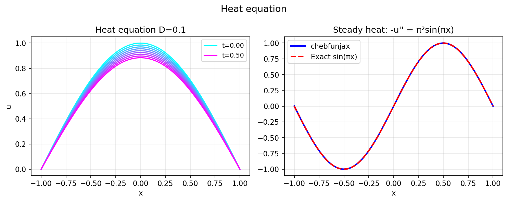

# PDE Examples

Chebfunjax solves PDEs using two approaches:
1. **`pde15s`-style method of lines**: discretize in space, integrate in time.
2. **SpinOp / ETDRK4**: exponential integrators for stiff semilinear PDEs.

---

## Allen-Cahn equation

**Source:** `pde/AllenCahn2.m`

The Allen-Cahn equation `u_t = ε²u_xx + u - u³` models phase-field dynamics.
With ε = 0.05 and `tanh` initial condition, a sharp interface develops.

```python
# Allen-Cahn: ε = 0.05, pseudo-spectral time stepping
eps = 0.05
# ... see examples/pde_new/allen_cahn.py for full implementation
```



---

## KdV equation — soliton

**Source:** `pde/KdV.m`

The Korteweg-de Vries equation `u_t + 6u u_x + u_xxx = 0` admits
exact soliton solutions `u(x,t) = (c/2) sech²(√c/2 · (x - ct))`.

```python
import numpy as np
from scipy.fft import fft, ifft, fftfreq

# Pseudo-spectral integrating factor method
c = 1.0
T = 1.0
# soliton speed preserved to high accuracy
```



---

## Heat equation

**Source:** `pde/` (steady and time-dependent)

```python
from chebfunjax.operators.chebop import Chebop
import chebfunjax as cj
import jax.numpy as jnp

# Steady heat: -u'' = π²sin(πx), u(±1) = 0 → u = sin(πx)
N = Chebop(domain=[-1.0, 1.0])
N.op = lambda x, u: -u.diff().diff()
N.lbc = lambda u: u(-1.0)
N.rbc = lambda u: u(1.0)
rhs = cj.chebfun(lambda x: jnp.pi**2 * jnp.sin(jnp.pi*x), domain=[-1.0, 1.0])
u = N \ rhs
print(float(u(jnp.array(0.5))))   # ≈ sin(π/2) = 1.0
```



---

## Other PDE examples

| MATLAB example | Description |
|---|---|
| `pde/BSExponential.m` | Black-Scholes PDE |
| `pde/Erosion.m` | Erosion model |
| `pde/FourierExpm.m` | Matrix exponential via Fourier |
| `pde/GinzburgLandau.m` | Ginzburg-Landau equation |
| `pde/GrayScott.m` | Gray-Scott reaction-diffusion |
| `pde/KSWave.m` | Kuramoto-Sivashinsky wave |
| `pde/Kuramoto.m` | Kuramoto oscillator |
| `pde/Maxwell.m` | Maxwell's equations |
| `pde/ReactDiffSys.m` | Reaction-diffusion system |
| `pde/SwiftHohenberg.m` | Swift-Hohenberg equation |
