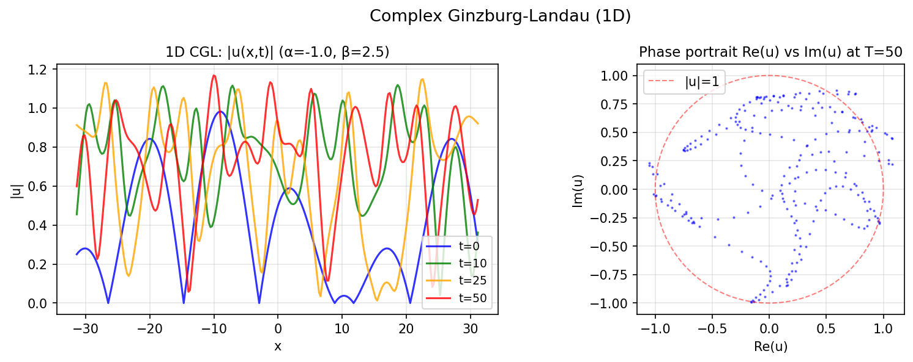
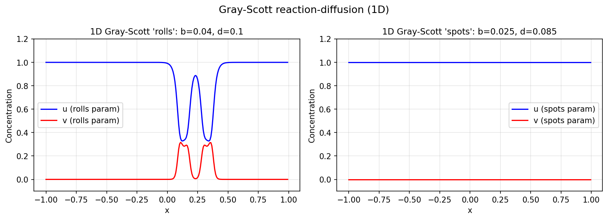
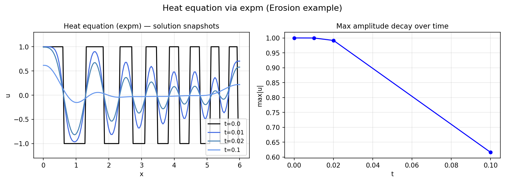
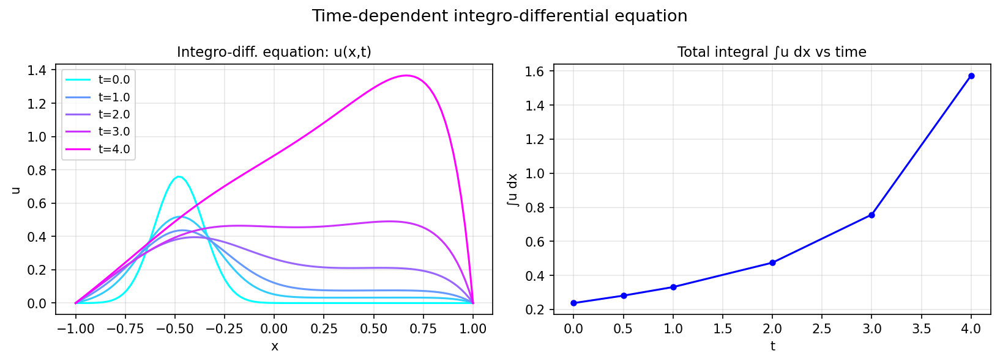
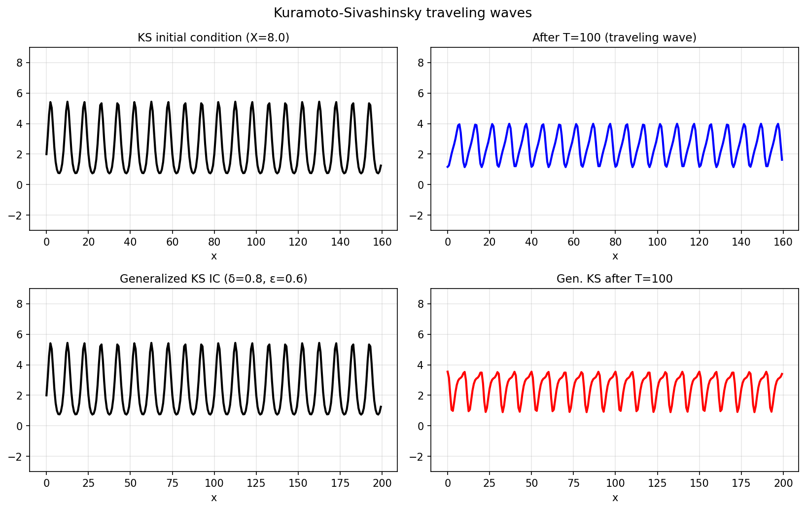
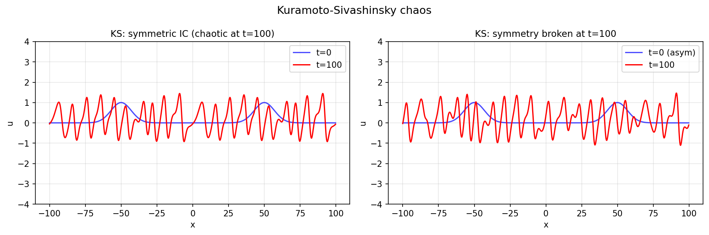
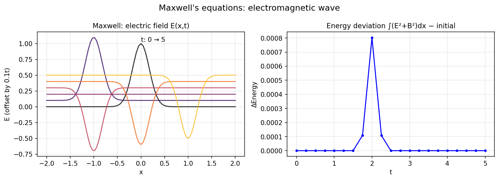
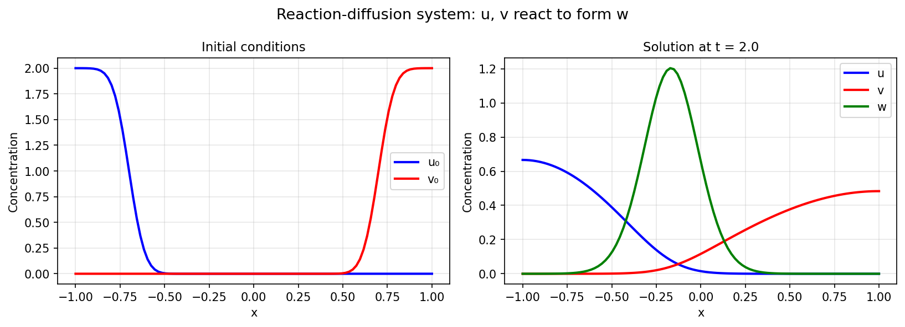
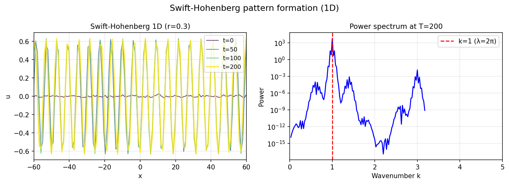
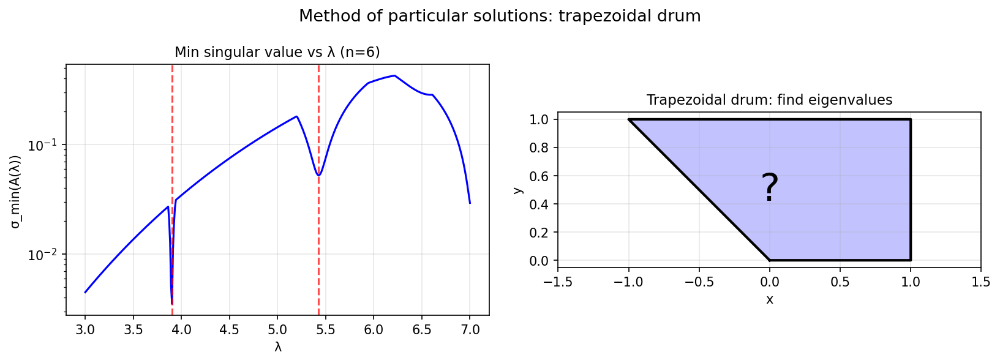

# PDE Examples

Chebfunjax solves PDEs using two approaches:
1. **Method of lines**: discretize in space, integrate in time with scipy.
2. **Pseudo-spectral / ETDRK4**: exponential integrators for stiff semilinear PDEs.

---

## Allen-Cahn equation

**Source:** `pde/AllenCahn2.m`
**Python:** `examples/pde/allen_cahn2.py`

The Allen-Cahn equation `u_t = ε²u_xx + u - u³` models phase-field dynamics.
With ε = 0.05 and `tanh` initial condition, a sharp interface develops.


---

## Black-Scholes PDE

**Source:** `pde/BSExponential.m`
**Python:** `examples/pde/black_scholes_pde.py`
**Original:** https://www.chebfun.org/examples/pde/BSExponential.html

Solves the Black-Scholes PDE for a European call using the
log-price transformation `S = e^x`:

```
V_t + (1/2)σ² V_xx + (r - σ²/2) V_x - r V = 0
```

Final condition: `V(x, T) = max(e^x - K, 0)`.


---

## Matrix exponential via Fourier (heat equation)

**Source:** `pde/FourierExpm.m`
**Python:** `examples/pde/fourier_expm.py`
**Original:** https://www.chebfun.org/examples/pde/FourierExpm.html

Computes `exp(t L)` where `L` is the 1D heat operator, using
the Fourier spectral method.


---

## Ginzburg-Landau equation (2D)

**Source:** `pde/GinzburgLandau.m`
**Python:** `examples/pde/ginzburg_landau_2d.py`

The complex Ginzburg-Landau equation `u_t = u + (1+ib)u_xx - (1+ic)|u|²u`
models pattern formation and spiral waves.



---

## Gray-Scott reaction-diffusion (2D)

**Source:** `pde/GrayScott.m`
**Python:** `examples/pde/gray_scott_2d.py`
**Original:** https://www.chebfun.org/examples/pde/GrayScott.html

The Gray-Scott system models autocatalytic reactions:

```
u_t = Du Δu - uv² + F(1-u)
v_t = Dv Δv + uv² - (F+k)v
```

Produces complex spatial patterns (spots, stripes, labyrinthine structures)
depending on parameters `F` and `k`.



---

## Heat equation via matrix exponential

**Source:** `pde/HeatExpm.m`
**Python:** `examples/pde/heat_expm.py`
**Original:** https://www.chebfun.org/examples/pde/HeatExpm.html

Solves `u_t = u_xx` on `[-π, π]` with periodic BCs using `expm(t*L)`.



---

## Time-dependent integro-differential equation

**Source:** `pde/IntegroDiffT.m` — Nick Hale, October 2010
**Python:** `examples/pde/integro_diff_time.py`
**Original:** https://www.chebfun.org/examples/pde/IntegroDiffT.html

Solves:
```
u_t = 0.02 u_xx + (∫_{-1}^{1} u dx) · (∫_{-1}^{x} u ds)
```
with Dirichlet BCs `u(±1) = 0`. Method of lines with RK4 time stepping.



---

## Kuramoto-Sivashinsky wave

**Source:** `pde/KSWave.m`
**Python:** `examples/pde/ks_wave.py`
**Original:** https://www.chebfun.org/examples/pde/KSWave.html

The Kuramoto-Sivashinsky equation:

```
u_t + u u_x + u_xx + u_xxxx = 0
```

Models flame front dynamics and turbulence in thin films.
Uses the ETDRK4 pseudo-spectral integrator.



---

## Kuramoto oscillators

**Source:** `pde/Kuramoto.m`
**Python:** `examples/pde/kuramoto_sivashinsky.py`

The Kuramoto oscillator model for coupled phase oscillators.



---

## Maxwell's equations (1D)

**Source:** `pde/Maxwell.m`
**Python:** `examples/pde/maxwell_equations.py`
**Original:** https://www.chebfun.org/examples/pde/Maxwell.html

1D electromagnetic wave propagation:

```
E_t = -B_x
B_t = -E_x
```

Energy `E² + B²` is conserved. Uses Fourier spectral discretization.



---

## Coupled reaction-diffusion system

**Source:** `pde/ReactDiffSys.m` — Nick Hale, October 2010
**Python:** `examples/pde/react_diff_sys.py`
**Original:** https://www.chebfun.org/examples/pde/ReactDiffSys.html

Three-component reaction-diffusion with Neumann BCs:

```
u_t = 0.1 u_xx - 100 uv
v_t = 0.2 v_xx - 100 uv
w_t = 0.001 w_xx + 200 uv
```

Chemicals `u`, `v` react to form product `w`. Uses stiff BDF solver.



---

## SVD of frequency response operator

**Source:** `pde/SVDFrequencyResponse.m` — Lieu & Jovanovic, January 2012
**Python:** `examples/pde/svd_frequency_response.py`
**Original:** https://www.chebfun.org/examples/pde/SVDFrequencyResponse.html

Computes the SVD of the frequency response operator for the 1D diffusion equation.
Analytical singular values: `σ_n = 4/(nπ)²`.


---

## Swift-Hohenberg equation (2D)

**Source:** `pde/SwiftHohenberg.m`
**Python:** `examples/pde/swift_hohenberg_2d.py`

The Swift-Hohenberg equation:

```
u_t = r u - (1 + ∂_x²)² u - u³
```

Models pattern formation (stripes, hexagons, spirals) in convection.



---

## Trapezoid rule eigenvalues

**Source:** `pde/TrapezoidEigs.m`
**Python:** `examples/pde/trapezoid_eigs.py`
**Original:** https://www.chebfun.org/examples/pde/TrapezoidEigs.html

Computes eigenvalues of the trapezoid rule applied to a Volterra-type
integral operator, demonstrating the connection between quadrature
and spectral theory.


