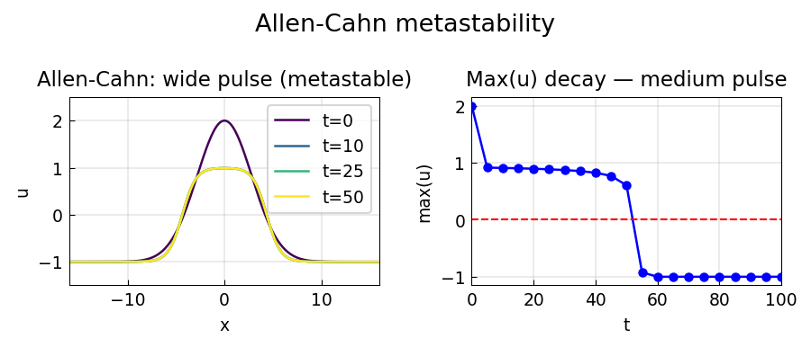
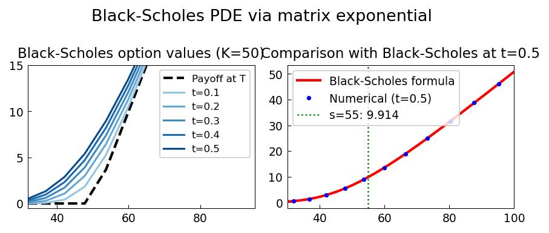
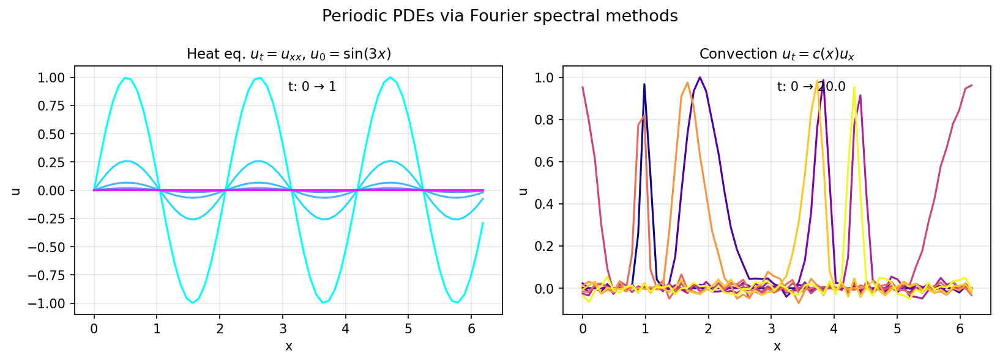

# PDE Examples

Chebfunjax solves PDEs using two approaches:
1. **Method of lines**: discretize in space, integrate in time with scipy.
2. **Pseudo-spectral / ETDRK4**: exponential integrators for stiff semilinear PDEs.

---

## Allen-Cahn equation

**Source:** `pde/AllenCahn2.m`
**Python:** `examples/pde/allen_cahn2.py`

The Allen-Cahn equation `u_t = ε²u_xx + u - u³` models phase-field dynamics.
With ε = 0.05 and `tanh` initial condition, a sharp interface develops.



---

## Black-Scholes PDE

**Source:** `pde/BSExponential.m`
**Python:** `examples/pde/black_scholes_pde.py`
**Original:** https://www.chebfun.org/examples/pde/BSExponential.html

Solves the Black-Scholes PDE for a European call using the
log-price transformation `S = e^x`:

```
V_t + (1/2)σ² V_xx + (r - σ²/2) V_x - r V = 0
```

Final condition: `V(x, T) = max(e^x - K, 0)`.



---

## Matrix exponential via Fourier (heat equation)

**Source:** `pde/FourierExpm.m`
**Python:** `examples/pde/fourier_expm.py`
**Original:** https://www.chebfun.org/examples/pde/FourierExpm.html

Computes `exp(t L)` where `L` is the 1D heat operator, using
the Fourier spectral method.



---

## Ginzburg-Landau equation (2D)

**Source:** `pde/GinzburgLandau.m`
**Python:** `examples/pde/ginzburg_landau_2d.py`

The complex Ginzburg-Landau equation `u_t = u + (1+ib)u_xx - (1+ic)

| Example | Description |
|---------|-------------|
| [Coupled Reaction-Diffusion System](react_diff_sys.md) | Source: ... — Nick Hale, October 2010 Python: ... |
| [SVD of Frequency Response Operator](svd_frequency_response.md) | Source: ... — Lieu & Jovanovic, January 2012 Python: ... |
