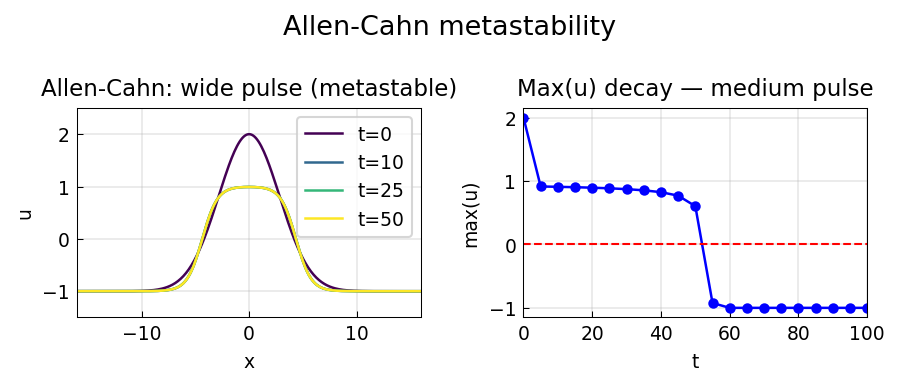
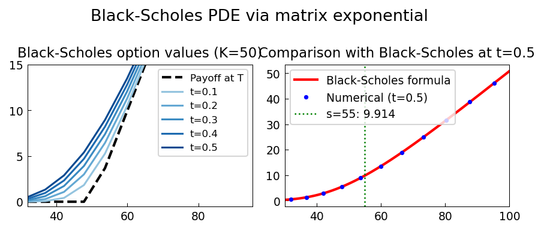
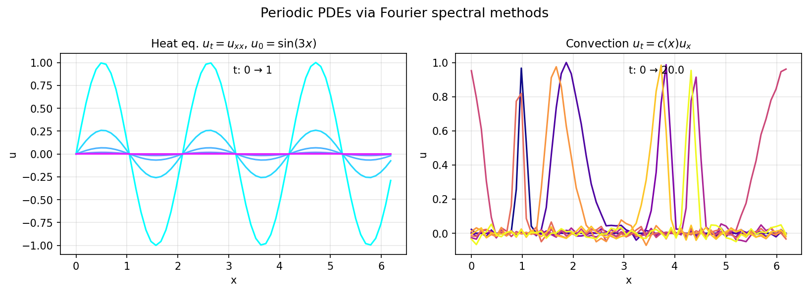

# PDE Examples

Chebfunjax solves PDEs using two approaches:
1. **Method of lines**: discretize in space, integrate in time with scipy.
2. **Pseudo-spectral / ETDRK4**: exponential integrators for stiff semilinear PDEs.

---

## Allen-Cahn equation

**Source:** `pde/AllenCahn2.m`
**Python:** `examples/pde/allen_cahn2.py`

The Allen-Cahn equation `u_t = ε²u_xx + u - u³` models phase-field dynamics.
With ε = 0.05 and `tanh` initial condition, a sharp interface develops.



---

## Black-Scholes PDE

**Source:** `pde/BSExponential.m`
**Python:** `examples/pde/black_scholes_pde.py`
**Original:** https://www.chebfun.org/examples/pde/BSExponential.html

Solves the Black-Scholes PDE for a European call using the
log-price transformation `S = e^x`:

```
V_t + (1/2)σ² V_xx + (r - σ²/2) V_x - r V = 0
```

Final condition: `V(x, T) = max(e^x - K, 0)`.



---

## Matrix exponential via Fourier (heat equation)

**Source:** `pde/FourierExpm.m`
**Python:** `examples/pde/fourier_expm.py`
**Original:** https://www.chebfun.org/examples/pde/FourierExpm.html

Computes `exp(t L)` where `L` is the 1D heat operator, using
the Fourier spectral method.



---

## Ginzburg-Landau equation (2D)

**Source:** `pde/GinzburgLandau.m`
**Python:** `examples/pde/ginzburg_landau_2d.py`

The complex Ginzburg-Landau equation `u_t = u + (1+ib)u_xx - (1+ic)

| Example | Description |
|---------|-------------|

| [KdV solitons and non-solitons (replica)](KdV.md) | Faithful replica: 13-digit conserved quantities; 9-digit soliton amplitude. |
| [Kuramoto-Sivashinsky equation and chaos (replica)](Kuramoto.md) | Faithful replica: crest-for-crest chaotic waveform at t=100. |
| [Traveling waves of the KS equations (replica)](KSWave.md) | Faithful replica: all four stability verdicts reproduced. |
| [Swift-Hohenberg equation in 2D (replica)](SwiftHohenberg.md) | Faithful replica: spot-for-spot pattern; refinement error exactly 3.63e-04. |
| [Gray-Scott equations in 2D (replica)](GrayScott.md) | Faithful replica: rolls/spots; tilted-symmetry test 1.4% vs 70%. |
| [Complex Ginzburg-Landau equation in 2D (replica)](GinzburgLandau.md) | Faithful replica: arm-for-arm spirals; diagonal symmetry preserved at t=48. |
| [Time-dependent PDEs on a periodic interval with expm (replica)](FourierExpm.md) | Faithful replica: heat decay e^-9 to 7 digits; coherent convection. |
| [Black-Scholes PDE using operator exponential (replica)](BSExponential.md) | Faithful replica: v(55) to 5 digits; piecewise-expm gap ledgered. |
| [Heat equation via expm (replica)](Erosion.md) | Faithful replica: erosion curves point-for-point at t=0.1. |
