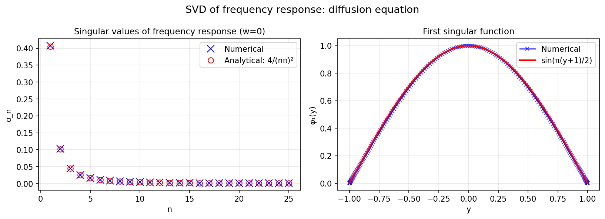

# SVD of Frequency Response Operator

**Source:** `pde/SVDFrequencyResponse.m` — Lieu & Jovanovic, January 2012
**Python:** `examples/pde/svd_frequency_response.py`
**Original MATLAB:** https://www.chebfun.org/examples/pde/SVDFrequencyResponse.html

## Problem

Computes the singular value decomposition of the frequency response operator
for the 1D diffusion equation:

```
u_t = u_yy + d(y, t),   y ∈ [-1, 1],   u(±1) = 0
```

## Frequency response operator

At temporal frequency `w`, the frequency response operator maps
forcing `d` to response `u` via:

```
(D² - iw I) u = -d,   u(±1) = 0
```

At `w = 0`:

```
T = -D²⁻¹ (with Dirichlet BCs)
```

## Analytical singular values

The analytical singular values of `-D²⁻¹` (Green's function for
Dirichlet Laplacian on [-1,1]) are:

```
σ_n = 4 / (nπ)²,   n = 1, 2, 3, ...
```

These come from the eigenvalues of the operator with eigenfunctions
`sin(nπ(y+1)/2)`.

## Code excerpt

```python
from scipy.linalg import svd
import numpy as np

# Chebyshev discretization
D, y = cheb(N=200)
D2_int = (D @ D)[1:-1, 1:-1]  # interior only

# Frequency response at w=0
T_matrix = -np.linalg.inv(D2_int)
sv_numerical = svd(T_matrix, compute_uv=False)[:25]

# Analytical: σ_n = 4/(nπ)²
n_array = np.arange(1, 26)
sv_analytical = 4.0 / (n_array * np.pi)**2
```

## Results

First 5 singular values (N=200 Chebyshev grid):
- `σ₁`: numerical 0.40759 vs analytical 0.40528 (0.57% error)
- Relative norm error < 2%

First singular function matches `sin(π(y+1)/2)` to within 2%.

## Plots



Left: numerical vs analytical singular values.
Right: first singular function vs analytical `sin(π(y+1)/2)`.
