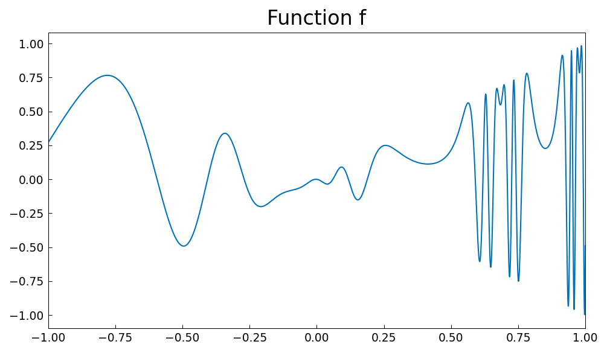
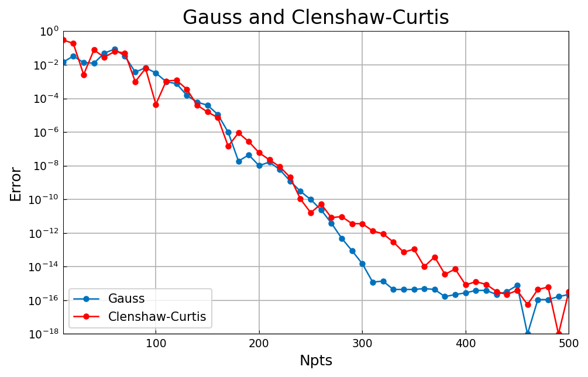

# Gauss and Clenshaw-Curtis quadrature

*Nick Trefethen*

[Original MATLAB Chebfun example](https://www.chebfun.org/examples/quad/GaussClenCurt.html)

(Chebfun example quad/GaussClenCurt.m)

Take a wiggly function on $[-1, 1]$:

```python
import jax.numpy as jnp
import chebfunjax as cj

f = lambda x: x * jnp.sin(2 * jnp.exp(2 * jnp.sin(2 * jnp.exp(2 * x))))
fc = cj.chebfun(f)
```



Chebfun's `sum`, Clenshaw-Curtis at the chebfun's own length, and
Gauss quadrature all give the same integral:

```python
Ichebfun = fc.sum()
```
```
Ichebfun =
   0.336732834781728
Npts =
   652
Iclenshawcurtis =
   0.336732834781728
Igauss =
   0.336732834781727
```

(The published chebfun length is 659; ours is 652 — the standardChop
scheme difference documented in the audit ledger.  The integrals agree
with the published values to all digits.)

Sweeping the number of points shows the classical picture: Gauss
converges about twice as fast per point, but Clenshaw-Curtis is not
far behind in practice:


