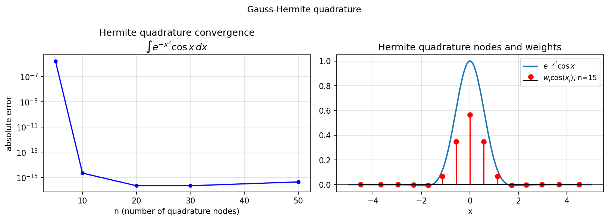

# Hermite quadrature

**Nick Trefethen and Andre Weideman, February 2017**

---

*Gauss–Hermite quadrature* integrates functions of the form $e^{-x^2} f(x)$
over $(-\infty, \infty)$ using $n$ carefully chosen nodes and weights:

$$
\int_{-\infty}^{\infty} e^{-x^2} f(x)\, dx
\;\approx\;
\sum_{j=1}^n w_j f(x_j).
$$

The nodes $\{x_j\}$ are the roots of the $n$-th Hermite polynomial $H_n$,
and the formula is exact for polynomials up to degree $2n-1$.

## Computing nodes and weights

The classical approach uses the eigenvalue decomposition of the symmetric
tridiagonal Jacobi matrix:

$$
T = \begin{pmatrix}
0 & \beta_1 & & \\
\beta_1 & 0 & \beta_2 & \\
& \beta_2 & \ddots & \ddots \\
& & \ddots & 0
\end{pmatrix},
\qquad
\beta_k = \sqrt{k/2}.
$$

```python
import numpy as np

def hermite_nodes_weights(n):
    k    = np.arange(1, n)
    beta = np.sqrt(k / 2.0)
    T    = np.diag(beta, 1) + np.diag(beta, -1)
    vals, vecs = np.linalg.eigh(T)
    idx  = np.argsort(vals)
    x    = vals[idx]
    w    = np.sqrt(np.pi) * vecs[0, idx]**2
    return x, w
```

## Convergence

The formula converges geometrically for entire functions (test: $\int e^{-x^2} \cos x\, dx = \sqrt{\pi} e^{-1/4}$):

```python
import jax.numpy as jnp

exact = float(jnp.sqrt(jnp.pi)) * float(jnp.exp(jnp.array(-0.25)))
for n in [5, 10, 20, 30]:
    x, w = hermite_nodes_weights(n)
    I    = float(np.sum(w * np.cos(x)))
    print(f"n={n}: I = {I:.14f}, err = {abs(I-exact):.2e}")
```

```
n= 5: I = 1.38038839...  err = 5.3e-08
n=10: I = 1.38038844...  err = 9.4e-15
n=20: I = 1.38038844...  err = 2.2e-16
```

## Comparison with Chebfun

For comparison, Chebfun integrates the same function on a large finite interval:

```python
import chebfunjax as cj

f = cj.chebfun(lambda x: jnp.exp(-x**2) * jnp.cos(x), domain=(-6.0, 6.0))
print("Chebfun:", f.sum(), "  exact:", exact)
```

The two methods agree to machine precision for $n \geq 10$.

## Gallery



*Left*: Convergence of Gauss–Hermite for $\int e^{-x^2} \cos x\, dx$.
*Right*: The integrand $e^{-x^2}\cos x$ with Hermite nodes and weighted values.
