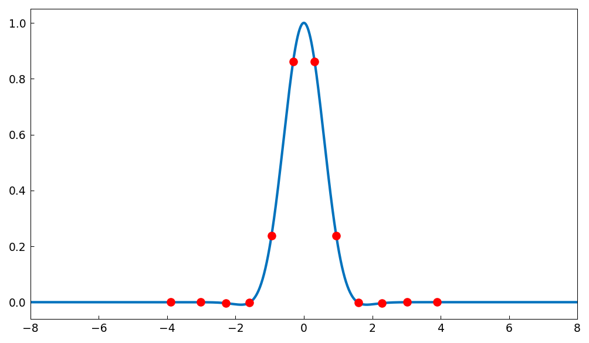

# Hermite quadrature

*Nick Trefethen and Andre Weideman*

[Original MATLAB Chebfun example](https://www.chebfun.org/examples/quad/HermiteQuad.html)

(Chebfun example quad/HermiteQuad.m)

Consider $\int_{-\infty}^{\infty} e^{-x^2} \cos(x)\, dx
= \sqrt{\pi}\, e^{-1/4}$.  A chebfun on the doubly-unbounded domain
integrates it to machine precision, and the value is unchanged when
the domain is truncated to $[-6, 6]$:

```python
import jax.numpy as jnp
import numpy as np
import chebfunjax as cj

g = cj.chebfun(lambda x: jnp.exp(-x**2) * jnp.cos(x),
               domain=[-np.inf, np.inf])
g.sum()
g.restrict(-6, 6).sum()
```
```
ans =
   1.380388447043143
exact =
   1.380388447043143
ans =
   1.380388447043142
```

Gauss-Hermite quadrature converges super-exponentially — every error
value below matches the published table digit-for-digit:

```
    n        error
  1   0.392065403862373
  2  -0.032889983326330
  3   0.001644624344905
  4  -0.000042670275757
  ...
 12  -0.000000000000000
```



Yet a plain trapezoidal rule with well-chosen spacing is competitive —
also converging extremely fast:

```
    n        error
  3   0.042363958855155
  6  -0.000513739182282
  9   0.000007261885988
 12  -0.000000082766157
  ...
```

The catch with Gauss-Hermite: most of its nodes lie where the
integrand is negligible.  At $n = 2000$, 88% of the nodes sit in the
tail where $e^{-x^2} < \varepsilon$ (the published run shows 95% at
$n = 10^4$; the fraction grows with $n$):

```
ratio =
    0.8790
```
