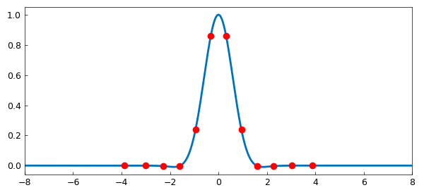

# Hermite quadrature

*Nick Trefethen and Andre Weideman, February 2017*

[Original MATLAB Chebfun example](https://www.chebfun.org/examples/quad/HermiteQuad.html)

Python translation: [`examples/quad/hermite_quad.py`](https://github.com/ma-gilles/chebfunjax/blob/main/examples/quad/hermite_quad.py)

## 1. A simple example

Hermite (more fully Gauss-Hermite) quadrature is a quadrature method for integrands of the form $\exp(-x^2) f(x)$ on the real axis, where $f$ is smooth. It is a classical subject, and surely thousands of people (including many physicists) have used Hermite quadrature. Nevertheless it is curious how little literature there is on its practicality and convergence rate as a numerical method, compared with other approaches such as a simple trapezoidal rule.

Here is an example showing that Hermite quadrature can be amazingly efficient. We take the function $g(x) = \exp(-x^2) \cos x$,

```matlab
ff = @(x) cos(x);
g = chebfun(@(x) exp(-x.^2).*ff(x), [-inf,inf]);
```

whose integral is

```matlab
format long, format compact
sum(g)
```

```text
ans =
   1.380388447043143
```

This matches the exact answer in all digits displayed

```matlab
exact = sqrt(pi)*exp(-1/4)
```

```text
exact =
   1.380388447043143
```

Chebfun has computed the integral by methods that are not our concern here. Even staying in the Chebfun context, one may note that because the integrand decays so rapidly to zero, there is no need in practice to use an infinite interval. For example, here is what we get if we integrate $g$ over $[-6,6]$:

```matlab
sum(g{-6,6})
```

```text
ans =
   1.380388447043143
```

Now let's integrate $g$ with Hermite quadrature, calling the Chebfun code `hermpts` to compute the nodes and weights. Here are the errors for $n = 1,\dots,12$ points:

```matlab
disp('    n        error')
for n = 1:12
    [s,w] = hermpts(n);
    In = w*ff(s);
    err = In - exact;
    fprintf('%3d %19.15f\n',n,err)
end
```

```text
    n        error
  1   0.392065403862373
  2  -0.032889983326330
  3   0.001644624344905
  4  -0.000058689881886
  5   0.000001628892514
  6  -0.000000036992409
  7   0.000000000710935
  8  -0.000000000011843
  9   0.000000000000174
 10  -0.000000000000002
 11   0.000000000000001
 12   0.000000000000000
```

All you need are 11 or 12 points to get full precision! And since $g$ is even, you only need half as many function evaluations as that -- an effect that carries over to many applications where the integrand may be expensive to evaluate but known to be even.

Here's a figure

```matlab
plot(g{-8,8},'linewidth',2)
hold on, plot(s,g(s),'.r','markersize',16), hold off
```



Let's compare this efficiency with the trapezoidal rule. As has been known since the days of Aitken and Turing, the trapezoidal rule converges exponentially as a function of $1/h$, where $h$ is the grid size, for analytic functions on the real axis provided they satisfy modest decay conditions at $\pm \infty$; see [1]. Formally the rule involves infinitely many sample points, but for a function of the Hermite form, one can truncate at a small value $\pm d$.

In work not yet published, we have derived an optimal choice of $h$ for this method. Applied to this particular function, the optimal choice is $$ h = (-1 + \sqrt{1 + 8\pi n} )/2n $$ Let's try it!

```matlab
disp('    n        error')
for n = 3:3:24
    h = (-1+sqrt(8*pi*n))/(2*n);
    d = (n-1)*h/2;
    s = linspace(-d,d,n);
    In = sum(h*g(s));              % trapezoidal sum
    err = In - exact;
    fprintf('%3d %19.15f\n',n,err)
end
```

```text
    n        error
  3   0.042363958855156
  6  -0.000513739182282
  9   0.000007261885988
 12  -0.000000082766157
 15   0.000000000965252
 18  -0.000000000011276
 21   0.000000000000119
 24  -0.000000000000001
```

Beautiful convergence again! -- but Hermite is about twice as fast.

## Large n?

Thanks to recent work by Townsend, Trogdon, and Olver [1], Chebfun can compute Hermite quadrature nodes and weights for very large values of $n$ with astonishing speed. For example,

```matlab
tic, [s,w]= hermpts(1000); toc
tic, [s,w]= hermpts(10000); toc
tic, [s,w]= hermpts(100000); toc
```

```text
(no matching output)
```

This raises questions. Most of the points in these large-$n$ formulas correspond to values of $x$ where $\exp(-x^2)$ is very small. For example, with $n = 10000$, here is the fraction of quadrature nodes for which $\exp(-x^2)$ is smaller than machine precision:

```matlab
n = 10000;
s = hermpts(n);
tail_points = s( exp(-s.^2) < eps );
format short
ratio = length(tail_points)/n
```

```text
ratio =
    0.8790
```

Perhaps there are applications where Hermite quadrature in such a regime makes sense, but we suspect they are rare. Indeed, when $n$ is large, Townsend et al. propose to throw away most of the quadrature points; they call this process "subsampling".

Since this example was initially drafted, an analysis has shown that indeed, for large $n$, Hermite quadrature is far less efficient than chopping to a finite integral (or more precisely one whose width grows in proportion to $n^{1/3}$), then using a simple formula like Gauss-Legendre quadrature or the trapezoidal rule. See section 5 of [3].

## References

1. A. Townsend, T. Trogdon, and S. Olver, Fast computation of Gauss quadrature nodes and weights on the whole real line, *IMA J. Numer. Anal.*, 2015.
2. L. N. Trefethen and J. A. C. Weideman, The exponentially convergent trapezoidal rule, *SIAM Review* 56 (2014), 385-458.
3. L. N. Trefethen, Exactness of quadrature formulas, *SIAM Review*, submitted, 2020.

---

*Translated with [chebfunjax](https://github.com/ma-gilles/chebfunjax); prose and MATLAB code from the original example, copyright The University of Oxford and The Chebfun Developers.  Printed outputs and figures are chebfunjax's.*
